# Modul 1: Wireshark & Setup GNS3

## Daftar Isi
- [Modul 1: Wireshark \& Setup GNS3](#modul-1-wireshark--setup-gns3)
  - [Daftar Isi](#daftar-isi)
  - [0. Pendahuluan](#0-pendahuluan)
  - [1. Wireshark](#1-wireshark)
    - [1.1 Struktur Paket Jaringan](#11-struktur-paket-jaringan)
    - [1.2 Instalasi](#12-instalasi)
    - [1.3 Filter](#13-filter)
      - [1.3.1 Capture Filter](#131-capture-filter)
      - [1.3.2 Display Filter](#132-display-filter)
      - [1.3.3 Perbandingan Capture Filter vs Display Filter](#133-perbandingan-capture-filter-vs-display-filter)
    - [1.4 Navigasi UI dan Ringkasan Trafik (Statistics)](#14-navigasi-ui-dan-ringkasan-trafik-statistics)
      - [1.4.1 Panel Utama dan Pewarnaan Paket](#141-panel-utama-dan-pewarnaan-paket)
      - [1.4.2 Follow Stream (TCP, UDP, HTTP)](#142-follow-stream-tcp-udp-http)
      - [1.4.3 Ringkasan Trafik (Statistics)](#143-ringkasan-trafik-statistics)
    - [1.5 Export Data Hasil Packet Capture](#15-export-data-hasil-packet-capture)
    - [1.6 Studi Kasus: Analisis Protokol Jaringan](#16-studi-kasus-analisis-protokol-jaringan)
      - [1.6.1 FTP (File Transfer Protocol)](#161-ftp-file-transfer-protocol)
      - [1.6.2 SMTP (Simple Mail Transfer Protocol)](#162-smtp-simple-mail-transfer-protocol)
      - [1.6.3 HTTP (Hypertext Transfer Protocol)](#163-http-hypertext-transfer-protocol)
    - [1.7 Pola Protokol Jaringan Esensial](#17-pola-protokol-jaringan-esensial)
      - [1.7.1 TCP Three-Way Handshake dan Teardown](#171-tcp-three-way-handshake-dan-teardown)
      - [1.7.2 Resolusi Alamat dengan ARP](#172-resolusi-alamat-dengan-arp)
      - [1.7.3 Mekanisme Diagnostik ICMP](#173-mekanisme-diagnostik-icmp)
  - [2. GNS3](#2-gns3)
    - [2.1 Apa itu GNS3?](#21-apa-itu-gns3)
    - [2.2 Instalasi GNS3](#22-instalasi-gns3)
      - [Opsi A: VirtualBox](#opsi-a-virtualbox)
      - [Opsi B: VMware Workstation Pro](#opsi-b-vmware-workstation-pro)
      - [Troubleshooting Virtualisasi Hardware (VT-x, AMD-V, Hyper-V)](#troubleshooting-virtualisasi-hardware-vt-x-amd-v-hyper-v)
    - [2.3 Memasukkan Image Node ke GNS3](#23-memasukkan-image-node-ke-gns3)
    - [2.4 Instalasi dan Setup GNS3 Client](#24-instalasi-dan-setup-gns3-client)
    - [2.5 Setup IP di Node](#25-setup-ip-di-node)
    - [2.6 Akses Sebuah Node ke Internet](#26-akses-sebuah-node-ke-internet)
    - [2.7 Membuat Topologi Terintegrasi](#27-membuat-topologi-terintegrasi)
      - [2.7.1 Skema Pengalamatan IP](#271-skema-pengalamatan-ip)
      - [2.7.2 Konfigurasi Router Linux (Multi-Homed)](#272-konfigurasi-router-linux-multi-homed)
      - [2.7.3 Mengaktifkan Kernel IP Forwarding](#273-mengaktifkan-kernel-ip-forwarding)
      - [2.7.4 Konfigurasi Source NAT (iptables MASQUERADE)](#274-konfigurasi-source-nat-iptables-masquerade)
      - [2.7.5 Konfigurasi Client dan DNS Resolver](#275-konfigurasi-client-dan-dns-resolver)
      - [2.7.6 Verifikasi Konektivitas End-to-End](#276-verifikasi-konektivitas-end-to-end)
    - [2.8 Tips, Trik, dan Troubleshooting](#28-tips-trik-dan-troubleshooting)
  - [3. Menghubungkan Wireshark dengan GNS3](#3-menghubungkan-wireshark-dengan-gns3)
    - [3.1 Capture Langsung dari Link Topologi](#31-capture-langsung-dari-link-topologi)
    - [3.2 Capture di Dalam Node dengan tcpdump dan TShark](#32-capture-di-dalam-node-dengan-tcpdump-dan-tshark)
    - [3.3 Contoh Skenario Analisis: Verifikasi SNAT dan ARP](#33-contoh-skenario-analisis-verifikasi-snat-dan-arp)
  - [4. Latihan](#4-latihan)
  - [5. Troubleshooting Common Pitfalls](#5-troubleshooting-common-pitfalls)
  - [6. Referensi](#6-referensi)
---

## 0. Pendahuluan

GNS3 dan Wireshark adalah dua alat yang saling melengkapi dalam rekayasa jaringan komputer. **GNS3** mensimulasikan topologi jaringan (router, switch, host) tanpa memerlukan perangkat fisik, sedangkan **Wireshark** menangkap dan membedah paket yang melintas di jaringan tersebut. Modul ini membahas instalasi dan konfigurasi keduanya, serta integrasi keduanya untuk menganalisis protokol secara langsung pada topologi simulasi.

> **Catatan versi:** Perangkat lunak di modul ini (Wireshark, GNS3, VirtualBox, VMware Workstation, FileZilla) dirilis secara berkala. Gunakan selalu versi stabil terbaru dari situs resmi masing-masing, bukan dari tautan usang yang tidak lagi didukung.

---

## 1. Wireshark

Wireshark adalah aplikasi penganalisa paket jaringan (*network packet analyzer*). Aplikasi ini menangkap paket yang lewat di sebuah interface jaringan dalam mode promiscuous dan menampilkan isinya secara mendalam, mulai dari layer fisik hingga data aplikasi.

### 1.1 Struktur Paket Jaringan

Sebuah paket jaringan terbentuk melalui proses enkapsulasi berlapis:

**1. Header**: Berisi alamat dan data kontrol lain yang dibawa paket:

| Field Header | Fungsi / Keterangan |
| :--- | :--- |
| Panjang paket | Beberapa jaringan memiliki panjang paket baku (*fixed-length*), yang lain bergantung pada header untuk menyimpan informasi panjang |
| Sinkronisasi | Bit yang membantu paket mencocokkan jaringan yang dituju |
| Nomor paket | Menunjukkan urutan dari total paket yang ada (Sequence Number) |
| Protokol | Menunjukkan jenis data yang dibawa (HTTP, FTP, DNS, TCP, UDP, ICMP) |
| Alamat tujuan | Ke mana paket dikirim (Destination MAC pada Layer 2, Destination IP pada Layer 3, Destination Port pada Layer 4) |
| Alamat asal | Dari mana paket dikirim (Source MAC pada Layer 2, Source IP pada Layer 3, Source Port pada Layer 4) |

**2. Payload**: Disebut juga *body* dari paket, berisi muatan data sebenarnya yang ditransmisikan oleh aplikasi pengguna.

**3. Trailer**: Kadang disebut *footer*, biasanya berisi bit penanda akhir frame dan bit pengecekan kesalahan transmisi (*Frame Check Sequence* / FCS berbasis CRC32).

---

### 1.2 Instalasi

**Windows dan macOS**
Unduh installer resmi dari [wireshark.org/download.html](https://www.wireshark.org/download.html). Installer Windows dan macOS sudah menyertakan **Npcap** sebagai driver capture pengganti WinPcap yang sudah usang. Pastikan mencentang opsi instalasi Npcap dalam mode kompatibel WinPcap API.

**Linux (Debian / Ubuntu / Kali)**
Install lewat package manager:
``` 
sudo apt update
sudo apt install -y wireshark tshark
```
Saat instalasi muncul pertanyaan apakah user non-root boleh melakukan capture, pilih **Yes**. Kemudian tambahkan user kalian ke group `wireshark`:
``` 
sudo usermod -aG wireshark $USER
```
Terapkan perubahan group dengan `newgrp wireshark` atau lakukan logout/login ulang agar Wireshark dapat berjalan tanpa perintah `sudo`.

Jalankan Wireshark dan pilih interface yang ingin diamati. Tampilan awalnya sebagai berikut:

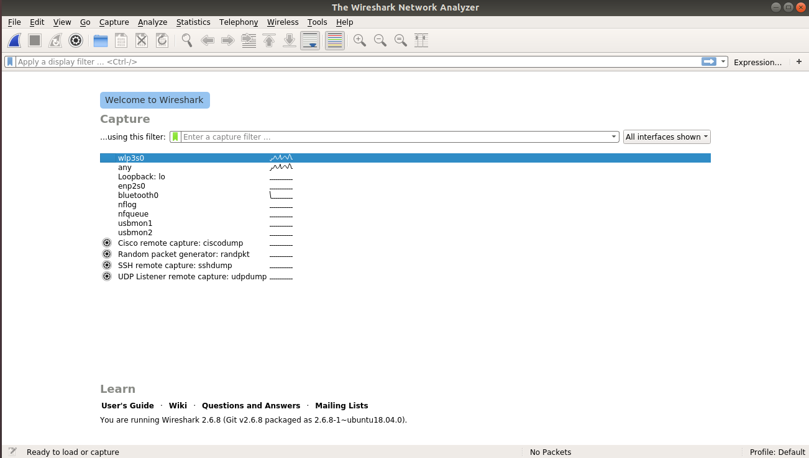

**TShark**
Satu paket instalasi Wireshark juga menyertakan **TShark**, yaitu versi command-line dari Wireshark. TShark berguna untuk capture di lingkungan server tanpa GUI atau langsung di dalam container node GNS3. Pembahasan lebih mendalam ada pada [bagian 3.2](#32-capture-di-dalam-node-dengan-tcpdump-dan-tshark).

---

### 1.3 Filter

Wireshark memiliki 2 jenis filter dengan arsitektur berbeda: **Capture Filter** dan **Display Filter**.

#### 1.3.1 Capture Filter

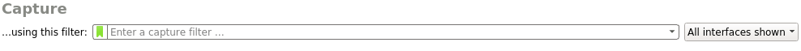

- **Definisi**: Menyaring paket pada tingkat driver/kernel sebelum disimpan ke memori buffer. Paket yang tidak memenuhi kriteria filter dibuang seketika dan tidak dapat dikembalikan.
- Sintaks filter menggunakan format **Berkeley Packet Filter (BPF)** yang terdiri dari satu atau lebih primitive:
  `[type] [dir] [proto] [id]`

| Qualifier | Keterangan | Contoh |
| :--- | :--- | :--- |
| type | Jenis id/nama yang menjadi target filter | host, net, port, portrange |
| dir | Arah paket dari/ke id | src, dst, src or dst |
| proto | Protokol target | ether, ip, ip6, arp, tcp, udp, icmp |

Sintaks dapat digabungkan dengan negasi (`!` atau `not`), konjungsi (`&&` atau `and`), dan disjungsi (`||` atau `or`).

| Filter expression | Keterangan |
| :--- | :--- |
| `host 10.151.36.1` | Menangkap semua paket dari/ke alamat 10.151.36.1 |
| `src host 10.151.36.1` | Menangkap semua paket yang berasal dari 10.151.36.1 |
| `net 192.168.0.0/24` | Menangkap semua paket dari/ke subnet 192.168.0.0/24 |
| `udp port 80` | Menangkap paket UDP dari/ke port 80 |
| `tcp src port 22 or host 10.151.36.30` | Paket TCP dari port 22, atau paket apa pun dari/ke 10.151.36.30 |
| `not arp and not icmp` | Mengabaikan seluruh lalu lintas ARP dan ICMP |

Contoh hasil capture filter `host 10.151.36.1`:

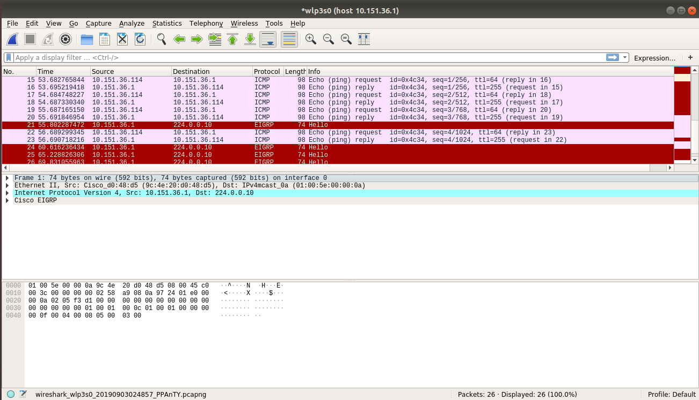

#### 1.3.2 Display Filter

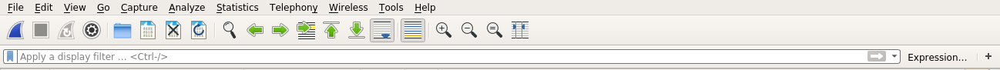

- **Definisi**: Memilah paket yang **ditampilkan** pada layar dari kumpulan paket yang sudah tersimpan di buffer memori. Filter ini tidak membuang data.
- Sintaks umum: `[protokol].[field] [comparison operator] [value]`

| Operator Teks | Simbol | Arti |
| :--- | :--- | :--- |
| eq | == | Sama dengan |
| ne | != | Tidak sama dengan |
| gt | > | Lebih besar dari |
| lt | < | Lebih kecil dari |
| ge | >= | Lebih besar atau sama dengan |
| le | <= | Lebih kecil atau sama dengan |
| contains | | Mengandung teks tertentu |
| matches | ~ | Cocok dengan regular expression |
| bitwise_and | & | Operasi logika bit |

Beberapa filter dapat digabungkan menggunakan operator logika: `and` (`&&`), `or` (`||`), `xor` (`^^`), `not` (`!`).

| Filter expression | Keterangan |
| :--- | :--- |
| `tcp.port == 443` | Semua paket TCP dari/ke port 443 |
| `ip.src == 192.168.0.1 or ip.dst == 192.168.0.1` | Paket dari atau ke 192.168.0.1 |
| `http.request.uri contains "login"` | Paket HTTP yang URI tujuannya memuat kata "login" |
| `quic` | Paket QUIC (protokol transport HTTP/3) |
| `tcp.flags.syn == 1 && tcp.flags.ack == 0` | Inisiasi awal koneksi TCP (paket SYN) |

Contoh hasil display filter `tcp.port == 80`:

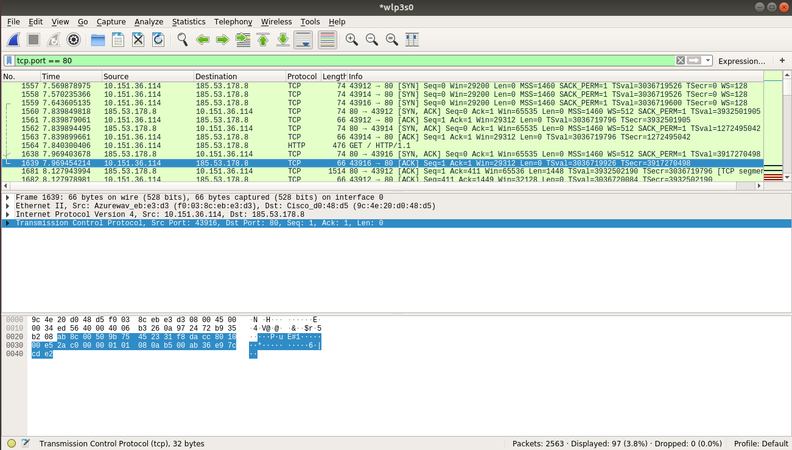

#### 1.3.3 Perbandingan Capture Filter vs Display Filter

| Parameter | Capture Filter | Display Filter |
| :--- | :--- | :--- |
| **Lokasi Eksekusi** | Kernel / Driver Npcap / libpcap | Userspace Wireshark Engine |
| **Dampak Paket Gagal** | Dibuang permanen dari memori | Tetap tersimpan di buffer, hanya disembunyikan |
| **Standar Sintaks** | Berkeley Packet Filter (BPF) | Wireshark Protocol Field Notation |
| **Contoh IP Filter** | `host 192.168.1.1` | `ip.addr == 192.168.1.1` |
| **Contoh Port Filter** | `tcp port 80` | `tcp.port == 80` |

---

### 1.4 Navigasi UI dan Ringkasan Trafik (Statistics)

#### 1.4.1 Panel Utama dan Pewarnaan Paket
Antarmuka Wireshark dibagi menjadi 3 panel:
1. **Packet List Pane**: Menampilkan ringkasan nomor frame, waktu relatif, IP asal, IP tujuan, protokol, panjang frame, dan info ringkas.
2. **Packet Details Pane**: Struktur hierarki dekonstruksi layer (Frame, Ethernet, IPv4, TCP/UDP, Application Data).
3. **Packet Bytes Pane**: Representasi heksadesimal mentah di sisi kiri dan representasi ASCII di sisi kanan.

Skema warna default:
- Hijau: Paket protokol HTTP web.
- Biru muda: Lalu lintas DNS.
- Ungu muda: Paket data TCP biasa.
- Hitam dengan teks merah: Masalah transmisi TCP (Retransmission, Duplicate ACK, ZeroWindow, Reset RST).

#### 1.4.2 Follow Stream (TCP, UDP, HTTP)
Fitur ini merekonstruksi seluruh aliran data dua arah antara client dan server:
1. Klik kanan pada paket TCP/HTTP yang ingin dianalisis.
2. Pilih **Follow -> TCP Stream** (atau HTTP Stream).
3. Jendela dialog menampilkan data utuh: teks berwarna merah berasal dari Client ke Server, dan teks berwarna biru adalah respons dari Server ke Client.

#### 1.4.3 Ringkasan Trafik (Statistics)

Menu **Statistics** menyajikan gambaran agregat saat capture berisi ribuan paket:

- **Statistics -> Protocol Hierarchy**: Menampilkan persentase distribusi paket dan byte untuk setiap protokol. Membantu melihat protokol apa yang paling mendominasi jaringan.

- **Statistics -> Conversations**: Menampilkan matriks komunikasi antar-dua perangkat beserta total volume data yang saling dipertukarkan. Berguna melacak perangkat yang paling banyak menyerap bandwidth.

- **Statistics -> I/O Graphs**: Grafik kurva volume trafik terhadap waktu untuk mengamati lonjakan trafik.

---

### 1.5 Export Data Hasil Packet Capture

1. Setelah paket tertangkap, pilih menu **File -> Export Objects -> (protokol yang diinginkan)**. Contoh: HTTP.

   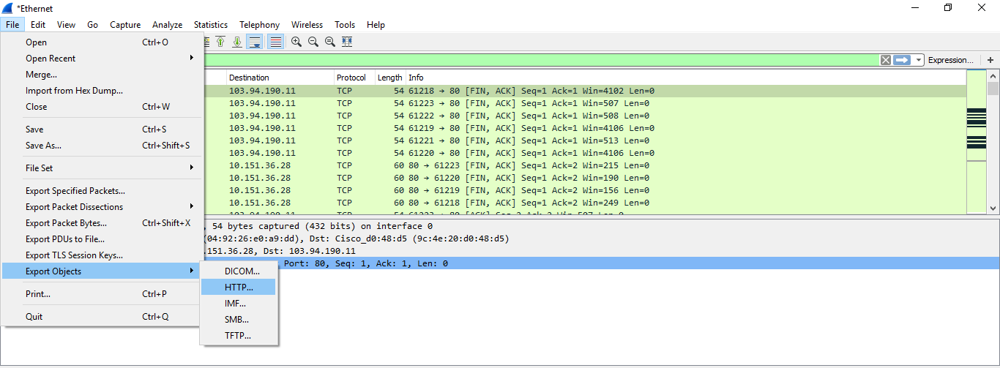

2. Pilih objek file yang ingin diekspor (misal gambar atau dokumen dari situs web), klik **Save**, lalu tentukan folder penyimpanan di komputer host.

   

3. File hasil rekonstruksi berhasil disimpan ke penyimpanan lokal.

---

### 1.6 Studi Kasus: Analisis Protokol Jaringan

Sebenarnya ada banyak sekali jenis trafik yang bisa dianalisis di Wireshark — DNS, DHCP, TLS, QUIC, dan puluhan protokol lain. Namun kami memilih tiga studi kasus berikut yaitu: **FTP** (kontrol multi-channel dan transfer file), **SMTP** (pengiriman email berbasis command-response), dan **HTTP** (request-response berbasis teks yang mendasari web). Ketiganya sengaja dipilih karena masih tidak terenkripsi secara default dan cocok sebagai titik awal yang paling jelas untuk belajar *cara membaca* sebuah protokol di Wireshark, sebelum nanti mencoba protokol lain yang lebih kompleks atau terenkripsi sehingga seluruh proses komunikasinya bisa diamati apa adanya beserta sebagai real-case yang bisa kalian temui di _real-world case_.

> **Studi kasus ini contoh aja, gak plek-ketiplek.** Langkah-langkahnya nggak harus sama persis karena sebagai simulasi aja — kalau kalian mau coba protokol lain (DNS, DHCP, atau bahkan trafik game/aplikasi favorit kalian sendiri) atau eksperimen dengan cara yang berbeda, silakan aja. Justru semakin banyak dicoba-coba semakin terbiasa membaca pola trafik di Wireshark. 
> 
> Dokumentasi resmi [User's Guide Wireshark](https://www.wireshark.org/docs/wsug_html_chunked/index.html) juga bisa jadi bahan belajar tambahan kalau ingin menggali lebih dalam.
>
> Beberapa acuan belajar lain seputar Wireshark (opsional):
> - [Wireshark Basics (Luca Deri, ntop)](https://luca.ntop.org/gr2022/Wireshark.pdf)
> - [Wireshark Cheat Sheet — Black Hills Information Security](https://www.blackhillsinfosec.com/wireshark-cheatsheet/)
> - [SOC Analyst Wireshark Cheat Sheet (Medium)](https://medium.com/@rebaleos0/soc-analyst-wireshark-cheat-sheet-e5915c3628b7)
> - [Video: Wireshark Tutorial](https://www.youtube.com/watch?v=NdTu3bDTBbo)
> - [Video: Wireshark for Beginners](https://www.youtube.com/watch?v=qTaOZrDnMzQ)
> - AND MORE!


#### 1.6.1 FTP (File Transfer Protocol)

Protokol File Transfer Protocol (FTP) sangat cocok untuk studi analisis protokol karena seluruh autentikasi dan kontrol ditransmisikan dalam bentuk plaintext tanpa enkripsi.

Sebelum menghubungkan client ke server FTP, pastikan Wireshark sudah menyala dan aktif menangkap interface yang relevan.

**Arsitektur Dual-Channel FTP: Active vs Passive Mode**

FTP menggunakan dua koneksi terpisah:
1. **Control Connection (Port 21)**: Dipakai untuk pertukaran perintah teks (`USER`, `PASS`, `PORT`, `PASV`, `LIST`, `QUIT`).
2. **Data Connection**: Saluran terpisah untuk mengalirkan file mentah dan daftar direktori:
   - **Active Mode**: Server menginisiasi koneksi dari port 20 ke port acak client yang ditentukan lewat instruksi `PORT`.
   - **Passive Mode (PASV)**: Client menginisiasi koneksi dari port acak dirinya ke port acak server yang ditentukan lewat instruksi `PASV`.

**Menyiapkan Server (FileZilla Server)**

FileZilla Server modern menggunakan arsitektur service di background dengan antarmuka administrasi terpisah.

1. Install FileZilla Server dari [filezilla-project.org](https://filezilla-project.org/download.php?type=server). Tentukan port admin dan password administrator saat instalasi.
2. Buka **FileZilla Server Administration Interface**, masukkan alamat host `127.0.0.1` beserta password admin untuk terhubung ke service.

   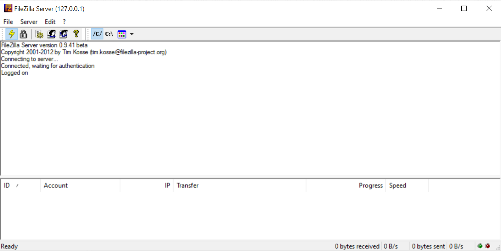

3. Buka **Server -> Configure** (atau shortcut `Ctrl+F`), masuk ke bagian **Users**. Klik **Add**, beri nama user (misal `jarkom2026`), pilih opsi **Require a password to log in**, dan tentukan passwordnya.

   

4. Pada user yang sama, atur **Mount Points**:
   - *Virtual path*: `/`
   - *Native path*: Folder di komputer kalian (misal `C:\ftp_share` atau `/srv/ftp`).
   - Berikan izin *Read* dan *Write*.

   

5. Klik **OK** untuk menerapkan konfigurasi.

**Koneksi dari Client**

*Koneksi via FileZilla Client* — buka FileZilla Client, isi kolom *Host*, *Username*, *Password*, dan *Port 21*, lalu klik tombol **Quickconnect**.

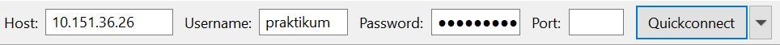

*Koneksi via Command Line (Windows / Linux CLI)*:
- Di Windows: Buka Command Prompt (CMD), utility `ftp` sudah tersedia bawaan:
  ```
  ftp [IP_SERVER]
  ```
- Di Linux: Jalankan perintah (pasang paket jika belum ada via `sudo apt install ftp`):
  ``` 
  ftp [IP_SERVER]
  ```

Pada capture Wireshark dengan filter `ftp`, perhatikan bahwa kredensial dikirimkan dalam bentuk plaintext murni:

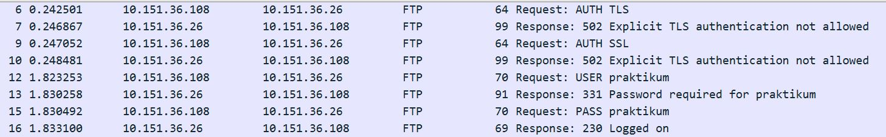

| Perintah FTP | Keterangan |
| :--- | :--- |
| `USER [nama]` | Mengirim username autentikasi ke FTP server |
| `PASS [rahasia]` | Mengirim password autentikasi ke FTP server |

**Upload dan Download**

*Upload* — drag file ke panel remote di FileZilla Client, atau ketik perintah `put [nama_file]` di terminal. Perintah yang dikirimkan pada control channel adalah `STOR`.

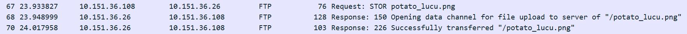

*Download* — drag file dari remote ke local site, atau ketik perintah `get [nama_file]` di terminal. Perintah yang dikirimkan pada control channel adalah `RETR`.

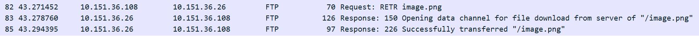

#### 1.6.2 SMTP (Simple Mail Transfer Protocol)

SMTP adalah protokol berbasis command-response teks (mirip FTP) yang menjadi dasar pengiriman email. Untuk praktikum ini kita tidak mengirim email ke server publik sungguhan, melainkan memakai **Mailpit** — SMTP server tiruan yang menangkap semua email masuk dan menampilkannya di web UI tanpa pernah benar-benar mengirim apa pun keluar. Mailpit adalah pengganti modern dari MailHog yang sudah tidak dikembangkan lagi.

**Menjalankan Mailpit**

Cara tercepat adalah lewat Docker (satu baris, tanpa instalasi tambahan):
``` 
docker run -d --name mailpit -p 25:1025 -p 8025:8025 axllent/mailpit
```
Perintah ini menjalankan:
- **SMTP server** di port `25` — tempat email "dikirim".
- **Web UI** di `http://localhost:8025` — tempat melihat email yang masuk.

Alternatif tanpa Docker: unduh binary tunggal dari [halaman rilis Mailpit di GitHub](https://github.com/axllent/mailpit/releases), atau `brew install mailpit` di macOS.

**Mengirim Email Uji Coba**

Karena Mailpit hanya *menerima* email, kita perlu cara untuk mengirimnya. Skrip Python singkat berikut memakai modul `smtplib` bawaan (tidak perlu instalasi tambahan):

```
import smtplib
from email.mime.text import MIMEText

msg = MIMEText("Menurutku tomboy lebih baik daripada femboy.")
msg["Subject"] = "whnyh"
msg["From"] = "pengirim@lab.local"
msg["To"] = "penerima@lab.local"

with smtplib.SMTP("127.0.0.1", 25) as server:
    server.send_message(msg)
```

> Disini, karena ribet kalau live capture dengan docker mailpit, kita capture tcpdump-nya terlebih dlu lalu analisis dari hasil .pcap capture tcpdumpnya. Dengan itu, kalo mau coba, di exec docker mailpit `apk add --no-cache tcpdump`, run script py sederhana, lalu capture `tcpdump -i eth0 port 1025 -w /tmp/cobasmtp.pcap` dan ambil file .pcap nya di file container mailpit.

Jalankan Wireshark dengan filter `smtp` (karena port server Mailpit 1025) **sebelum** menjalankan skrip di atas, lalu amati pertukaran perintahnya:

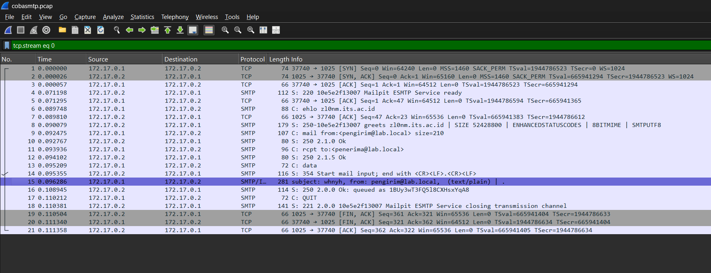
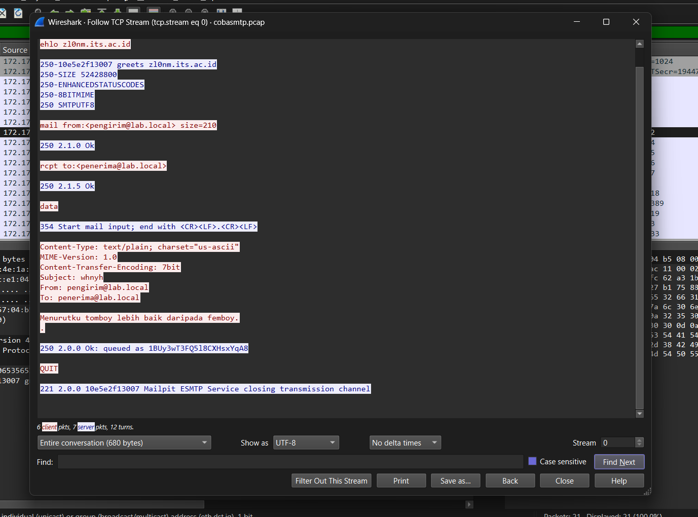
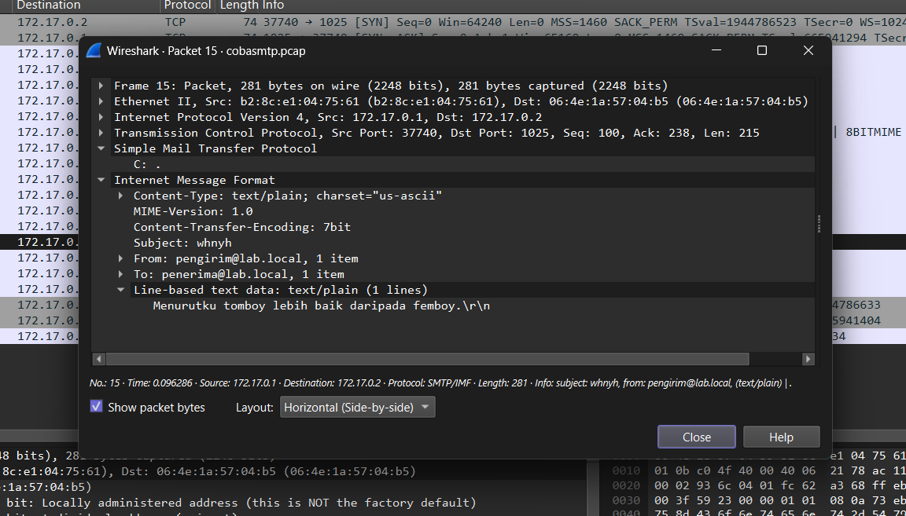

| Perintah SMTP | Keterangan |
| :--- | :--- |
| `EHLO` / `HELO` | Client memperkenalkan diri ke server |
| `MAIL FROM:` | Menentukan alamat pengirim |
| `RCPT TO:` | Menentukan alamat penerima |
| `DATA` | Memulai pengiriman header dan isi email, diakhiri baris berisi titik tunggal (`.`) |
| `QUIT` | Mengakhiri sesi |

Karena Mailpit tidak mewajibkan autentikasi secara default, seluruh transaksi ini bisa diamati tanpa langkah `AUTH LOGIN` tambahan — cocok untuk fokus ke mekanisme dasar protokolnya dulu. Buka `http://localhost:8025` di browser untuk memastikan email tadi benar-benar "diterima" oleh Mailpit:

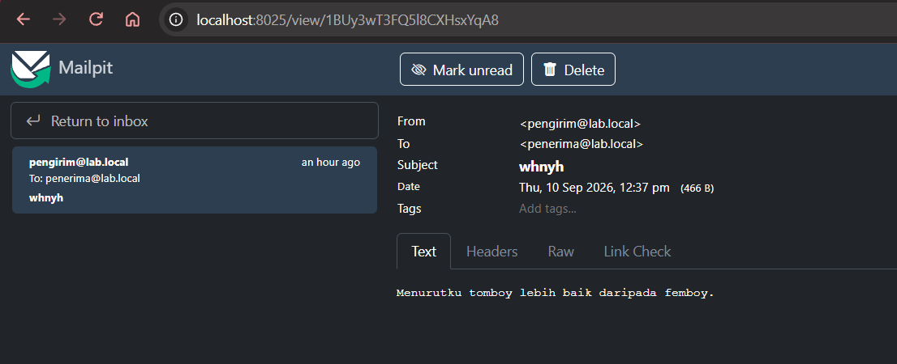

#### 1.6.3 HTTP (Hypertext Transfer Protocol)

HTTP adalah protokol request-response yang mendasari web. Untuk mengamatinya tanpa bergantung pada situs eksternal, kita bisa menjalankan server HTTP lokal memakai modul bawaan Python (tidak perlu instalasi tambahan):

``` 
python3 -m http.server 8080 / python -m http.server 8080
```
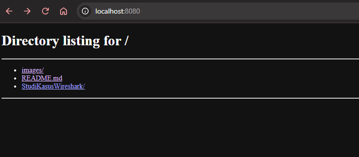

Perintah ini menjalankan server HTTP sederhana di `http://localhost:8080` yang menyajikan isi folder tempat perintah dijalankan.

Jalankan Wireshark dengan filter `http`, lalu akses server tersebut lewat browser atau `curl`:
``` 
curl http://localhost:8080/
```

Amati struktur request dan response-nya di Wireshark:

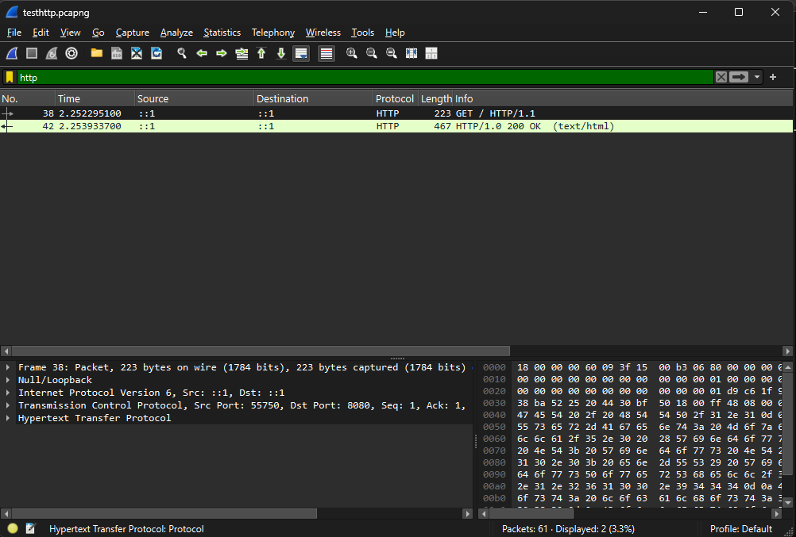

- **Request line**: `GET / HTTP/1.1` — metode, path yang diminta, dan versi protokol.
- **Request headers**: `Host`, `User-Agent`, `Accept`, dsb.
- **Status line** pada response: `HTTP/1.1 200 OK`.
- **Response headers**: `Server`, `Content-Type`, `Content-Length`, dsb, diikuti isi (body) halaman.

Klik kanan pada salah satu paket HTTP lalu pilih **Follow -> HTTP Stream** (lihat [bagian 1.4.2](#142-follow-stream-tcp-udp-http)) untuk melihat keseluruhan request dan response sebagai satu blok teks yang mudah dibaca:

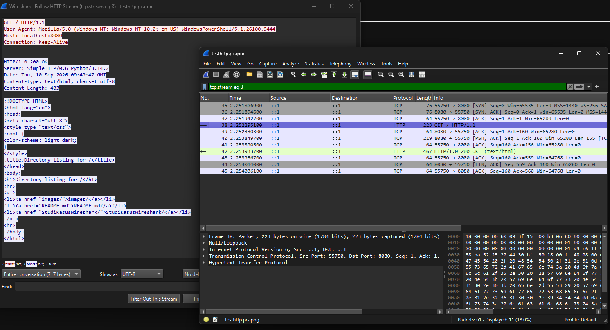

> **Jika dibandingkan dengan HTTPS:** Karena trafik di atas dikirim tanpa enkripsi, seluruh header dan body terlihat apa adanya. Ulangi eksperimen serupa terhadap situs HTTPS sambil mengaktifkan teknik dekripsi `SSLKEYLOGFILE` untuk melihat bahwa strukturnya sebenarnya sama — hanya dibungkus lapisan enkripsi TLS.

---

### 1.7 Pola Protokol Jaringan Esensial

#### 1.7.1 TCP Three-Way Handshake dan Teardown
Sebelum pertukaran data TCP dimulai, koneksi dibangun melalui 3 langkah:
1. **SYN**: Client mengirim segmen dengan flag SYN aktif, Sequence Number awal (ISN = 0 relatif).
2. **SYN-ACK**: Server membalas dengan flag SYN dan ACK aktif, Sequence Number miliknya sendiri, dan Acknowledgment Number = Client ISN + 1.
3. **ACK**: Client mengonfirmasi balasan dengan flag ACK aktif, Acknowledgment Number = Server ISN + 1.

Penutupan koneksi dilakukan secara teratur melalui 4 arah menggunakan flag **FIN** dan **ACK**, atau diputus secara paksa seketika menggunakan flag **RST**.

#### 1.7.2 Resolusi Alamat dengan ARP
Address Resolution Protocol (ARP) memetakan IP logis ke MAC address fisik:
- **ARP Request**: Dikirim secara broadcast ke seluruh host di satu segmen jaringan (`ff:ff:ff:ff:ff:ff`, Opcode 1).
- **ARP Reply**: Host pemilik IP membalas langsung ke MAC address pemohon secara unicast (Opcode 2).

#### 1.7.3 Mekanisme Diagnostik ICMP
- **Echo Request (Type 8, Code 0)**: Permintaan ping dari pengirim.
- **Echo Reply (Type 0, Code 0)**: Jawaban balasan ping dari penerima.
- **Time-to-Live Exceeded (Type 11, Code 0)**: Dihasilkan oleh router transit ketika nilai TTL pada header IP turun menjadi 0, mendasari prinsip kerja utility `traceroute`.

---

## 2. GNS3

### 2.1 Apa itu GNS3?

**GNS3 (Graphical Network Simulator-3)** adalah perangkat lunak simulator jaringan berbasis visual yang mendukung emulasi perangkat nyata mulai dari router Cisco, MikroTik, hingga container Linux berbasis Docker.

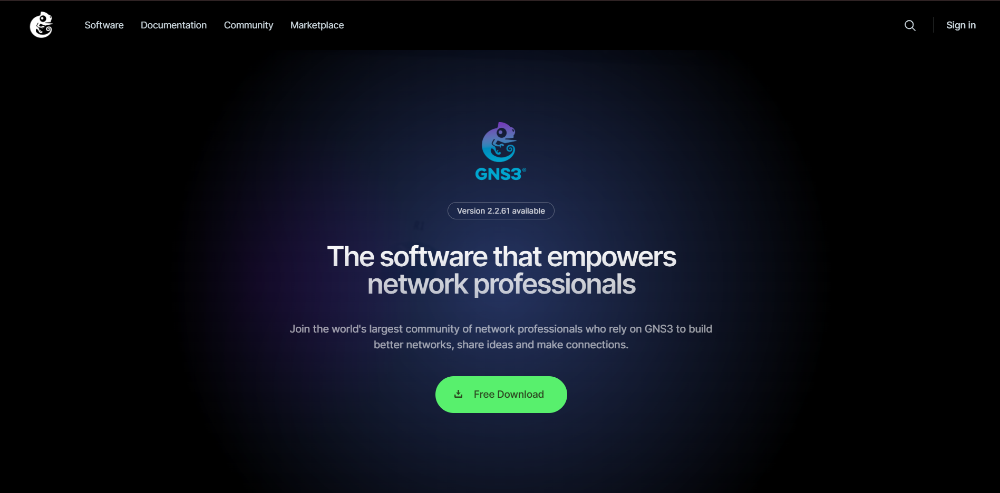

GNS3 menggunakan model terdistribusi:
- **GNS3 Desktop Client / WebClient**: Antarmuka pengguna (aplikasi desktop atau langsung lewat browser) tempat merancang diagram topologi dan memanggil konsol terminal.
- **GNS3 VM (Server / Controller)**: Mesin virtual Linux yang menjalankan komputasi emulasi berat, bridging interface virtual (`ubridge`), dan engine Docker di lingkungan kernel terisolasi dengan akselerasi KVM.

Pada praktikum ini, controller sudah disediakan bersama per kelompok (lihat [bagian 2.4](#24-instalasi-dan-setup-gns3-client)), jadi sebagian besar dari kalian hanya perlu memasang client/webclient dan terhubung ke controller tersebut — bukan menjalankan GNS3 VM sendiri.

---

### 2.2 Instalasi GNS3

GNS3 3.0.6 dibagikan sebagai satu **installer all-in-one** yang mencakup GNS3 Desktop Client, GNS3 WebClient, Wireshark, dan (opsional) GNS3 VM sekaligus — tidak perlu lagi mengunduh komponen-komponen ini secara terpisah seperti versi lama.

1. Buka [github.com/GNS3/gns3-gui/releases](https://github.com/GNS3/gns3-gui/releases), cari rilis stabil terbaru (**Version 3.0.6** saat modul ini ditulis — GNS3 merilis versi baru cukup sering, jadi selalu cek yang paling atas di daftar rilis).

   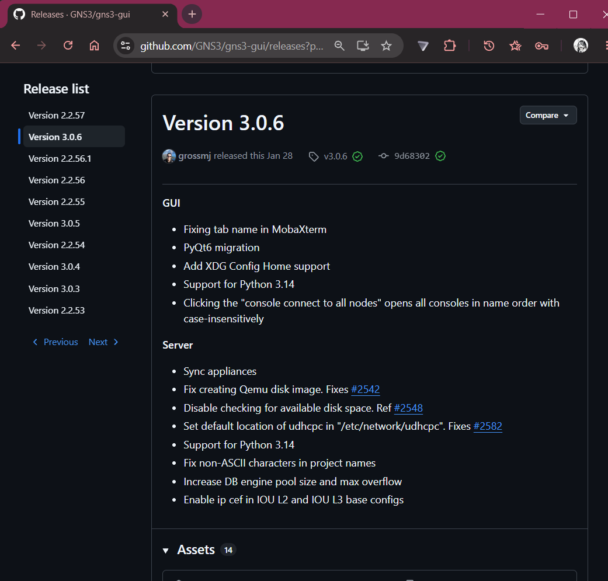

2. Pada bagian **Assets**, pilih file sesuai kebutuhan:
   - **Windows**: `GNS3-3.0.6-all-in-one.exe` — **direkomendasikan**, mencakup semua komponen dalam satu wizard.
   - **macOS**: `GNS3-3.0.6.dmg`.
   - File `GNS3.VM.*.zip` (VirtualBox, VMware Workstation, VMware ESXi, Hyper-V, KVM) adalah VM standalone — hanya diperlukan bila kalian **tidak** memakai jalur all-in-one, atau ingin mengunduh ulang VM-nya secara terpisah.

   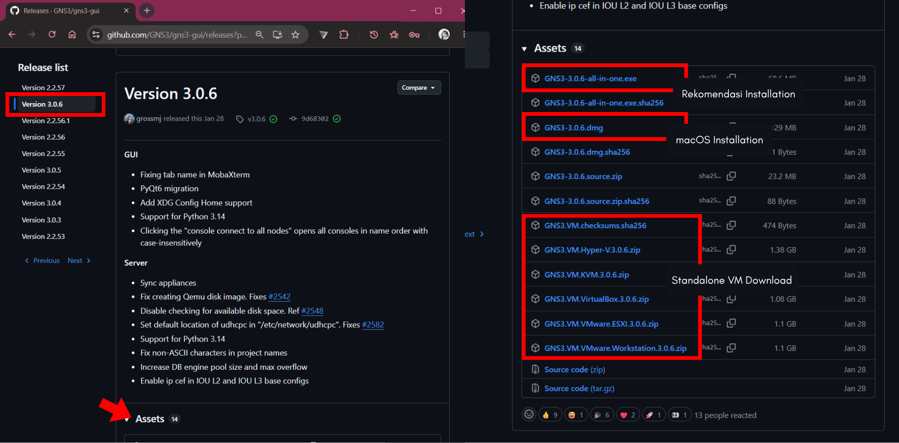

3. Jalankan installer, klik **Next** terus melalui layar sambutan dan Setujui **License Agreement** (GPLv3).

   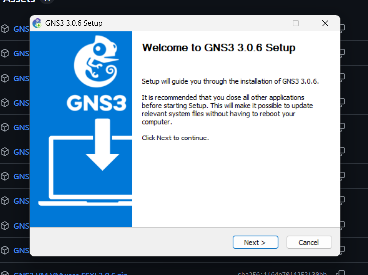

   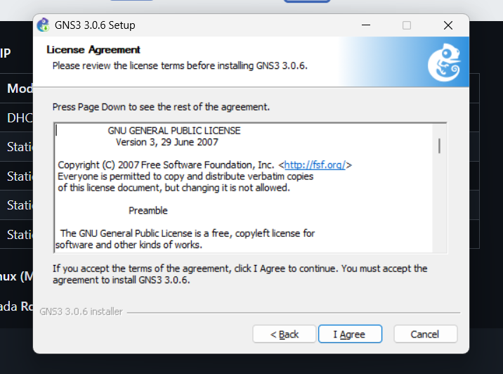

4. Pada layar **Choose Components**, pilih tipe install **Custom** agar bisa memilih komponen satu per satu:
   - **GNS3 Desktop** — aplikasi client utama.
   - **GNS3 WebClient** — akses lewat browser tanpa perlu membuka aplikasi desktop.
   - **GNS3 VM** — centang **hanya jika** kalian ingin menjalankan server/controller sendiri di komputer ini (lihat bagian opsional di bawah). Untuk praktikum yang controllernya sudah disediakan asisten, bagian ini **boleh dikosongkan**.
   - **Tools**: Wireshark (versi yang dibundel saat ini: 4.6.3) dan TightVNC Viewer — sebaiknya tetap dicentang.

   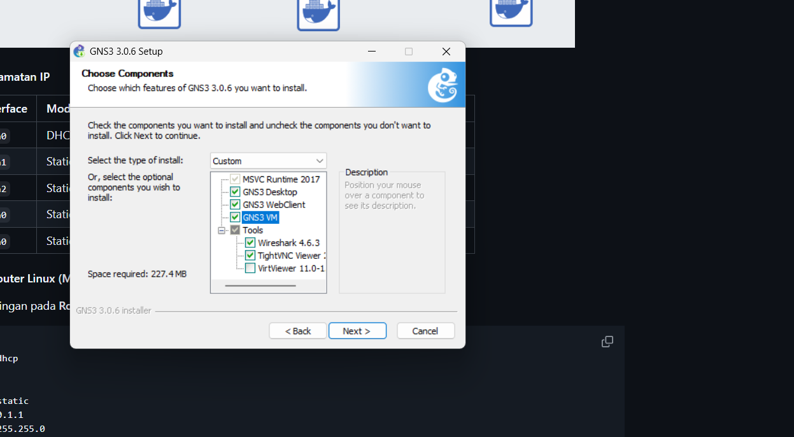

5. **Jika mencentang GNS3 VM**, wizard akan meminta jenis virtualisasi yang dipakai: VMware Workstation, VMware ESXi, VirtualBox, atau Hyper-V. Pilih salah satu lalu klik **Install** — installer akan mengunduh `VM.zip` yang sesuai ke folder Downloads kalian secara otomatis. File ini masih perlu di-*extract* dan di-*import* manual ke aplikasi virtualisasi pilihan kalian (langkah lengkapnya ada di bagian opsional "Menyiapkan GNS3 VM Sendiri" di bawah).

   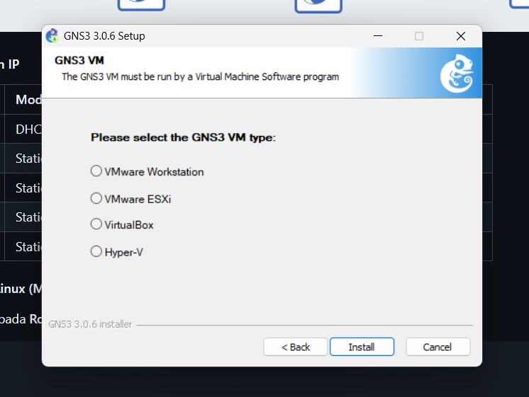

6. Pilih folder Start Menu, lalu klik **Next** hingga instalasi selesai. (Setelah ini juga ada ada panel lagi, pilih **No** aja.)

   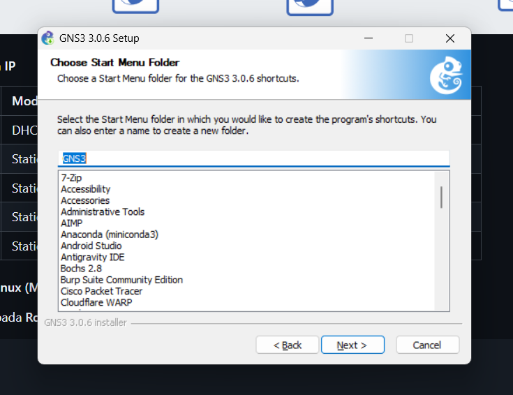

7. Klik **Finish**. Centang **Start GNS3** untuk langsung membuka aplikasinya.

   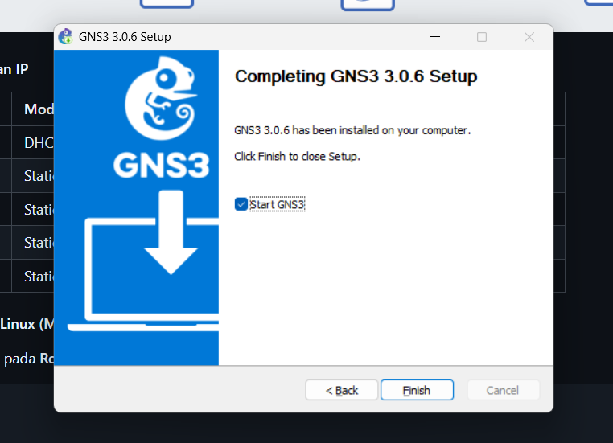

> **!PENTING!**

> **macOS**: Alur instalasi serupa lewat file `.dmg`. Video referensi setup GNS3 di macOS: [youtube.com/watch?v=7Hui9aDqX50](https://www.youtube.com/watch?v=7Hui9aDqX50).
>
> **iOS/iPadOS**: GNS3 juga menyediakan client resmi di App Store bagi yang ingin mengakses controller dari perangkat mobile.

---

Bagian di bawah ini (Opsi A dan Opsi B) hanya perlu diikuti jika kalian mencentang **GNS3 VM** pada langkah 5 di atas dan ingin meng-*host* controller sendiri. Jika kalian memakai controller bersama yang sudah disediakan asisten, langsung lanjut ke [bagian 2.4](#24-instalasi-dan-setup-gns3-client).

#### Opsi A: VirtualBox

1. Pastikan [VirtualBox](https://www.virtualbox.org/) sudah terpasang (atau instal versi terbaru jika belum).
2. Ekstrak `VM.zip` yang terunduh tadi hingga memperoleh file `.ova`. Di VirtualBox, klik **Import** pada toolbar, arahkan ke file `.ova` tersebut.

   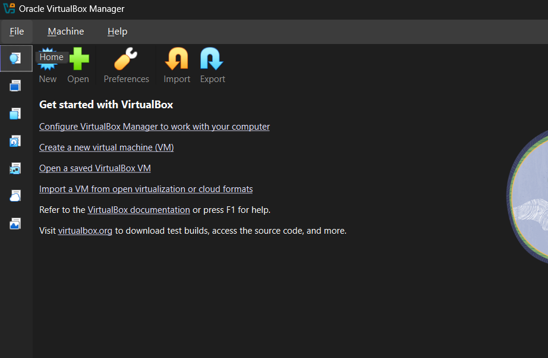

3. Buat host network adapter baru: **File -> Tools -> Network Manager -> Host-only Networks -> Create**. Atur IPv4 Address ke `192.168.56.1` dan Netmask `255.255.255.0`.

   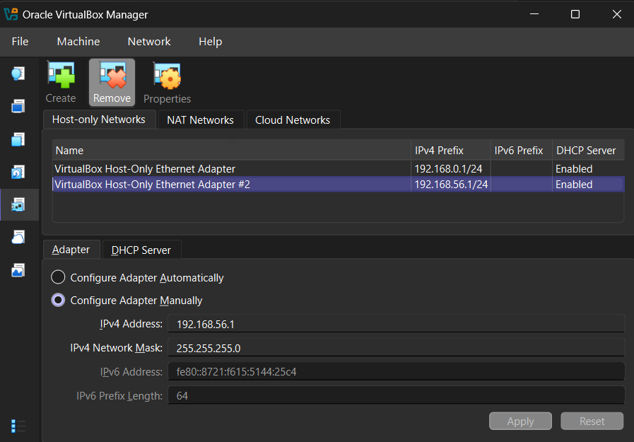

   > **Perhatikan nama adapternya, bukan hanya urutannya.** VirtualBox/Windows kadang menukar mana yang bernama "VirtualBox Host-Only Ethernet Adapter" polos dan mana yang "#2" setelah adapter di-disable/enable ulang. Yang harus dicocokkan adalah **angka IP-nya** (`192.168.56.x`), bukan nama adapternya.

4. Pada VM GNS3, buka **Settings -> Network** (mode Expert):
   - Adapter 1: **Attached to** = **Host-only Adapter**, **Name** = adapter yang IP-nya `192.168.56.x` (lihat catatan di atas).
   - Adapter 2: Pilih **NAT**.

   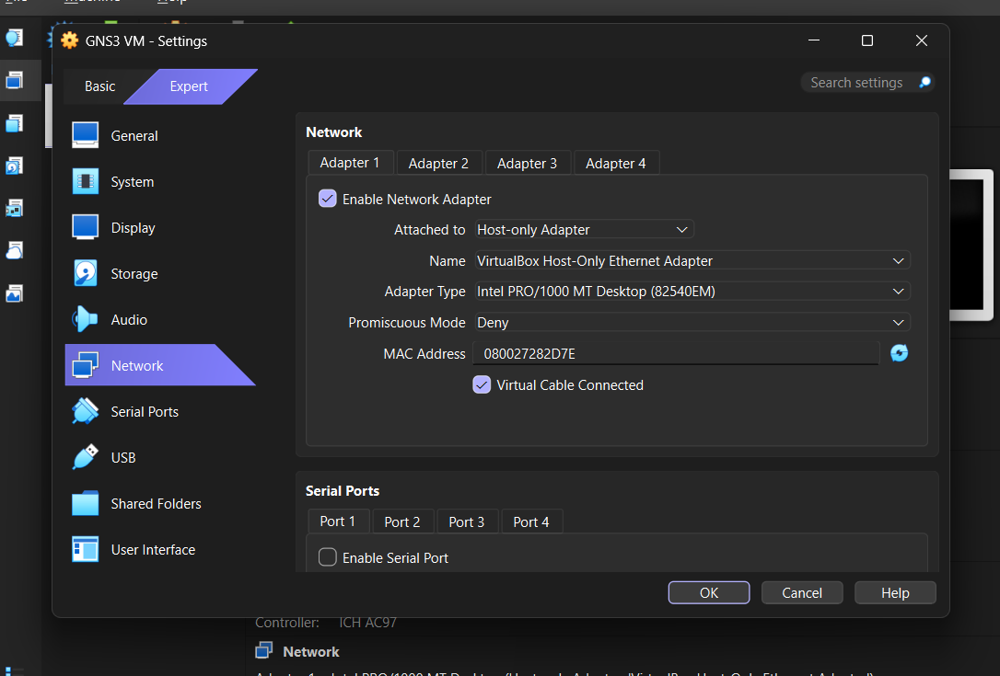

5. Jalankan VM. Layar konsol VM akan menampilkan alamat IP Web-UI, misalnya `http://192.168.56.101`.

   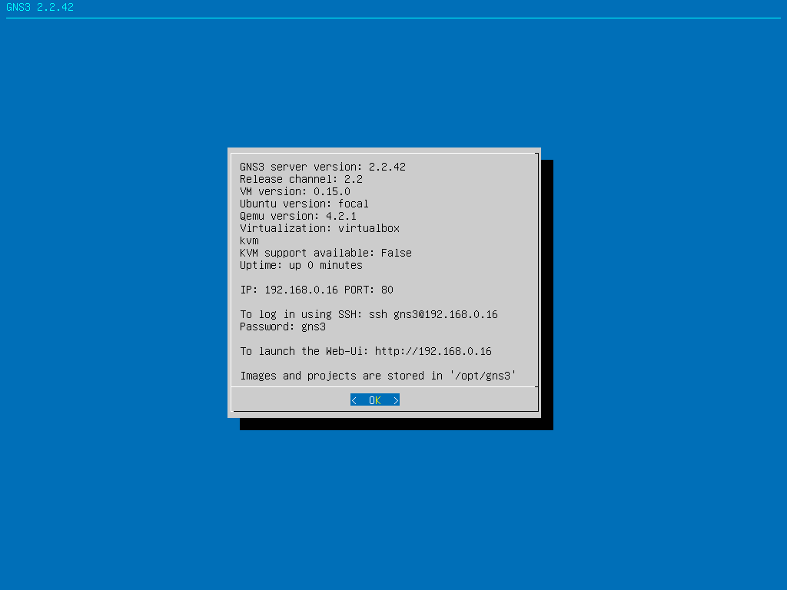

#### Opsi B: VMware Workstation Pro

VMware Workstation Pro kini **gratis untuk penggunaan personal dan edukasi**. Cukup mendaftar akun di Broadcom Support Portal tanpa memerlukan license key berbayar.

1. Unduh installer VMware Workstation Pro dari portal Broadcom dan pilih opsi *Personal Use*.
2. Ekstrak `VM.zip` (VMware Workstation) yang terunduh dari installer all-in-one tadi.
3. Di VMware: **File -> Open**, pilih file OVA/OVF, lalu beri nama VM.

   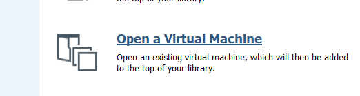

4. Masuk ke **Edit virtual machine settings**:
   - Pastikan Network Adapter 1 berada di **Host-only** (VMnet1) dan Adapter 2 di **NAT** (VMnet8).
   - Pada bagian **Processors**, pastikan opsi **Virtualize Intel VT-x/EPT or AMD-V/RVI** tercentang.

   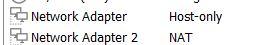

5. Jalankan VM hingga konsol menampilkan alamat IP Web-UI.

   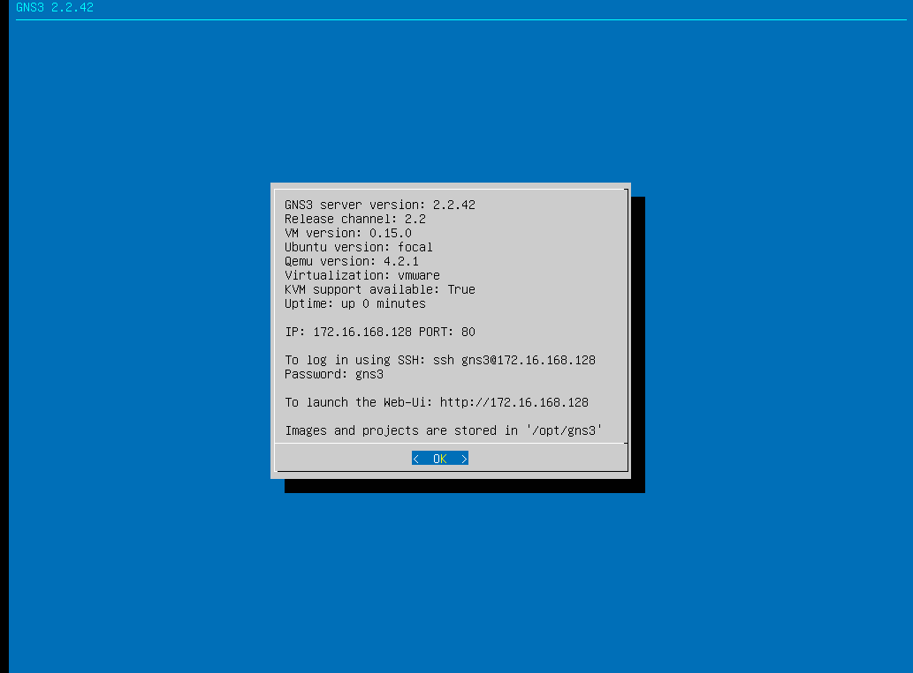

#### Troubleshooting Virtualisasi Hardware (VT-x, AMD-V, Hyper-V)
Jika muncul pesan error virtualisasi tidak didukung:
1. Pastikan fitur Intel VT-x atau AMD-V aktif di menu BIOS/UEFI komputer kalian.
2. Di Windows 11, nonaktifkan isolasi memori: **Windows Security -> Device Security -> Core Isolation -> Matikan Memory Integrity**.
3. Jika Hyper-V memblokir hypervisor pihak ketiga, jalankan perintah ini di PowerShell Administrator lalu reboot:
   ```
   bcdedit /set hypervisorlaunchtype off
   ```

---

### 2.3 Memasukkan Image Node ke GNS3

Ada dua jalur untuk mengatur template node: lewat GNS3 Desktop Client, atau langsung lewat browser (WebClient). Bagian ini biasanya dikerjakan oleh yang mengelola controller — kalau kalian memakai controller bersama yang templatenya sudah disiapkan asisten, boleh langsung lanjut ke [bagian 2.4](#24-instalasi-dan-setup-gns3-client) dan gunakan langsung template yang sudah ada.

**Lewat GNS3 Desktop Client**

1. Buka **Edit -> Preferences** (`Ctrl+Shift+P`).

   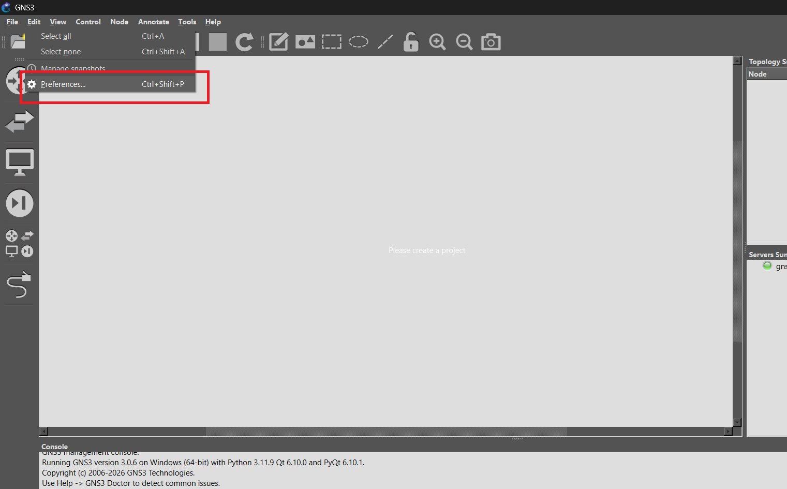

2. Di panel kiri, pilih **Docker -> Docker containers**. Template yang sudah ada akan terdaftar di sini.

   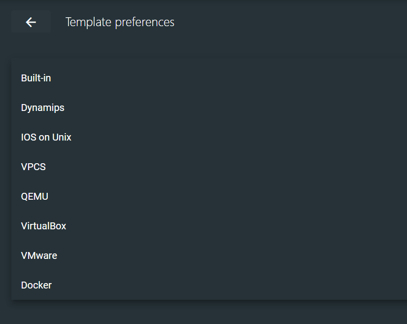

3. Klik **New** untuk membuat template baru, atau pilih salah satu template lalu lihat/ubah detailnya: nama template, nama image Docker, compute (server/VM tempat container dijalankan), jumlah network adapters, dan tipe konsol.

   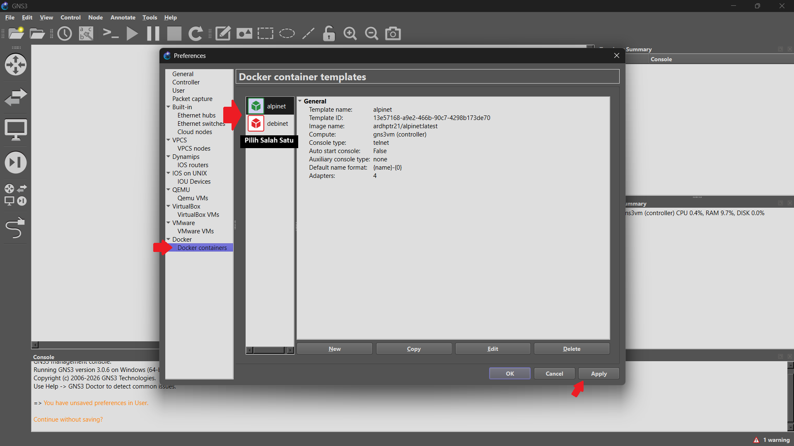

4. Isi nama image Docker <u>sesuai rekomendasi praktikum</u>:
   - `ardhptr21/alpinet:latest` (berbasis Alpine, ringan)
   - `ardhptr21/debinet:latest` (berbasis Debian, lebih lengkap)
   - Alternatif <u>image resmi</u> dari GNS3 (kalau image di atas sudah tidak ter-*maintain*): [`gns3/ipterm`](https://hub.docker.com/r/gns3/ipterm) — sudah terpasang `iproute2`, `ping`, `curl`, `traceroute`, `nano`.
5. Tentukan jumlah **Network adapters** sesuai kebutuhan topologi (isi **4** untuk node yang akan dipakai sebagai router agar memiliki interface eth0 hingga eth3).
6. Klik **Apply** lalu **OK**.

**Lewat GNS3 WebClient (browser)**

1. Buka menu hamburger (≡) di kiri atas, pilih **Template preferences** untuk melihat/mengedit template yang ada, atau **New template** untuk membuat baru.

   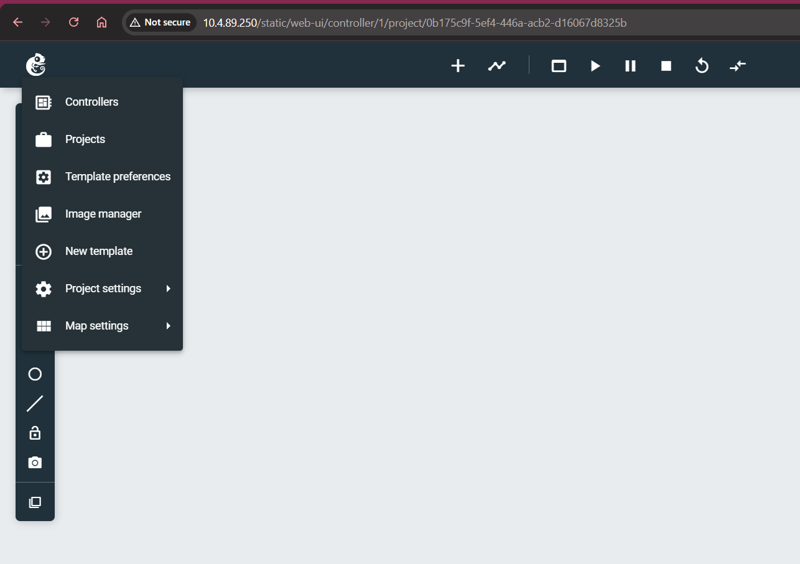

2. Ikuti wizard: pilih tipe **Docker**, isi nama image serta jumlah adapter pada panel **General settings / Advanced / Usage**, lalu klik **Save**.

   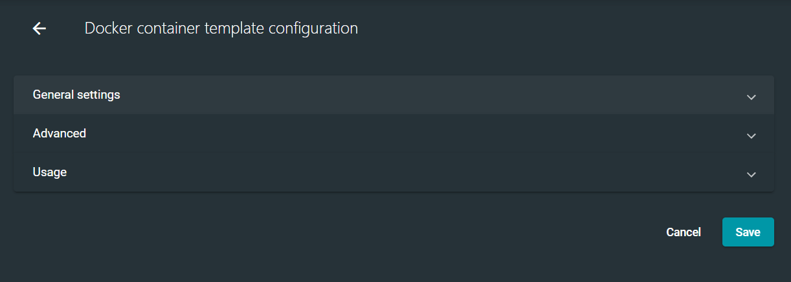

**Menguji Template**

1. Buat project baru (**File -> New blank project** di Desktop, atau **Add blank project** di WebClient — lihat [bagian 2.4](#24-instalasi-dan-setup-gns3-client)), lalu tarik node baru ke workspace.
   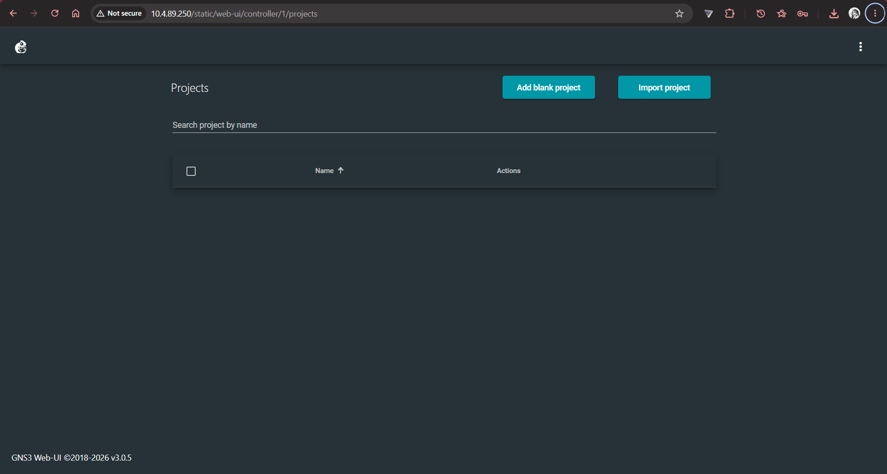

   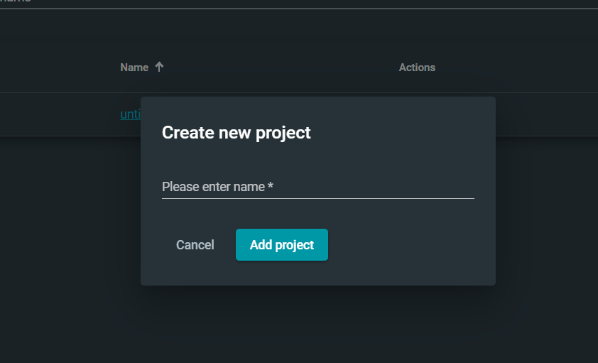

2. Klik kanan node lalu pilih **Start**. Akses konsol melalui **Web console**, atau terminal lokal via Telnet:
   
   ```
   telnet [IP_CONTROLLER] [Port_Node]
   ```
   Untuk keluar dari sesi Telnet, tekan shortcut `Ctrl + ]` lalu ketik `quit`.

   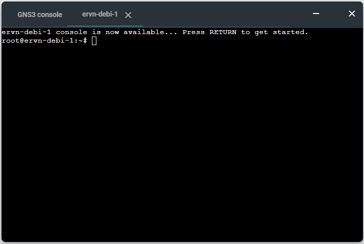

---

### 2.4 Instalasi dan Setup GNS3 Client

Setelah GNS3 Desktop terpasang (lihat [bagian 2.2](#22-instalasi-gns3)), client perlu dihubungkan ke sebuah controller — baik controller bersama yang disediakan asisten, maupun GNS3 VM milik sendiri.

1. Buka GNS3 Desktop, dari menu **Help -> Setup Wizard**.

   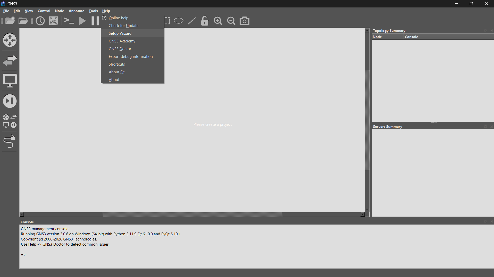

2. Pada langkah **Controller**, pilih **Connect to a remote controller** (opsi "Start and connect to a local controller" hanya tersedia di Linux), lalu klik **Next**.

   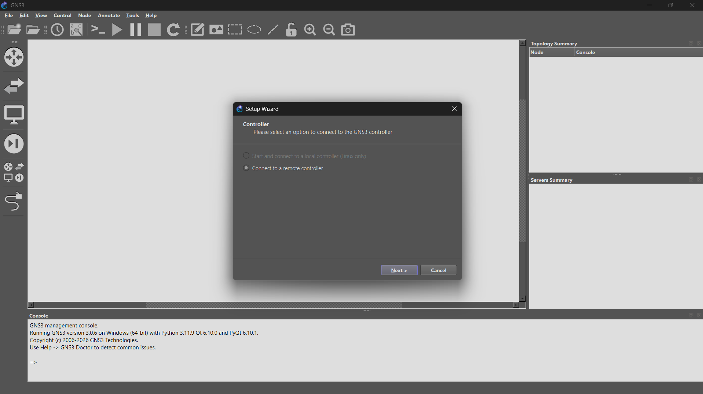

3. Isi form **Remote controller**:
   - **Protocol**: `HTTP`
   - **Host**: alamat IP controller sesuai kelompok kalian (lihat tabel di bawah)
   - **Port**: `80`
   - **Username** & **Password**: kredensial GNS3 yang diberikan asisten

   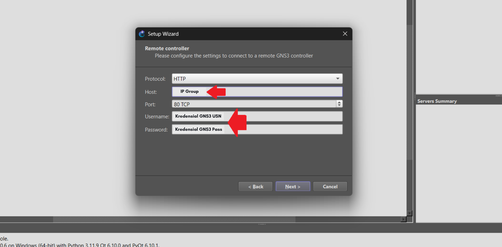

   | Kelompok | Host (IP Controller) |
   | :--- | :--- |
   | Group A | `10.4.89.246` |
   | Group B | `10.4.89.247` |
   | Group C | `10.4.89.250` |

4. Klik **Next** hingga selesai. Jika berhasil, panel **Servers Summary** di kanan bawah akan menampilkan controller dengan indikator hijau (terhubung).

> **Alternatif tanpa install client:** Karena GNS3 3.x berbasis web, kalian juga bisa langsung membuka alamat controller (`http://[Host]`) di browser tanpa perlu meng-install GNS3 Desktop sama sekali — cukup pastikan **GNS3 WebClient** tercentang saat instalasi (lihat [bagian 2.2](#22-instalasi-gns3)), atau akses langsung dari browser mana pun yang berada di jaringan yang sama.
>
> 
>
> Klik **Add blank project** untuk mulai membuat topologi:
>
> 

> **Catatan keamanan:** Secara default koneksi client ke controller menggunakan HTTP polos di port 80 — artinya kredensial yang dimasukkan bisa disadap dengan Wireshark, persis seperti kredensial FTP di [bagian 1.7.1](#171-ftp-file-transfer-protocol). Untuk lab yang dipakai bersama di jaringan yang tidak sepenuhnya terpercaya, aktifkan **HTTPS** pada pengaturan server GNS3.

---

### 2.5 Setup IP di Node

1. Pastikan node dalam kondisi berhenti (*Stop*). Klik kanan pada node, pilih **Configure**.
2. Pada tab **General settings**, klik tombol **Edit network configuration**.

   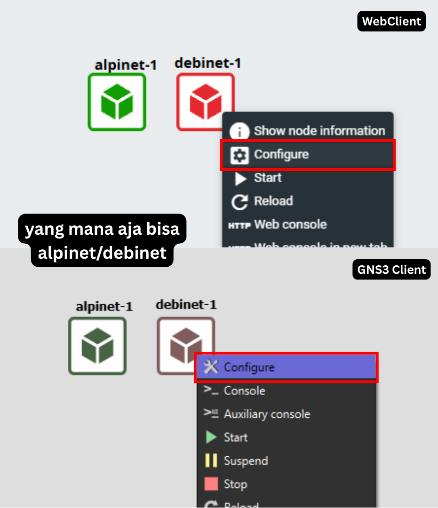

3. File konfigurasi `/etc/network/interfaces` akan terbuka untuk mengatur konfigurasi IP statis atau dinamis pada interface yang digunakan.

   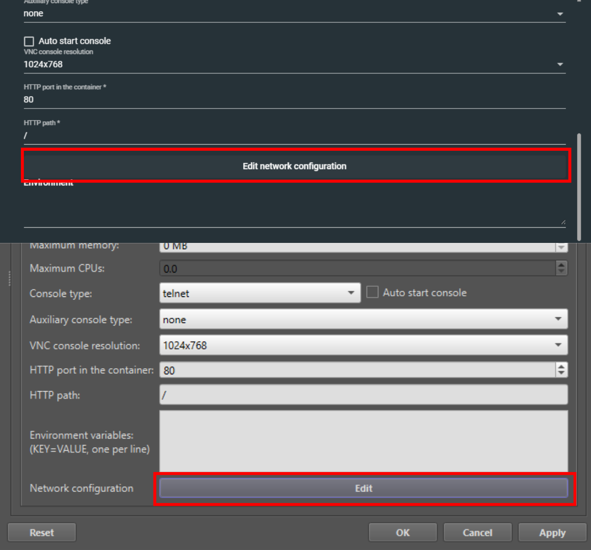
   
---

### 2.6 Akses Sebuah Node ke Internet

1. Tarik node bertuliskan **NAT** dari panel perangkat ke workspace.
2. Gunakan tool **Add a Link**, hubungkan interface **NAT0** pada node NAT menuju interface **eth0** pada node Linux kalian.

   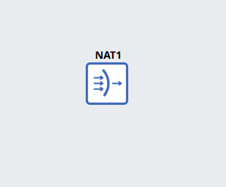

3. Konfigurasikan interface `eth0` node agar meminta IP otomatis lewat DHCP:
   ```
   auto eth0
   iface eth0 inet dhcp
      # up sysctl -w net.ipv4.ip_forward=1    
      # up iptables -t nat -A POSTROUTING -o eth0 -j MASQUERADE    <-- lihat kebawah kenapa butuh 2 ini
   ```
   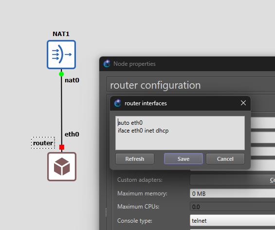
   
4. Jalankan node, buka konsol, lalu uji koneksi dengan perintah `ping -c 3 google.com` atau `ping -c 3 8.8.8.8`.

   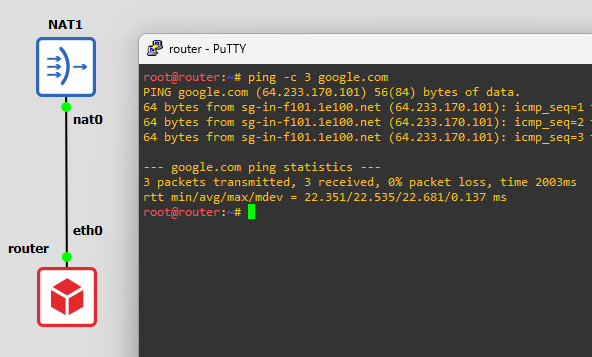

5. Ubah nama node menjadi `Router1` melalui klik kanan -> **Change hostname** atau dari panel `configure`, dan ubah simbolnya menjadi router melalui klik kanan -> **Change symbol** (Terserah kalian, tapi lebih rapih diganti.). Node ini siap digunakan sebagai router pada topologi berikutnya.

---

### 2.7 Membuat Topologi Terintegrasi

Tambahkan node **Ethernet switch** dan beberapa node Linux, hubungkan menggunakan kabel, dan beri nama setiap perangkat:

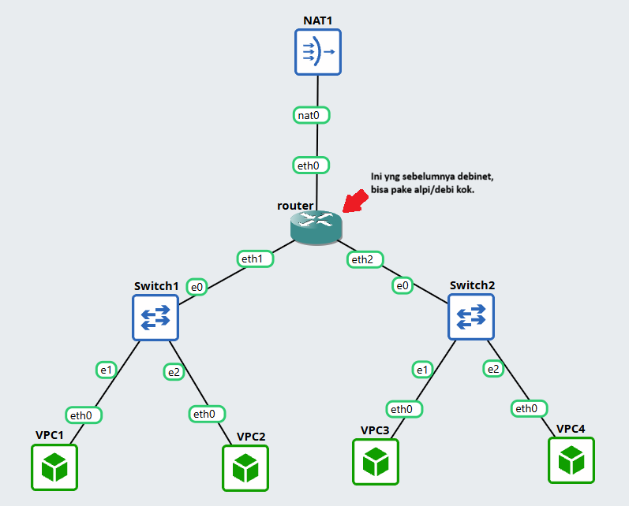

#### 2.7.1 Skema Pengalamatan IP

| Perangkat | Interface | Mode | IP Address | Netmask | Gateway | Fungsi |
| :--- | :--- | :--- | :--- | :--- | :--- | :--- |
| **Router1** | `eth0` | DHCP | Otomatis dari NAT | Sesuai NAT | Otomatis | WAN (Internet) |
| | `eth1` | Static | `10.10.1.1` | `255.255.255.0` | None | Gateway LAN 1 |
| | `eth2` | Static | `10.10.2.1` | `255.255.255.0` | None | Gateway LAN 2 |
| **Client1** | `eth0` | Static | `10.10.1.2` | `255.255.255.0` | `10.10.1.1` | Host di Subnet 1 |
| **Client2** | `eth0` | Static | `10.10.1.3` | `255.255.255.0` | `10.10.1.1` | Host di Subnet 1 |
| **Client3** | `eth0` | Static | `10.10.2.2` | `255.255.255.0` | `10.10.2.1` | Host di Subnet 2 |
| **Client4** | `eth0` | Static | `10.10.2.3` | `255.255.255.0` | `10.10.2.1` | Host di Subnet 2 |

#### 2.7.2 Konfigurasi Router Linux (Multi-Homed)
Buka konfigurasi jaringan pada **Router**:
```
auto eth0
iface eth0 inet dhcp

auto eth1
iface eth1 inet static
    address 10.10.1.1
    netmask 255.255.255.0

auto eth2
iface eth2 inet static
    address 10.10.2.1
    netmask 255.255.255.0
```

<u>Konfigurasi pada **Switch 1**:</u>
- **Client1**
```
auto eth0
iface eth0 inet static
    address 10.10.1.2
    netmask 255.255.255.0
    gateway 10.10.1.1
```
- **Client2**
```
auto eth0
iface eth0 inet static
    address 10.10.1.3     # Perhatikan angkanya.
    netmask 255.255.255.0
    gateway 10.10.1.1
```
<u>Konfigurasi pada **Switch 2**:</u>
- **Client1**
```
auto eth0
iface eth0 inet static
    address 10.10.2.2
    netmask 255.255.255.0
    gateway 10.10.2.1
```
- **Client1**
```
auto eth0
iface eth0 inet static
    address 10.10.2.3
    netmask 255.255.255.0
    gateway 10.10.2.1
```

#### 2.7.3 Mengaktifkan Kernel IP Forwarding
Sistem operasi Linux secara default menonaktifkan penerusan paket antar-interface. Tanpa pengaturan ini, paket dari LAN 1 tidak akan pernah bisa melompat ke interface internet `eth0`.

Nyalakan router, buka konsol, lalu jalankan:
``` 
sysctl -w net.ipv4.ip_forward=1
```
Pastikan nilainya bernilai 1 dengan mengecek `cat /proc/sys/net/ipv4/ip_forward`.

#### 2.7.4 Konfigurasi Source NAT (iptables MASQUERADE)
Karena alamat `10.10.1.0/24` dan `10.10.2.0/24` adalah IP Private, router harus menyamarkan alamat sumber paket menjadi IP milik `eth0` saat paket keluar menuju internet:
``` 
iptables -t nat -A POSTROUTING -o eth0 -j MASQUERADE
iptables -A FORWARD -i eth1 -o eth0 -j ACCEPT
iptables -A FORWARD -i eth2 -o eth0 -j ACCEPT
iptables -A FORWARD -i eth0 -m state --state ESTABLISHED,RELATED -j ACCEPT
```

> **Tips Persistensi Router:** Karena container Docker bersifat ephemeral, kalian dapat menyisipkan perintah ini langsung ke konfigurasi interface `eth0` router (`/etc/network/interfaces`) menggunakan baris awalan `up` agar otomatis dimuat setiap kali node dinyalakan ulang:
> ```
> auto eth0
> iface eth0 inet dhcp
>     up sysctl -w net.ipv4.ip_forward=1
>     up iptables -t nat -A POSTROUTING -o eth0 -j MASQUERADE
> ```

#### 2.7.5 Konfigurasi Client dan DNS Resolver
Nyalakan Client1 dan Client2. Buka konsol masing-masing lalu tambahkan DNS resolver:
``` 
echo "nameserver 8.8.8.8" > /etc/resolv.conf
```

#### 2.7.6 Verifikasi Konektivitas End-to-End
1. Cek konfigurasi IP pada setiap node dengan perintah `ip a`:
2. Uji ping dari Client1 ke gateway: `ping -c 2 10.10.1.1`.

   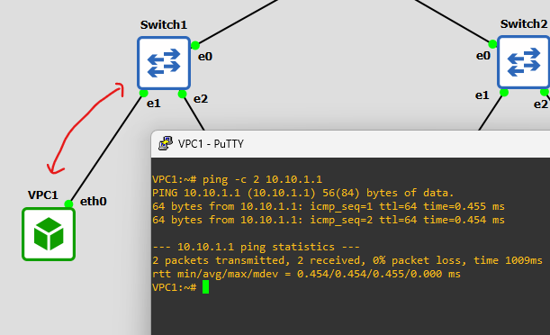

3. Uji routing antar-subnet dari Client1 ke Client2: `ping -c 2 10.10.2.2`.

   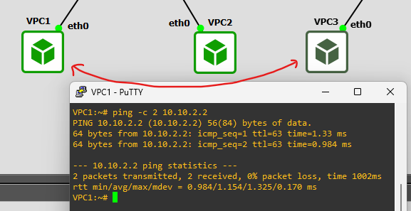

4. Uji akses internet publik dari Client1 dan Client2: `ping -c 2 8.8.8.8` dan `ping -c 2 google.com`.

   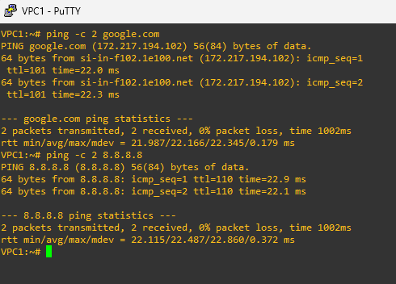

---

### 2.8 Tips, Trik, dan Troubleshooting

- File dan aplikasi yang diinstal di dalam root filesystem container Docker bersifat **ephemeral** (hilang saat node dihapus). Hanya direktori `/root` yang dipertahankan secara persisten oleh image seperti `gns3/ipterm` sehingga direkomendasikan menyimpan seluruh skrip otomasi konfigurasi penting ke dalam folder `/root`.
- Perintah yang ingin dijalankan otomatis setiap kali membuka konsol dapat dimasukkan ke bagian bawah file `/root/.bashrc` biasanya terkait:
   ```
   apt update && apt install -y iptables
   iptables -t nat -A POSTROUTING -o eth0 -j MASQUERADE -s 192.216.0.0/16
   echo "nameserver 192.168.122.1" > /etc/resolv.conf
   ```
   > seperti yang telah dikonfigurasikan diatas.
- Perintah startup jaringan juga dapat dimasukkan langsung ke file `/etc/network/interfaces` menggunakan baris awalan `up`:
  ```
  auto eth0
  iface eth0 inet dhcp
      up sysctl -w net.ipv4.ip_forward=1
      up iptables -t nat -A POSTROUTING -o eth0 -j MASQUERADE
  ```
- Ekspor project untuk tugas tim menggunakan menu **File -> Export portable project** (`.gns3project`).
- Jika simulasi tiba-tiba mengalami error komunikasi socket, lakukan restart pada GNS3 VM.

---

## 3. Menghubungkan Wireshark dengan GNS3

### 3.1 Capture Langsung dari Link Topologi

GNS3 memungkinkan penyadapan link virtual secara real-time langsung ke Wireshark:

1. Pada topologi yang sedang berjalan, klik kanan pada kabel link yang ingin diamati, lalu pilih **Start capture**.

2. Centang opsi **Start the capture visualization program**, lalu klik **OK**. Wireshark akan terbuka otomatis menampilkan lalu lintas data yang melintasi link tersebut secara langsung.

3. Untuk menghentikan proses sadap, klik kanan kabel yang sama lalu pilih **Stop capture**. Simpan data melalui **File -> Save** di Wireshark jika diperlukan.

> Pastikan `Preferences` network capture kalian terhubung dengan wireshark kalian --> lihat di edit -> Preferences -> Packet Capture

---

### 3.2 Capture di Dalam Node dengan tcpdump dan TShark

Untuk menangkap paket langsung dari sudut pandang internal node tanpa GUI:

**Menggunakan tcpdump**
``` 
# Menangkap 10 paket pertama pada eth0
tcpdump -i eth0 -n -c 10

# Menyimpan paket ke file pcap di folder persisten
tcpdump -i eth0 -s 0 -w /root/hasil-capture.pcap
```

**Menggunakan TShark**
``` 
tshark -i eth0 -w /root/hasil-capture.pcap
```
Hentikan capture dengan `Ctrl + C`. File `.pcap` dapat dibaca kembali di terminal menggunakan `tshark -r /root/hasil-capture.pcap` atau disalin ke komputer host untuk dibuka pada Wireshark GUI.

---

### 3.3 Contoh Skenario Analisis: Verifikasi SNAT dan ARP

- **Analisis ARP Sebelum ICMP**: Capture link antara dua node yang baru pertama kali berkomunikasi. Saat perintah `ping` dijalankan, amati paket ARP Request (broadcast) dan ARP Reply (unicast) yang mendahului paket ICMP Echo Request pertama.
- **Verifikasi Source NAT**: Pasang live capture pada link internal (`eth1`) dan link eksternal router (`eth0`) secara bersamaan. Saat client melakukan ping ke internet (`8.8.8.8`), perhatikan perubahan IP sumber pada paket sebelum melewati router (`10.10.1.2`) dan setelah melewati router (berganti menjadi IP DHCP `eth0` router).

---

## 4. Latihan

1. **Analisis ARP & ICMP:** Bangun topologi sederhana (2 node + 1 switch) di GNS3. Lakukan capture pada link, kirim `ping` antar-node dan juga ke google (8.8.8.8), lalu identifikasi protokol dan opcode yang muncul sebelum balasan ping pertama diterima.

2. **Capture Filter:** Terapkan capture filter di Wireshark (bukan menu Packet Filters pada link GNS3) yang hanya menangkap lalu lintas data dari salah satu IP node. Tuliskan sintaks filter yang digunakan.
  
3. **Inspeksi FTP Plaintext:** Rekam proses login dan pengiriman berkas ke server FTP menggunakan Wireshark, lalu tunjukkan paket plaintext yang memuat username dan password.

---

## 5. Troubleshooting Common Pitfalls

| Masalah | Penyebab Utama | Solusi |
| :--- | :--- | :--- |
| **Server GNS3 VM berwarna abu-abu / Disconnected** | Perubahan alamat IP adapter atau pemblokiran firewall | Cek IP pada konsol VM dan sesuaikan di Preferences GNS3 Client. Izinkan port 80 (atau port HTTPS yang dipakai) pada firewall. |
| **Client gagal ping ke gateway router** | Kesalahan penulisan netmask atau interface tertukar | Jalankan `ip a` di router dan client untuk memastikan interface fisik sesuai dengan konfigurasi file `/etc/network/interfaces`. |
| **Client bisa ping gateway tapi gagal ping ke 8.8.8.8** | IP forwarding belum aktif di kernel atau rule iptables belum disetel | Jalankan `sysctl -w net.ipv4.ip_forward=1` di router dan pasang rule `iptables -t nat -A POSTROUTING -o eth0 -j MASQUERADE`. |
| **Bisa ping IP publik tapi gagal ping nama domain** | File resolver DNS belum dikonfigurasi | Tambahkan DNS server ke `/etc/resolv.conf` client dengan perintah `echo "nameserver 8.8.8.8" > /etc/resolv.conf`. |
| **Paket tidak muncul saat Start Capture** | Driver Npcap bermasalah atau hak akses ubridge | Restart service Npcap pada Windows (`net stop npcap && net start npcap`), atau atur capability ubridge di Linux. |

---

## 6. Referensi

- [Dokumentasi Resmi Wireshark](https://www.wireshark.org/docs/wsug_html_chunked/)
- [Wireshark Capture Filter BPF Reference](https://www.wireshark.org/docs/wsug_html_chunked/ChCapCaptureFilterSection.html)
- [Wireshark Display Filter Reference](https://www.wireshark.org/docs/wsug_html_chunked/ChWorkBuildDisplayFilterSection.html)
- [Dokumentasi Inti GNS3](https://docs.gns3.com/)
- [Halaman Rilis GNS3 (GitHub)](https://github.com/GNS3/gns3-gui/releases)
- [Video Setup GNS3 di macOS](https://www.youtube.com/watch?v=7Hui9aDqX50)
- [Broadcom Support Portal untuk Unduhan VMware Workstation Pro](https://knowledge.broadcom.com/external/article/368667/download-and-license-vmware-desktop-hype.html)
- [Mailpit — SMTP Testing Tool](https://github.com/axllent/mailpit)
- [RFC 5321: Simple Mail Transfer Protocol](https://datatracker.ietf.org/doc/html/rfc5321)
- [RFC 2616 / RFC 9110: Hypertext Transfer Protocol](https://datatracker.ietf.org/doc/html/rfc9110)
- [RFC 792: Internet Control Message Protocol](https://datatracker.ietf.org/doc/html/rfc792)
- [RFC 793: Transmission Control Protocol](https://datatracker.ietf.org/doc/html/rfc793)
- [RFC 959: File Transfer Protocol](https://datatracker.ietf.org/doc/html/rfc959)
- [Dokumentasi Netfilter dan iptables Linux](https://netfilter.org/documentation/)
