# Modul 1

## Modul Wireshark & Setup GNS3

## Daftar Isi
- [Modul 1](#modul-1)
  - [Modul Wireshark \& Setup GNS3](#modul-wireshark--setup-gns3)
  - [Daftar Isi](#daftar-isi)
  - [0. Pendahuluan](#0-pendahuluan)
  - [1. Wireshark](#1-wireshark)
    - [1.1 Struktur Paket Jaringan](#11-struktur-paket-jaringan)
    - [1.2 Instalasi](#12-instalasi)
    - [1.3 Filter](#13-filter)
      - [1.3.1 Capture Filter](#131-capture-filter)
      - [1.3.2 Display Filter](#132-display-filter)
    - [1.4 Melihat Ringkasan Trafik (Statistics)](#14-melihat-ringkasan-trafik-statistics)
    - [1.5 Export Data Hasil Packet Capture](#15-export-data-hasil-packet-capture)
    - [1.6 Menangkap dan Mendekripsi Trafik HTTPS/TLS](#16-menangkap-dan-mendekripsi-trafik-httpstls)
    - [1.7 Studi Kasus: Memantau Trafik FTP](#17-studi-kasus-memantau-trafik-ftp)
      - [1.7.1 Menyiapkan Server (FileZilla Server)](#171-menyiapkan-server-filezilla-server)
      - [1.7.2 Koneksi dari Client](#172-koneksi-dari-client)
      - [1.7.3 Upload dan Download](#173-upload-dan-download)
  - [2. GNS3](#2-gns3)
    - [2.1 Apa itu GNS3?](#21-apa-itu-gns3)
    - [2.2 Instalasi GNS3 VM](#22-instalasi-gns3-vm)
    - [2.3 Memasukkan Image Node ke GNS3](#23-memasukkan-image-node-ke-gns3)
    - [2.4 Instalasi dan Setup GNS3 Client](#24-instalasi-dan-setup-gns3-client)
  - [2.5 Setup IP di Node](#25-setup-ip-di-node)
  - [2.6 Akses Sebuah Node ke Internet](#26-akses-sebuah-node-ke-internet)
  - [2.7 Membuat Topologi](#27-membuat-topologi)
  - [2.8 Ketentuan, Tips, Trik, dan Troubleshooting](#28-ketentuan-tips-trik-dan-troubleshooting)
  - [3. Menghubungkan Wireshark dengan GNS3](#3-menghubungkan-wireshark-dengan-gns3)
    - [3.1 Capture Langsung dari Link Topologi](#31-capture-langsung-dari-link-topologi)
    - [3.2 Capture di Dalam Node dengan TShark](#32-capture-di-dalam-node-dengan-tshark)
    - [3.3 Contoh Skenario Analisis](#33-contoh-skenario-analisis)
  - [4. Latihan](#4-latihan)
  - [5. Referensi](#5-referensi)

## 0. Pendahuluan

GNS3 dan Wireshark adalah dua alat yang saling melengkapi. **GNS3** mensimulasikan topologi jaringan (router, switch, host) tanpa perlu perangkat fisik, sedangkan **Wireshark** menangkap dan membedah paket yang lewat di jaringan tersebut. Modul ini membahas instalasi dan penggunaan keduanya, sekaligus bagaimana memakainya bersama-sama untuk melihat langsung apa yang sebenarnya terjadi di dalam sebuah topologi simulasi.

> **Catatan versi:** Perangkat lunak di modul ini (Wireshark, GNS3, VirtualBox, VMware Workstation, FileZilla) dirilis cukup sering. Nomor versi yang disebut adalah versi saat modul ini ditulis — selalu unduh versi terbaru dari halaman resmi masing-masing, bukan dari tautan versi lama yang sudah usang.

## 1. Wireshark

Wireshark adalah aplikasi penganalisa paket jaringan (*network packet analyzer*). Aplikasi ini menangkap paket yang lewat di sebuah interface jaringan dan menampilkan isinya sedetail mungkin, mulai dari alamat pengirim/tujuan sampai isi data yang dibawa.

### 1.1 Struktur Paket Jaringan

Sebuah paket jaringan terdiri dari tiga bagian utama:

**1. Header** — berisi alamat dan data kontrol lain yang dibawa paket:

| Instruksi | Keterangan |
|--|---|
| Panjang paket | Beberapa jaringan punya panjang paket baku (*fixed-length*), yang lain bergantung pada header untuk menyimpan informasi ini |
| Sinkronisasi | Bit yang membantu paket mencocokkan jaringan yang dituju |
| Nomor paket | Menunjukkan urutan dari total paket yang ada |
| Protokol | Menunjukkan jenis data yang dibawa: e-mail, halaman web, dsb |
| Alamat tujuan | Ke mana paket dikirim |
| Alamat asal | Dari mana paket dikirim |

**2. Payload** — disebut juga *body* dari paket, berisi data yang sebenarnya ingin dikirim.

**3. Trailer** — kadang disebut *footer*, biasanya berisi bit penanda bahwa paket sudah mencapai ujungnya, dan bisa memuat *error checking*.

### 1.2 Instalasi

**Windows / macOS**
Unduh installer dari [wireshark.org/download.html](https://www.wireshark.org/download.html). Selalu ambil rilis stabil terbaru (saat modul ini ditulis, jalur stabilnya ada di seri 4.6.x/4.4.x). Installer Windows sudah menyertakan **Npcap** sebagai driver capture — ini pengganti WinPcap yang sudah tidak dikembangkan lagi, jadi tidak perlu instalasi terpisah.

**Linux**
Install lewat package manager, misalnya:
```
sudo apt install wireshark
```
Saat instalasi, akan muncul pertanyaan apakah user non-root boleh melakukan capture. Pilih **Yes**, lalu tambahkan user ke group `wireshark`:
```
sudo usermod -aG wireshark $USER
```
Setelah itu logout/login ulang agar tidak perlu menjalankan Wireshark sebagai `root` setiap saat.

Jalankan Wireshark, pilih interface yang ingin di-*capture*, berikut tampilan awalnya:


<!-- FOTO BARU: tampilan awal Wireshark versi terbaru saat memilih interface -->

**TShark**
Satu paket instalasi Wireshark juga menyertakan **TShark**, versi command-line dari Wireshark. TShark berguna untuk capture di lingkungan tanpa GUI (server, atau — relevan untuk modul ini — node GNS3 yang berupa container Linux). Dibahas lebih lanjut di [bagian 3.2](#32-capture-di-dalam-node-dengan-tshark).

### 1.3 Filter

Wireshark punya 2 jenis filter: **Capture Filter** dan **Display Filter**.

#### 1.3.1 Capture Filter


<!-- FOTO BARU: kotak input capture filter di layar awal Wireshark -->

- **Definisi**: memilah paket yang akan ditangkap. Paket yang tidak memenuhi kriteria dibiarkan lewat tanpa ditangkap sama sekali.
- Sintaks filter terdiri dari satu atau lebih **primitive**, yang biasanya terdiri dari **id** (angka atau nama) didahului satu atau lebih **qualifier**. Dalam satu primitive tidak boleh ada 2 qualifier sejenis.

| Qualifier | Keterangan | Contoh |
|--|--|--|
| type | Jenis id/nama yang menjadi nilai filter | host, net, port, portrange |
| dir | Arah dari id | src, dst, dsb |
| proto | Protokol dari id | tcp, udp, dsb |

Sintaks bisa memuat operator, tanda kurung, negasi (`!` / `not`), dan konjungsi (`&&` / `and` atau `||` / `or`).

| Filter expression | Keterangan |
|--|--|
| `host 10.151.36.1` | Menangkap semua paket dari/ke alamat 10.151.36.1 |
| `src host 10.151.36.1` | Menangkap semua paket yang berasal dari 10.151.36.1 |
| `net 192.168.0.0/24` | Menangkap semua paket dari/ke subnet 192.168.0.0/24 |
| `udp port 80` | Menangkap paket UDP dari/ke port 80 |
| `tcp src port 22 or host 10.151.36.30` | Paket TCP dari port 22, atau paket apa pun dari/ke 10.151.36.30 |

Contoh capture filter `host 10.151.36.1`:


<!-- FOTO BARU: hasil capture dengan filter host 10.151.36.1 -->

#### 1.3.2 Display Filter


<!-- FOTO BARU: kotak input display filter di atas daftar paket -->

- **Definisi**: memilah paket yang **ditampilkan** dari kumpulan paket yang sudah tertangkap (tidak membuang paket, hanya menyembunyikan dari tampilan).
- Sintaks umum: `[protokol] [field] [comparison operator] [value]`

| English | Operator | Indonesia |
|---|---|---|
| eq | == | Sama dengan |
| ne | != | Tidak sama dengan |
| gt | > | Lebih besar dari |
| lt | < | Lebih kecil dari |
| ge | >= | Lebih besar atau sama dengan |
| le | <= | Lebih kecil atau sama dengan |
| contains | | Mengandung nilai tertentu |
| matches | ~ | Cocok dengan *regular expression* |
| bitwise_and | & | Membandingkan nilai bit |

Beberapa filter bisa digabung dengan **logical operator**: `and`/`&&`, `or`, `xor`/`^^`, `not`/`!`, `[...]` (substring), `in` (membership).

| Filter expression | Keterangan |
|--|--|
| `tcp.port == 443` | Semua paket TCP dari/ke port 443 |
| `ip.src == 192.168.0.1 or ip.dst == 192.168.0.1` | Paket dari/ke 192.168.0.1 |
| `http.request.uri contains "login"` | Paket HTTP yang URI-nya mengandung "login" |
| `quic` | Paket QUIC (protokol dasar HTTP/3 — makin banyak dipakai situs modern menggantikan TCP+TLS klasik) |

Contoh display filter `tcp.port == 80`:


<!-- FOTO BARU: hasil display filter tcp.port == 80 -->

### 1.4 Melihat Ringkasan Trafik (Statistics)

Selain memfilter paket satu per satu, menu **Statistics** membantu membaca pola trafik secara keseluruhan — berguna saat capture berisi ratusan/ribuan paket dan kalian perlu gambaran cepat sebelum menyelam ke detail.

- **Statistics → Protocol Hierarchy**: menampilkan persentase dan jumlah byte per protokol dalam capture. Cocok untuk cek cepat "trafik ini didominasi protokol apa?"

  
  <!-- FOTO BARU: jendela Statistics > Protocol Hierarchy -->

- **Statistics → Conversations**: menampilkan daftar pasangan host/port yang saling berkomunikasi beserta total data yang dipertukarkan. Berguna melacak host mana yang paling "ramai" trafiknya.

  
  <!-- FOTO BARU: jendela Statistics > Conversations -->

- **Statistics → I/O Graph**: grafik volume trafik terhadap waktu. Berguna untuk melihat lonjakan trafik atau pola yang tidak wajar.

### 1.5 Export Data Hasil Packet Capture

1. Setelah punya hasil capture, pilih **File → Export Objects → (protokol yang diinginkan)**. Contoh: HTTP.

   
   <!-- FOTO BARU: menu File > Export Objects > HTTP -->

2. Pilih objek yang ingin di-export (misal gambar dari sebuah situs), klik **Save**, beri nama file dan lokasi penyimpanan.

   
   <!-- FOTO BARU: jendela pemilihan objek untuk di-export -->

3. File berhasil diekspor ke lokasi yang dipilih.

### 1.6 Menangkap dan Mendekripsi Trafik HTTPS/TLS

Contoh HTTP polos di atas makin jarang ditemui di internet nyata karena hampir semua situs sekarang memakai **HTTPS**. Wireshark tetap bisa menangkap paketnya, tapi payload-nya akan terlihat sebagai `Application Data` yang terenkripsi. Untuk keperluan belajar (bukan menyadap trafik orang lain), kalian bisa mendekripsi trafik HTTPS **milik sendiri** menggunakan mekanisme `SSLKEYLOGFILE` yang didukung Chrome, Firefox, curl, dan Wireshark.

Caranya:

1. Tentukan lokasi file log kunci, lalu set sebagai environment variable **sebelum** membuka browser.
   - Windows (Command Prompt):
     ```
     set SSLKEYLOGFILE=C:\tls-keys.log
     ```
   - Linux/macOS:
     ```
     export SSLKEYLOGFILE=~/tls-keys.log
     ```
2. Dari terminal yang sama, jalankan browser (Chrome/Firefox). Setiap sesi TLS yang dibuka browser akan menambah baris baru ke file log tersebut.
3. Mulai capture di Wireshark pada interface yang relevan, lalu buka situs HTTPS apa saja (mis. `https://example.com`).
4. Di Wireshark: **Edit → Preferences → Protocols → TLS**, isi kolom **(Pre)-Master-Secret log filename** dengan path file log tadi.

   
   <!-- FOTO BARU: jendela Preferences > Protocols > TLS dengan kolom key log filename terisi -->

5. Terapkan display filter `tls` — paket yang tadinya `Application Data` sekarang bisa dibuka isinya (biasanya berupa HTTP/2 di dalamnya).

   
   <!-- FOTO BARU: paket TLS yang sudah terdekripsi, terlihat isi HTTP/2 di dalamnya -->

> **Catatan keamanan**: file key log ini sensitif — siapa pun yang memegangnya bisa mendekripsi seluruh sesi TLS terkait. Jangan pernah membagikan file ini, dan hapus setelah selesai praktikum.

### 1.7 Studi Kasus: Memantau Trafik FTP

FTP tetap relevan untuk dipelajari justru *karena* protokolnya tidak terenkripsi — cocok untuk melihat langsung bagaimana kredensial dan perintah dikirim dalam bentuk plaintext.

Jalankan Wireshark terlebih dahulu sebelum connect ke server FTP.

#### 1.7.1 Menyiapkan Server (FileZilla Server)

FileZilla Server sekarang berarsitektur client-server: ada **service** yang berjalan di background, dan **Administration Interface** terpisah yang connect ke service tersebut (beda dari versi lama yang menyatu dalam satu jendela).

1. Install FileZilla Server dari [filezilla-project.org](https://filezilla-project.org/download.php?type=server). Saat instalasi, kalian akan diminta menentukan port Administration Interface dan **password admin** (wajib diisi di versi sekarang).
2. Buka **FileZilla Server Interface**, masukkan alamat `127.0.0.1` dan password admin yang tadi dibuat untuk connect ke service.

   
   <!-- FOTO BARU: jendela Administration Interface saat connect ke service -->

3. Buka **Server → Configure** (atau `Ctrl+F`), masuk ke halaman **Users**. Klik **Add**, isi nama user, pilih **Require a password to log in**, dan isi passwordnya.

   
   <!-- FOTO BARU: halaman Users, menambah user baru dengan password -->

4. Pada user yang sama, tambahkan **Mount Point**: isi *Virtual path* (misal `/`) dan *Native path* (folder asli di komputer, misal `D:\ftp_share`). Centang **Writable** jika user boleh mengunggah file.

   
   <!-- FOTO BARU: konfigurasi mount point virtual path dan native path -->

5. Klik **OK**/**Apply**. Server FTP siap dipakai.

#### 1.7.2 Koneksi dari Client

**Menggunakan FileZilla Client**
Buka FileZilla, masukkan *Host*, *Username*, *Password*, *Port* server tujuan, lalu klik **Quickconnect**.


<!-- FOTO BARU: FileZilla Client melakukan Quickconnect -->

**Menggunakan command Linux**
```
$ ftp [Host IP]
```
Masukkan username dan password, lalu gunakan seperti CLI biasa.

Pada capture Wireshark akan terlihat:


<!-- FOTO BARU: capture menampilkan command USER dan PASS -->

| Perintah | Keterangan |
|---|---|
| USER | Username untuk login ke FTP server |
| PASS | Password untuk login ke FTP server |

#### 1.7.3 Upload dan Download

**Upload** — drag file dari *Local site* ke *Remote site* di FileZilla Client, atau `put [path file]` di Linux CLI. Command yang terlihat di capture: `STOR`.


<!-- FOTO BARU: capture menampilkan command STOR -->

**Download** — drag file dari *Remote site* ke *Local site*, atau `get [nama file]` di Linux CLI. Command yang terlihat di capture: `RETR`.


<!-- FOTO BARU: capture menampilkan command RETR -->

## 2. GNS3

### 2.1 Apa itu GNS3?

**GNS3 (Graphical Network Simulator-3)** adalah alat yang membantu menjalankan simulasi topologi jaringan, mulai dari topologi kecil di satu komputer sampai topologi besar yang di-hosting di beberapa server.

### 2.2 Instalasi GNS3 VM

GNS3 versi saat ini (seri 3.0.x ke atas) menggunakan arsitektur berbasis web: ada **GNS3 VM** yang menjalankan server/controller, dan **GNS3 Client** (desktop) yang connect ke controller tersebut lewat browser bawaan atau aplikasi client.

**Opsi A: VirtualBox**

1. Install [VirtualBox](https://www.virtualbox.org/) versi terbaru (saat modul ini ditulis di seri 7.2.x).
2. Unduh **GNS3 VM** untuk VirtualBox dari halaman resmi [gns3.com/software/download-vm](https://www.gns3.com/software/download-vm) — jangan pakai tautan versi lama yang di-hardcode, karena GNS3 VM cukup sering dirilis ulang. Extract file zip yang didapat.
3. Import file `.ova` ke VirtualBox.

   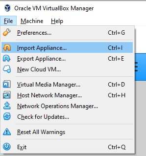
   <!-- FOTO BARU: proses import .ova ke VirtualBox -->

4. Buat host network adapter baru: **File → Host Network Manager → Create**, lalu set IPv4 Address `192.168.0.1` dan Network Mask `255.255.255.0`.

   
   <!-- FOTO BARU: konfigurasi Host Network Manager -->

5. Di **Settings → Network** VM: Adapter 1 → **Host-only Adapter** (arahkan ke network yang baru dibuat), Adapter 2 → **NAT**.

   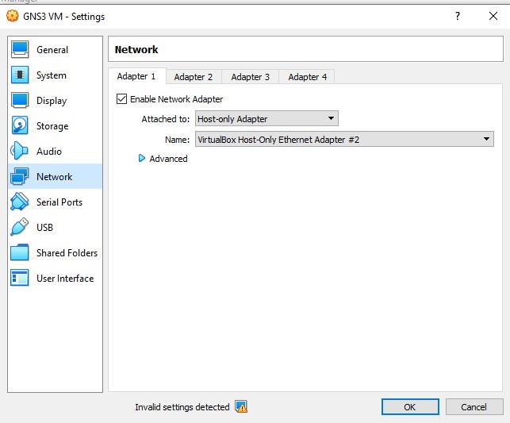
   <!-- FOTO BARU: pengaturan Adapter 1 & 2 pada VM -->

6. Jalankan VM. Buka alamat yang tertera pada layar VM ("To launch the Web-UI") di browser.

   
   <!-- FOTO BARU: layar VM menampilkan alamat Web-UI -->

**Opsi B: VMware Workstation Pro**

Sejak kebijakan Broadcom, **VMware Workstation Pro** (dan Fusion Pro untuk macOS) kini **gratis untuk penggunaan personal maupun edukasi** — tidak perlu lagi versi trial/evaluasi seperti sebelumnya, cukup daftar akun Broadcom untuk mengunduh.

1. Unduh dan install VMware Workstation Pro dari akun [Broadcom Support Portal](https://knowledge.broadcom.com/external/article/368667/download-and-license-vmware-desktop-hype.html), pilih opsi **Personal Use** — tidak perlu memasukkan license key.
2. Unduh **GNS3 VM** untuk VMware dari [gns3.com/software/download-vm](https://www.gns3.com/software/download-vm), lalu extract.
3. Import file `.ova` ke VMware dan beri nama VM-nya.

   
   <!-- FOTO BARU: proses import .ova ke VMware Workstation -->

4. **Edit virtual machine settings** untuk memastikan pengaturan Network sudah sesuai. Jika muncul error `Virtualized ... Not Supported on Platform` saat VM dijalankan, coba nonaktifkan virtualisasi di pengaturan processor.

   
   <!-- FOTO BARU: pengaturan network dan processor VM di VMware -->

5. Jalankan VM, buka alamat "To launch the Web-UI" di browser.

   
   <!-- FOTO BARU: layar VM VMware menampilkan alamat Web-UI -->

### 2.3 Memasukkan Image Node ke GNS3

1. **Open menu** (kiri atas) → **Template preferences** → **Docker** → **Add Docker container template**.

   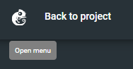
   <!-- FOTO BARU: alur menu Template preferences > Docker > Add Docker container template -->

2. **Server type**: pilih **Run this Docker container locally**.
3. Pada **Docker Virtual Machine**, pilih **New image**, isi nama image sesuai yang ditentukan tim praktikum (contoh: `nevarre/gns3-debi:latest`).

   > **Alternatif jika image lama sudah tidak ter-maintain**: GNS3 menyediakan image resmi seperti [`gns3/ipterm`](https://hub.docker.com/r/gns3/ipterm) atau [`gns3/webterm`](https://hub.docker.com/r/gns3/webterm) — berbasis Debian, sudah terpasang `net-tools`, `iproute2`, `ping`, `curl`, `ssh client`, dan direktori `/root` bersifat persisten selama container belum dihapus.

4. Isi **Container name** sesuai kebutuhan, misalnya `debian-node`.
5. Pada **Network adapters**, isi sesuai kebutuhan topologi (contoh: 4).
6. Biarkan bagian `Start command`, `Console type`, `Auxiliary console type`, dan `Environment` sesuai default, lalu klik **Add template**.

   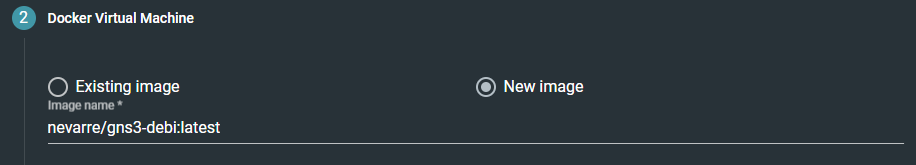
   <!-- FOTO BARU: konfigurasi image name, container name, network adapters -->

7. Uji image: buat project baru (**Projects → Add blank project**), klik **Add a node**, tarik node yang baru dibuat ke area kosong, tunggu loading selesai.

   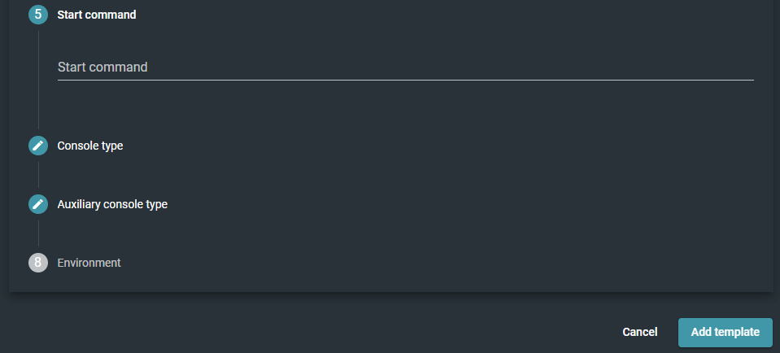
   <!-- FOTO BARU: node ditarik ke workspace dan berhasil ditambahkan -->

8. Klik kanan node → **Start**. Akses node lewat **Web console**, atau via terminal lokal dengan:
   ```
   telnet [IP VM] [Port node]
   ```
   Jika pakai telnet, keluar dari node dengan `Ctrl + ]` lalu ketik `quit`.

   
   <!-- FOTO BARU: mengakses node lewat Web console dan lewat telnet -->

### 2.4 Instalasi dan Setup GNS3 Client

1. Unduh GNS3 Client (all-in-one installer) dari [gns3.com/software/download](https://www.gns3.com/software/download).
2. Jalankan installer, centang komponen yang dibutuhkan (GNS3 Desktop, Wireshark, dsb bila belum terpasang), ikuti wizard sampai selesai.

   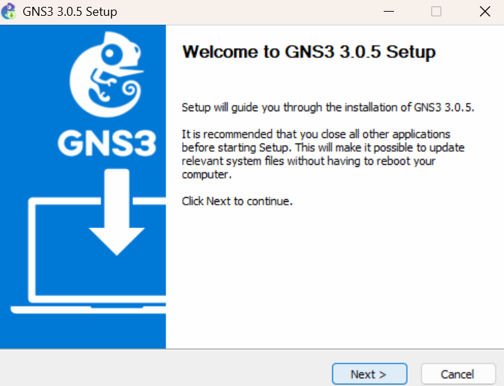
   <!-- FOTO BARU: ringkasan langkah-langkah installer GNS3 Client -->

3. Saat pertama dibuka, pilih **Connect to a remote controller**, masukkan protokol, host, port, dan kredensial yang diberikan asisten.

   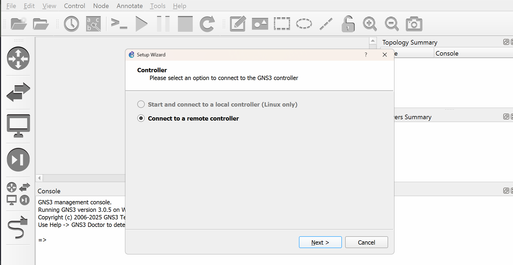
   <!-- FOTO BARU: jendela setup koneksi ke remote controller -->

> **Catatan keamanan:** secara default koneksi client-ke-controller memakai HTTP polos — artinya kredensial yang dimasukkan bisa ditangkap dengan Wireshark, persis seperti kredensial FTP di [bagian 1.7](#17-studi-kasus-memantau-trafik-ftp). Untuk lab yang dipakai bersama di jaringan yang tidak sepenuhnya terpercaya, aktifkan **HTTPS** pada controller (opsi ini tersedia di pengaturan server GNS3) dan gunakan password yang kuat.

## 2.5 Setup IP di Node

1. Klik kanan pada node, buka **Configure**.
2. Pada **General settings**, cari tombol **Edit network configuration**.

   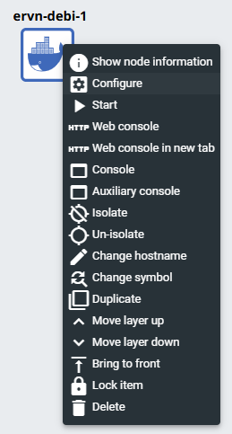
   <!-- FOTO BARU: jendela Edit network configuration -->

3. Di situ IP bisa diatur sesuai interface yang digunakan. Interface adalah sesuatu yang menghubungkan dua device.

## 2.6 Akses Sebuah Node ke Internet

1. Buka **Add a Node**, tarik node **NAT** ke area kosong.
2. Aktifkan **Add a Link**, klik node, pilih interface `eth0`, lalu klik node NAT tadi.

   
   <!-- FOTO BARU: menghubungkan node ke NAT lewat Add a Link -->

3. Konfigurasi IP node (contoh Ubuntu/Debian, format `/etc/network/interfaces`): cari baris berikut lalu hapus tanda komentarnya:
   ```
   # auto eth0
   # iface eth0 inet dhcp
   ```
   menjadi:
   ```
   auto eth0
   iface eth0 inet dhcp
   ```
4. Start node, akses console, coba `ping google.com` — jika berhasil, konfigurasi sudah benar.

   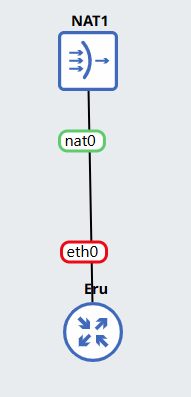
   <!-- FOTO BARU: hasil ping ke google.com dari console node -->

5. Ganti nama node ini menjadi nama yang mudah diingat (misal `Router1`) lewat fitur **Change hostname**, dan ubah simbolnya ke simbol router lewat **Change symbol** — node ini akan dipakai sebagai router pada bagian topologi berikutnya.

## 2.7 Membuat Topologi

1. Tambahkan beberapa node **ethernet switch** dan node Linux, hubungkan sesuai kebutuhan, dan beri nama tiap node.

   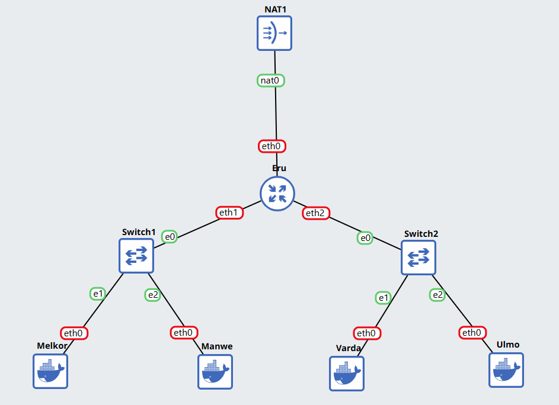
   <!-- FOTO BARU: contoh topologi dengan router, switch, dan beberapa node -->

2. Atur network tiap node lewat **Edit network configuration** seperti di [bagian 2.5](#25-setup-ip-di-node). Contoh konfigurasi untuk router (dua subnet di belakangnya):
   ```
   auto eth0
   iface eth0 inet dhcp

   auto eth1
   iface eth1 inet static
   	address [Prefix IP].1.1
   	netmask 255.255.255.0

   auto eth2
   iface eth2 inet static
   	address [Prefix IP].2.1
   	netmask 255.255.255.0
   ```
   Contoh konfigurasi untuk node biasa di belakang router:
   ```
   auto eth0
   iface eth0 inet static
   	address [Prefix IP].1.2
   	netmask 255.255.255.0
   	gateway [Prefix IP].1.1
   ```
   **Gateway**: jalur pada jaringan yang harus dilewati paket data untuk masuk ke jaringan lain.

3. Restart semua node, lalu cek IP tiap node dengan `ip a` untuk memastikan sesuai konfigurasi.

   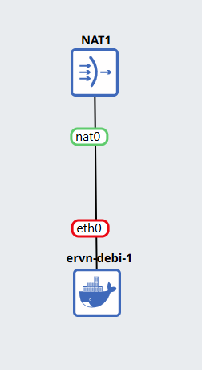
   <!-- FOTO BARU: hasil ip a menunjukkan IP sesuai konfigurasi -->

4. Topologi sudah bisa jalan secara lokal, tapi belum bisa akses jaringan luar. Di router, jalankan:
   ```
   iptables -t nat -A POSTROUTING -o eth0 -j MASQUERADE -s [Prefix IP].0.0/16
   ```
   - **iptables**: tools di Linux untuk memfilter lalu lintas data, baik yang masuk, keluar, maupun yang hanya lewat.
   - **NAT (Network Address Translation)**: metode menerjemahkan alamat jaringan, memungkinkan lebih dari satu komputer terhubung ke internet lewat satu alamat IP.
   - **Masquerade**: menyamarkan paket, misalnya mengganti alamat pengirim dengan alamat router.
   - **-s (Source Address)**: spesifikasi source, bisa berupa nama jaringan, nama host, atau alamat IP.

5. Cek IP DNS di router dengan `cat /etc/resolv.conf`, lalu terapkan ke node lain:
   ```
   echo nameserver [IP DNS] > /etc/resolv.conf
   ```

   
   <!-- FOTO BARU: semua node berhasil ping ke internet -->

6. Semua node sekarang seharusnya bisa ping ke internet.

## 2.8 Ketentuan, Tips, Trik, dan Troubleshooting

- Yang diinstal di dalam node **tidak persisten** — saat mengerjakan project lagi, aplikasi yang diinstal sebelumnya perlu dipasang ulang, kecuali image node yang dipakai memang menjaga `/root` tetap persisten (lihat catatan `gns3/ipterm` di [bagian 2.3](#23-memasukkan-image-node-ke-gns3)).
- **Selalu** simpan config penting ke direktori `/root` sebelum keluar dari project.
- Command yang ingin selalu dijalankan otomatis bisa dimasukkan ke bagian bawah file `/root/.bashrc`.
- Command startup juga bisa ditambahkan langsung di network config dengan awalan `up`.
- Project bisa diekspor untuk kerja tim lewat **Project settings → Export portable project**.
- Jika bekerja dengan VM lokal sendiri, matikan VM dalam mode *save state* agar aplikasi/config tidak hilang.
- Manfaatkan bash scripting untuk instalasi aplikasi yang berulang, lalu simpan ke `/root`.
- Sesuatu yang biasanya berjalan tiba-tiba bermasalah? Coba restart VM terlebih dahulu.
- Tidak bisa install dengan satu metode (VirtualBox/VMware)? Coba metode lain sebelum bertanya ke asisten.

## 3. Menghubungkan Wireshark dengan GNS3

### 3.1 Capture Langsung dari Link Topologi

GNS3 punya fitur bawaan untuk menangkap trafik langsung dari sebuah link di topologi, dan membukanya otomatis di Wireshark:

1. Klik kanan pada link yang ingin diamati, pilih **Start capture**.
2. Pada jendela yang muncul, centang **Start the capture visualization program**, lalu klik **OK**. Wireshark akan terbuka otomatis menampilkan trafik dari link tersebut secara real-time.

   
   <!-- FOTO BARU: klik kanan link topologi > Start capture -->

   
   <!-- FOTO BARU: Wireshark terbuka otomatis menampilkan trafik dari link GNS3 -->

3. Untuk menghentikan, klik kanan link yang sama → **Stop capture**. Jika ingin menyimpan hasilnya, gunakan **File → Save** di Wireshark sebelum menutupnya.

### 3.2 Capture di Dalam Node dengan TShark

Fitur di atas menangkap trafik dari sudut pandang link (di luar node). Untuk menangkap trafik langsung dari sudut pandang sebuah node (misalnya untuk melihat apa yang benar-benar diterima/dikirim oleh node itu sendiri), gunakan **TShark** langsung di dalam console node:

```
tshark -i eth0 -w /root/hasil-capture.pcap
```
Hentikan dengan `Ctrl+C`. File `.pcap` yang dihasilkan bisa dipindahkan ke luar node (atau dibuka lagi dengan `tshark -r`) untuk dianalisis lebih lanjut dengan Wireshark di PC host.

### 3.3 Contoh Skenario Analisis

- Saat melakukan `ping` antar dua node yang baru terhubung, capture link-nya dan cari paket **ARP** (permintaan MAC address) sebelum paket **ICMP** (ping) muncul — ini menunjukkan bagaimana ARP bekerja sebelum komunikasi IP dimulai.
- Saat mengaktifkan NAT/masquerade di [bagian 2.7](#27-membuat-topologi), capture link antara router dan node NAT, lalu bandingkan alamat IP sumber paket sebelum dan sesudah melewati router — ini memperlihatkan langsung bagaimana proses *masquerade* mengubah alamat pengirim.

## 4. Latihan

1. Bangun topologi sederhana (2 node + 1 switch) di GNS3, capture link menggunakan fitur **Start capture**, lakukan `ping` antar node, lalu identifikasi protokol apa saja yang muncul sebelum balasan ping pertama diterima.
2. Terapkan capture filter yang hanya menangkap trafik dari salah satu node di topologi kalian.
3. Buka `https://example.com` dengan `SSLKEYLOGFILE` aktif, buktikan trafik TLS-nya bisa didekripsi di Wireshark, lalu sebutkan protokol apa yang terlihat di dalam payload yang sudah terdekripsi.
4. Buat server FTP dengan FileZilla, capture proses login dan upload sebuah file, lalu sebutkan command FTP apa saja yang terlihat dalam bentuk plaintext.
5. Aktifkan HTTPS pada controller GNS3 (jika memungkinkan di lingkungan lab kalian), lalu bandingkan capture saat GNS3 Client login lewat HTTP vs HTTPS — apa perbedaan isi paketnya?
6. (Tantangan) Jalankan `tshark` langsung di dalam salah satu node GNS3 untuk menangkap trafik ICMP tanpa membuka GUI Wireshark, lalu pindahkan hasilnya untuk dibuka di Wireshark pada PC host.

## 5. Referensi

- https://www.wireshark.org/docs/wsug_html_chunked/ChapterIntroduction.html
- https://www.wireshark.org/docs/wsug_html_chunked/ChCapCaptureFilterSection.html
- https://www.wireshark.org/docs/wsug_html_chunked/ChWorkBuildDisplayFilterSection.html
- https://wiki.wireshark.org/TLS
- https://www.wireshark.org/download.html
- https://docs.gns3.com/docs/
- https://www.gns3.com/software/download
- https://www.gns3.com/software/download-vm
- https://hub.docker.com/r/gns3/ipterm
- https://knowledge.broadcom.com/external/article/368667/download-and-license-vmware-desktop-hype.html
- https://www.virtualbox.org/
- https://filezilla-project.org/