# Modul 2: DNS (Domain Name System)

## Daftar Isi
- [Modul 2: DNS (Domain Name System)](#modul-2-dns-domain-name-system)
  - [Daftar Isi](#daftar-isi)
  - [0. Pendahuluan](#0-pendahuluan)
  - [1. DNS](#1-dns)
    - [1.1 Cara Kerja DNS](#11-cara-kerja-dns)
    - [1.2 List DNS Record](#12-list-dns-record)
    - [1.3 SOA (Start of Authority)](#13-soa-start-of-authority)
  - [2. Praktik](#2-praktik)
    - [2.1 Topologi](#21-topologi)
    - [2.2 Instalasi BIND9](#22-instalasi-bind9)
    - [2.3 Membuat Domain](#23-membuat-domain)
    - [2.4 Reverse DNS (Record PTR)](#24-reverse-dns-record-ptr)
    - [2.5 CNAME Record](#25-cname-record)
    - [2.6 DNS Slave](#26-dns-slave)
    - [2.7 Membuat Subdomain](#27-membuat-subdomain)
    - [2.8 DNS Forwarder](#28-dns-forwarder)
  - [3. Keterangan Configurasi Zone file](#3-keterangan-konfigurasi-zone-file)
  - [4. Latihan Modul 2: DNS Dunia Arda](#4-latihan-modul-2-dns-dunia-arda)
  - [5. Referensi](#5-referensi)
---

## 0. Pendahuluan

Untuk praktikum jarkom kita menggunakan aplikasi BIND9 sebagai DNS server, karena BIND(Berkley Internet Naming Daemon) adalah DNS server yang paling banyak digunakan dan juga memiliki fitur-fitur yang cukup lengkap.

---

## 1. DNS (Domain Name System)

DNS (_Domain Name System_) adalah sistem penamaan untuk semua device (smartphone, computer, atau
network) yang terhubung dengan internet. DNS Server berfungsi menerjemahkan nama domain menjadi alamat IP. DNS dibuat guna untuk menggantikan sistem penggunaan file host yang dirasa tidak efisien.

### 1.1 Cara kerja DNS

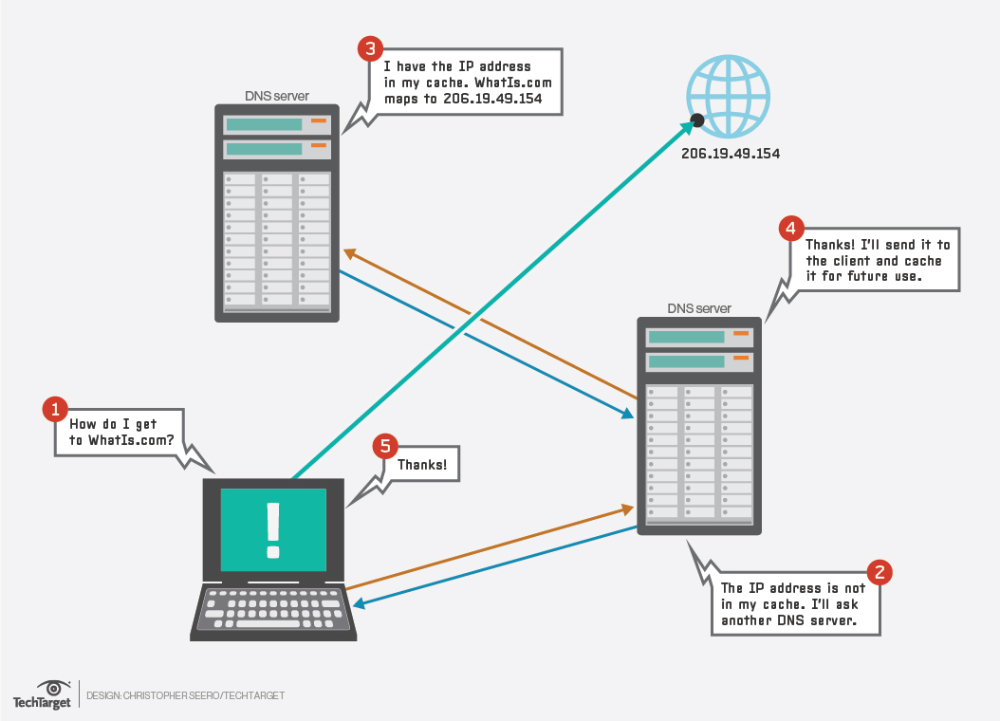

Client akan meminta alamt IP dari suatu domain ke DNS server. Jika pada DNS server data alamat IP dari DNS server tersebut ada maka akan di return alamat IP nya kembali menuju client. Jika DNS server tersebut tidak memiliki alamat IP dari domain tersebut maka dia akan bertanya kepada DNS server yang lain sampai alamat domain itu ditemukan.

### 1.2 List DNS Record

| Tipe          | Deskripsi                     |
| ------------- |:-----------------------------|
| A             | Memetakan nama domain ke alamat IP (IPv4) dari komputer hosting domain|
| AAAA          | AAAA record hampir mirip A record, tapi mengarahkan domain ke alamat Ipv6|
| CNAME         | Alias ​​dari satu nama ke nama lain: pencarian DNS akan dilanjutkan dengan mencoba lagi pencarian dengan nama baru|
| NS            | Delegasikan zona DNS untuk menggunakan authoritative name servers yang diberikan|
| PTR           | Digunakan untuk Reverse DNS (Domain Name System) lookup|
| SOA           | Mengacu server DNS yang mengediakan otorisasi informasi tentang sebuah domain Internet|
| TXT           | Mengijinkan administrator untuk memasukan data acak ke dalam catatan DNS, catatan ini juga digunakan di spesifikasi Sender Policy Framework|

### 1.3 SOA (Start of Authority)

Adalah informasi yang dimiliki oleh suatu DNS zone.

| Nama          | Deskripsi                     |
| ------------- |:-----------------------------|
| Serial        | Jumlah revisi dari file zona ini. Kenaikan nomor ini setiap kali file zone diubah sehingga perubahannya akan didistribusikan ke server DNS sekunder manapun|
| Refresh       | Jumlah waktu dalam detik bahwa nameserver sekunder harus menunggu untuk memeriksa salinan baru dari zona DNS dari nameserver utama domain. Jika file zona telah berubah maka server DNS sekunder akan memperbarui salinan zona tersebut agar sesuai dengan zona server DNS utama|
| Retry         | Jumlah waktu dalam hitungan detik bahwa nameserver utama domain (atau server) harus menunggu jika upaya refresh oleh nameserver sekunder gagal sebelum mencoba refresh zona domain dengan nameserver sekunder itu lagi|
| Expire        | Jumlah waktu dalam hitungan detik bahwa nameserver sekunder (atau server) akan menahan zona sebelum tidak lagi mempunyai otoritas|
| Minimum       | Jumlah waktu dalam hitungan detik bahwa catatan sumber daya domain valid. Ini juga dikenal sebagai TTL minimum, dan dapat diganti oleh TTL catatan sumber daya individu|
| TTL           | (waktu untuk tinggal) - Jumlah detik nama domain di-cache secara lokal sebelum kadaluarsa dan kembali ke nameserver otoritatif untuk informasi terbaru|

---

## 2. Praktik

### 2.1 Topologi

Buat topologi seperti di bawah ini, 

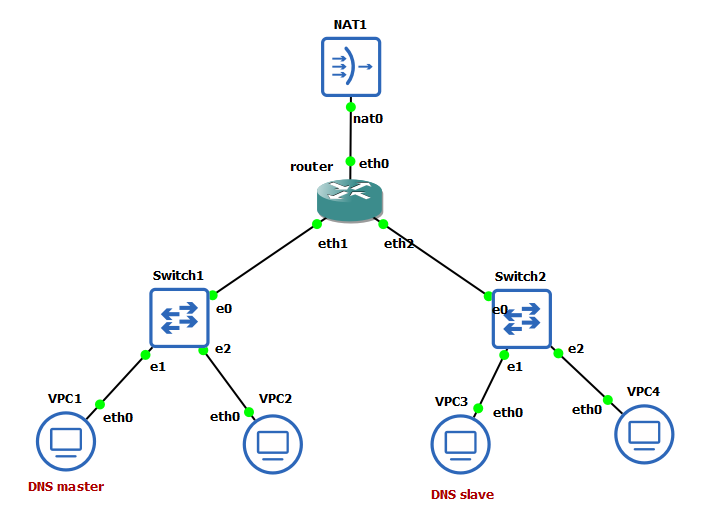

| Perangkat | Interface | Mode | IP Address | Netmask | Gateway | Fungsi |
| :--- | :--- | :--- | :--- | :--- | :--- | :--- |
| **router** | `eth0` | DHCP | Otomatis dari NAT | Sesuai NAT | Otomatis | WAN (Internet) |
| | `eth1` | Static | `10.91.1.1` | `255.255.255.0` | None | Gateway LAN 1 (Switch 1) |
| | `eth2` | Static | `10.91.2.1` | `255.255.255.0` | None | Gateway LAN 2 (Switch 2) |
| **VPC1** | `eth0` | Static | `10.91.1.2` | `255.255.255.0` | `10.91.1.1` | DNS Master (Subnet 1) |
| **VPC2** | `eth0` | Static | `10.91.1.3` | `255.255.255.0` | `10.91.1.1` | Host di Subnet 1 |
| **VPC3** | `eth0` | Static | `10.91.2.2` | `255.255.255.0` | `10.91.2.1` | DNS Slave (Subnet 2) |
| **VPC4** | `eth0` | Static | `10.91.2.3` | `255.255.255.0` | `10.91.2.1` | Host di Subnet 2 |

Kita akan membuat node `VPC1` sebagai DNS server.

### 2.2 Instalasi BIND9

Buka *VPC1* dan lakukan instalasi BIND9 sesuai dengan jenis *node* yang digunakan:

#### A. Untuk Node Debinet (Debian)
- Update *package lists*:
  ```bash
  apt-get update
  ```

- Install aplikasi bind9:
  ```bash
  apt-get install bind9 -y
  ```

- Setelah install jalankan command berikut:
  ```bash
  ln -s /etc/init.d/named /etc/init.d/bind9
  ```

#### B. Untuk Node Alpinet (Alpine)
- Install aplikasi bind dan bind-tools:
  ```bash
  apk update
  apk add bind bind-tools
  ```

### 2.3 Membuat Domain

Buat nama domain untuk VPC1, kita akan menggunakan nama domain **jarkom.it**.

- Lakukan perintah pada *VPC1*. Isikan seperti berikut:

  ```
  nano /etc/bind/named.conf.local
  ```

- Isikan configurasi domain **jarkom.it** sesuai dengan syntax berikut:

  ```
  zone "jarkom.it" {
    type master;
    file "/etc/bind/jarkom/jarkom.it";
  };
  ```

  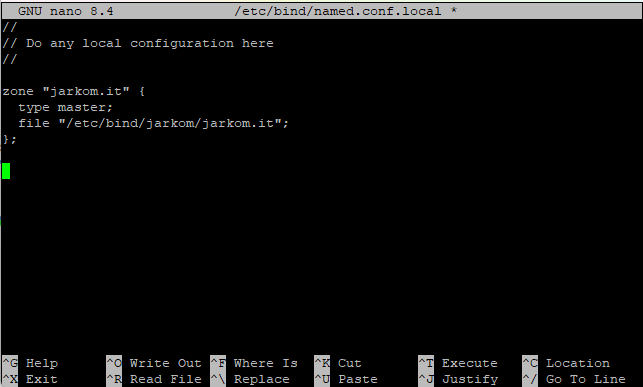

- Buat folder **jarkom** di dalam **/etc/bind**

  ```
  mkdir /etc/bind/jarkom
  ```

- Dibawah ini Jalankan urut dari A ke B.
  - A. buat file baru bernama **zone.template** pada direktori `/etc/bind/`.
    ```
    nano /etc/bind/zone.template
    ```
    Isi dengan isi berikut:
    ```
    $TTL    604800          ; Waktu cache default (detik)
    @       IN      SOA     localhost. root.localhost. (
                            2025100401 ; Serial (format YYYYMMDDXX)
                            604800     ; Refresh (1 minggu)
                            86400      ; Retry (1 hari)
                            2419200    ; Expire (4 minggu)
                            604800 )   ; Negative Cache TTL
    ;
    
    @       IN      NS      localhost.
    @       IN      A       127.0.0.1
    ```
  
  - B. Copy file `/etc/bind/zone.template` dan rename file hasil copy menjadi `/etc/bind/jarkom/jarkom.it`
    ```
    cp /etc/bind/zone.template /etc/bind/jarkom/jarkom.it
    ``` 

- Kemudian buka file **jarkom.it** dan edit seperti gambar berikut dengan IP *VPC1* masing-masing kelompok:

  ```
  nano /etc/bind/jarkom/jarkom.it
  ```
  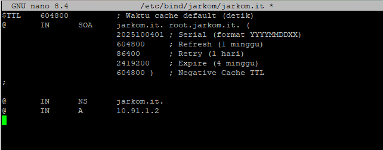

#### Persiapan Konfigurasi & Restart Service DNS

Pilih langkah sesuai dengan jenis *node* yang digunakan pada *VPC1*:

##### A. Untuk Node Debinet (Debian)

Lakukan restart service bind9 dengan perintah berikut:

```bash
service bind9 restart
  
named -g # Atau bisa gunakan ini untuk restart sekaligus debugging
```

##### B. Untuk Node Alpinet (Alpine)

Lakukan restart dengan mematikan proses lama dan menjalankan ulang daemon `named`:

```bash
killall named
named

named -g # Atau bisa gunakan ini untuk restart sekaligus debugging
```

#### Setting nameserver pada client

Domain yang kita buat tidak akan langsung dikenali oleh client oleh sebab itu kita harus merubah settingan nameserver yang ada kepada client.

- Pada client *VPC2* dan *VPC4* arahkan nameserver menuju IP *VPC1* dengan mengedit file _resolv.conf_ dengan mengetikkan perintah 

    ```
    nano /etc/resolv.conf
    ```
  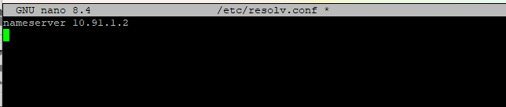

- Untuk mencoba koneksi DNS, lakukan ping domain **jarkom.it** dengan melakukan  perintah berikut pada client *VPC2* dan *VPC4*

  ```
  ping jarkom.it -c 5
  ```
  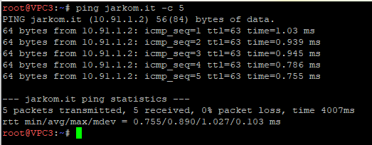


### 2.4 Reverse DNS (Record PTR)

Jika pada pembuatan domain sebelumnya DNS server kita bekerja menerjemahkan string domain **jarkom.it** kedalam alamat IP agar dapat dibuka, maka Reverse DNS atau Record PTR digunakan untuk menerjemahkan alamat IP ke alamat domain yang sudah diterjemahkan sebelumnya.

- Edit file **/etc/bind/named.conf.local** pada *VPC1*

  ```
  nano /etc/bind/named.conf.local
  ```

- Lalu tambahkan konfigurasi berikut ke dalam file **named.conf.local**. Tambahkan **reverse dari 3 byte awal** dari IP yang ingin dilakukan Reverse DNS. Karena di contoh saya menggunakan IP `10.91.1` untuk IP dari records, maka reversenya adalah `1.91.10` 

  ```
  zone "1.91.10.in-addr.arpa" {
    type master;
    file "/etc/bind/jarkom/1.91.10.in-addr.arpa";
  };
  ```
  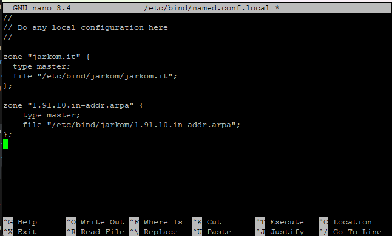

- Copykan file **zone.template** pada path **/etc/bind** ke dalam folder **jarkom** yang baru saja dibuat dan ubah namanya menjadi **1.91.10.in-addr.arpa**

    ```
    cp /etc/bind/zone.template /etc/bind/jarkom/1.91.10.in-addr.arpa
    ```

  *Keterangan 1.91.10 adalah 3 byte pertama IP VPC1 yang dibalik urutan penulisannya*

- Edit file **1.91.10.in-addr.arpa** menjadi seperti gambar di bawah ini

  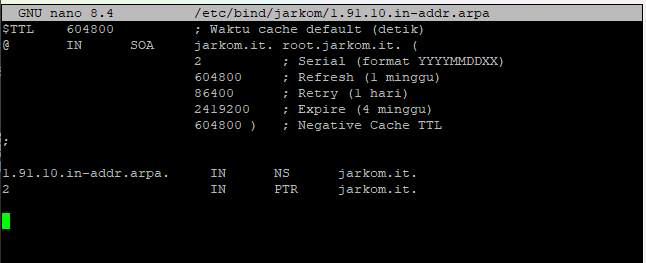

#### Restart Service & Pengujian di Client

Pilih langkah sesuai dengan jenis node yang digunakan untuk melakukan restart service di *VPC1* dan pengujian di *VPC2*.

##### A. Untuk Node Debinet (Debian)

- Di *VPC1*, restart layanan bind9 dengan perintah berikut:
    
    ```bash
    service bind9 restart
    ```

- Buka client *VPC2*, pastikan nameserver di `/etc/resolv.conf` telah diarahkan ke IP *VPC1*, lalu install utilitas DNS:

    ```bash
    apt-get update
    apt-get install dnsutils -y
    ```

##### B. Untuk Node Alpinet (Alpine)

- Di *VPC1*, restart layanan DNS dengan mematikan dan menjalankan ulang daemon `named`: 

    ```bash
    killall named
    named
    ```

- Buka client *VPC2*, pastikan nameserver di `/etc/resolv.conf` telah diarahkan ke IP *VPC1*, lalu install utilitas DNS:
    ```bash
    apk update
    apk add bind-tools
    ```

#### Pengujian Reverse DNS

Setelah utilitas terinstal di client *VPC2*, cek apakah Record PTR sudah berfungsi menggunakan perintah berikut (ganti dengan IP *VPC1*):

```bash
host -t PTR [IP VPC1]
```

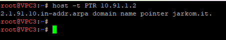

### 2.5 CNAME Record

Dalam implementasi jaringan, sebuah server sering kali perlu diakses menggunakan beberapa nama domain yang berbeda. Kita akan menambahkan alias agar saat pengguna mengetikkan www.jarkom.it, mereka tetap diarahkan secara tepat ke server domain utama kita.

Record CNAME adalah sebuah record yang membuat alias name dan mengarahkan domain ke alamat/domain yang lain.

Langkah-langkah membuat record CNAME:

- Buka file **jarkom.it** pada server *VPC1* dan tambahkan konfigurasi seperti pada gambar berikut:

  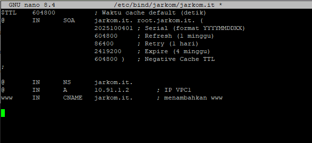

#### Restart Service & Pengujian

- Kemudian restart layanan DNS pada *VPC1* untuk menerapkan perubahan. Pilih perintah sesuai jenis node yang digunakan:

  A. Untuk Node Debinet (Debian)

  ```bash
  service bind9 restart
  ```

  B. Untuk Node Alpinet (Alpine)

  ```bash
  killall named
  named
  ```

- Lalu cek konfigurasi dari client (misalnya *VPC2*) dengan melakukan pengecekan host atau ping ke alamat alias tersebut. Hasilnya harus secara otomatis mengarah ke host domain utama (IP *VPC1*): 

  ```bash
  host -t CNAME www.jarkom.it

  # ATAU

  ping www.jarkom.it -c 5
  ```

  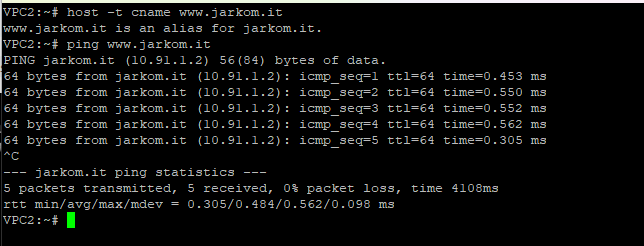

### 2.6 DNS Slave

DNS Slave adalah DNS cadangan yang akan diakses jika server DNS utama mengalami kegagalan. Kita akan menjadikan server *VPC3* sebagai DNS slave dan server *VPC1* sebagai DNS masternya.

#### I. Konfigurasi Pada Server VPC1 (Master)

- Edit file **/etc/bind/named.conf.local** dan sesuaikan dengan syntax berikut

  ```
  zone "jarkom.it" {
      type master;
      notify yes;
      also-notify { "IP VPC3"; }; // Masukan IP VPC3 tanpa tanda petik
      allow-transfer { "IP VPC3"; }; // Masukan IP VPC3 tanpa tanda petik
      file "/etc/bind/jarkom/jarkom.it";
  };
  ```

  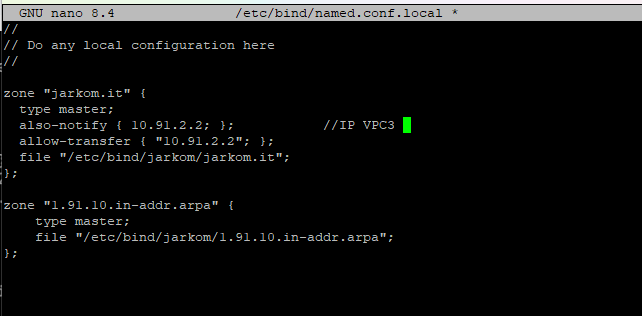

- Lakukan restart layanan DNS pada *VPC1* sesuai jenis *node* yang digunakan

#### II. Konfigurasi Pada Server VPC3 (Slave)

Buka *VPC3* dan lakukan instalasi BIND9 sesuai dengan jenis *node* yang digunakan:

##### A. Untuk Node Debinet (Debian)

- Update package lists dan install aplikasi bind9:
    
    ```bash
    apt-get update
    apt-get install bind9 -y
    ```
- Buat symbolic link agar service dapat dijalankan:

    ```bash
    ln -s /etc/init.d/named /etc/init.d/bind9
    ```

##### B. Untuk Node Alpinet (Alpine)

- Install aplikasi bind dan buat direktori untuk menyimpan file zona transfer:

    ```bash
    apk update
    apk add bind bind-tools
    mkdir -p /etc/bind/jarkom
    ```

- Kemudian buka file **/etc/bind/named.conf.local** pada *VPC3* dan tambahkan syntax berikut:

  ```
  zone "jarkom.it" {
      type slave;
      masters { "IP VPC1"; }; // Masukan IP VPC1 tanpa tanda petik
      file "/etc/bind/jarkom/jarkom.it";
  };
  ```
  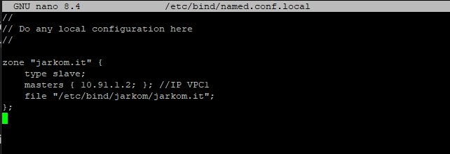

- Lakukan restart layanan DNS pada *VPC1* sesuai jenis *node* yang digunakan

#### III. Testing

- Pada server *VPC1*, simulasikan kegagalan server dengan mematikan layanan DNS:

##### A. Untuk Node Debinet (Debian)

  ```bash
  service bind9 stop
  ```

##### B. Untuk Node Alpinet (Alpine)

  ```bash
  killall named
  ```

- Pada client *VPC2*, pastikan file `/etc/resolv.conf` telah diatur agar mengarah ke IP *VPC1* (Master) sebagai baris pertama dan IP *VPC3* (Slave) sebagai baris kedua:

  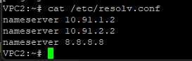


- Lakukan ping ke **jarkom.it** pada client *VPC2*. Jika ping tetap berhasil me-reply meskipun *VPC1* sedang mati, maka konfigurasi DNS Slave telah berhasil mengambil alih:

  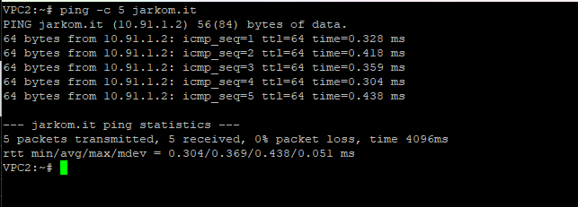

### 2.7 Membuat Subdomain

Subdomain adalah bagian dari sebuah nama domain induk. Subdomain umumnya mengacu ke suatu alamat fisik di sebuah situs contohnya: **jarkom.it** merupakan sebuah domain induk. Sedangkan **api.jarkom.it** merupakan sebuah subdomain.

- Pada *VPC1*, edit file **/etc/bind/jarkom/jarkom.it** lalu tambahkan subdomain untuk **jarkom.it** yang mengarah ke IP *VPC3*.

  ```
  nano /etc/bind/jarkom/jarkom.it
  ```

- Tambahkan konfigurasi seperti pada gambar ke dalam file **jarkom.it**.

  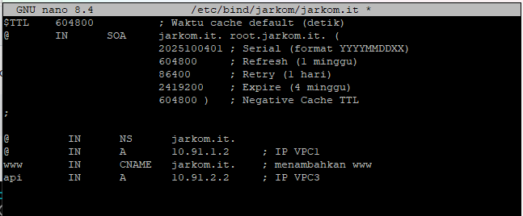

- Lakukan restart layanan DNS pada *VPC1* sesuai jenis *node* yang digunakan

- Coba ping ke subdomain dengan perintah berikut dari client *VPC2*

  ```
  ping api.jarkom.it -c 5
  
  ATAU
  
  host -t A api.jarkom.it
  ```
  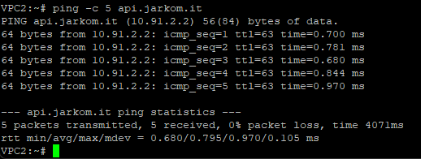

#### Delegasi Subdomain

Delegasi subdomain adalah pemberian wewenang atas sebuah subdomain kepada DNS baru.

Misal kita akan mendelegasikan wilayah **dev**. Semua urusan *dev* akan langsung ditangani oleh *VPC1*, tetapi di dalamnya ada *staging* (dalam contoh diarahkan ke *VPC2*).

#### I. Konfigurasi Pada Server *VPC1*

- Pada *VPC1*, edit file **/etc/bind/jarkom/jarkom.it** dan ubah menjadi seperti di bawah ini sesuai dengan pembagian IP *VPC1* kelompok masing-masing.

  ```
  nano /etc/bind/jarkom/jarkom.it
  ```
  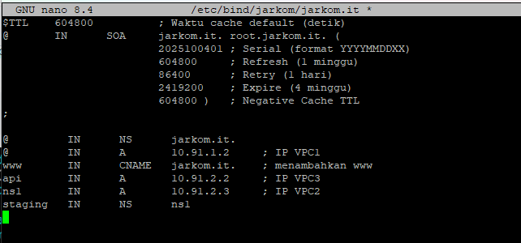


- Kemudian edit file **/etc/bind/named.conf.options** pada *VPC1*.

  ```
  nano /etc/bind/named.conf.options
  ```

- Tambahkan baris berikut pada **/etc/bind/named.conf.options**

  ```
  allow-query{any;};
  auth-nxdomain no;
  listen-on-v6 { any; }
  ```
  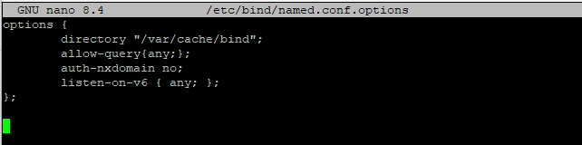


- Kemudian edit file **/etc/bind/named.conf.local** menjadi seperti gambar di bawah:

  ```
  zone "jarkom.it" {
    type master;
    file "/etc/bind/jarkom/jarkom.it";
    allow-transfer { "IP VPC3"; }; // Masukan IP VPC3 tanpa tanda petik
  };
  ```
  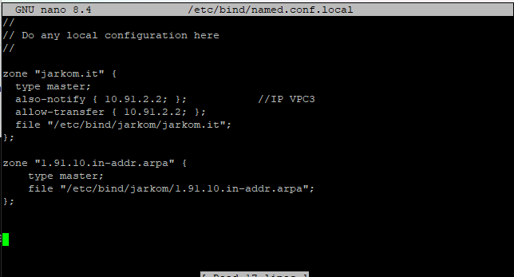

- Lakukan restart layanan DNS pada *VPC1* sesuai jenis *node* yang digunakan

#### II. Konfigurasi Pada Server *VPC3*

- Pada *VPC3* edit file **/etc/bind/named.conf.options**

  ```
  nano /etc/bind/named.conf.options
  ```

- tambahkan baris berikut pada **/etc/bind/named.conf.options**

  ```
  allow-query{any;};
  auth-nxdomain no;
  listen-on-v6 { any; }
  ```
  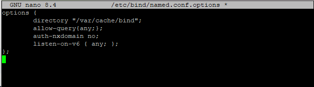

- Lalu edit file **/etc/bind/named.conf.local** menjadi seperti gambar di bawah:

  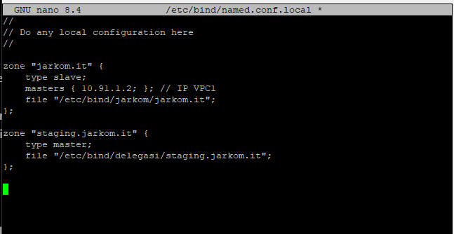

- Kemudian buat direktori dengan nama **delegasi** 
  ```
  mkdir /etc/bind/delegasi
  ```

- Dibawah ini Jalankan urut dari A ke B.
  - A. buat file baru bernama **zone.template** pada direktori `/etc/bind/`.
    ```
    nano /etc/bind/zone.template
    ```
    Isi dengan isi berikut:
    ```
    $TTL    604800          ; Waktu cache default (detik)
    @       IN      SOA     localhost. root.localhost. (
                            2025100401 ; Serial (format YYYYMMDDXX)
                            604800     ; Refresh (1 minggu)
                            86400      ; Retry (1 hari)
                            2419200    ; Expire (4 minggu)
                            604800 )   ; Negative Cache TTL
    ;
    
    @       IN      NS      localhost.
    @       IN      A       127.0.0.1
    ```
  
  - B. Copy file `/etc/bind/zone.template` dan rename file hasil copy menjadi `/etc/bind/delegasi/staging.jarkom.it`
    ```
    cp /etc/bind/zone.template /etc/bind/delegasi/staging.jarkom.it
    ``` 

  - C. Kemudian edit file **staging.jarkom.it** menjadi seperti dibawah ini

    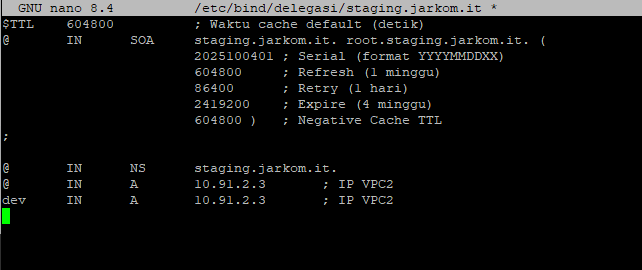

  - D. Lakukan restart layanan DNS pada *VPC3* sesuai jenis *node* yang digunakan

#### III. Testing

- Lakukan ping ke domain **staging.jarkom.it** dan **dev.staging.jarkom.it** dari client *VPC2*

  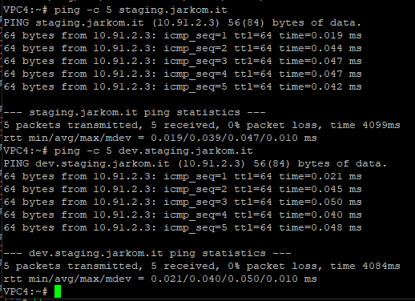

### 2.8 DNS Forwarder

DNS Forwarder digunakan untuk mengarahkan DNS Server ke IP yang ingin dituju.

- Edit file **/etc/bind/named.conf.options** pada server *VPC1*
- tambahkan bagian ini

```
forwarders {
    "IP nameserver dari Router";
};
```
- Dan tambahkan

```
dnssec-validation no;
allow-query{any;};
auth-nxdomain no;
listen-on-v6 { any; }
```

- Lakukan restart layanan DNS pada *VPC1* sesuai jenis *node* yang digunakan

- Harusnya jika nameserver pada file **/etc/resolv.conf** di client diubah menjadi IP **VPC1** maka akan di forward ke IP DNS GNS3 yaitu IP nameserver yang ada di **Router** dan bisa mendapatkan koneksi.
- Coba ping google.com pada **VPC4**, kalau benar maka tetap bisa mendapatkan respon dari google

  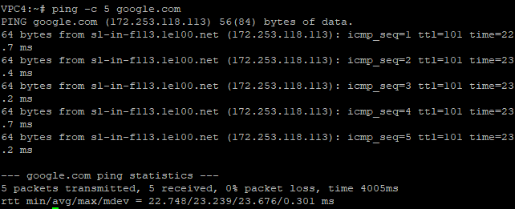

---

## 3. Keterangan Configurasi Zone file

1. #### Penulisan Serial

   Ditulis dengan format YYYYMMDDXX. Serial di increment setiap melakukan perubahan pada file zone.

   ```
   YYYY adalah tahun
   MM adalah bulan
   DD adalah tanggal
   XX adalah counter
   ```

   Contoh:

   

2. #### Penggunaan Titik

   

   Pada salah satu contoh di atas, dapat kita amati pada kolom keempat terdapat record yang menggunakan titik pada akhir kata dan ada yang tidak. Penggunaan titik berfungsi sebagai penentu FQDN (Fully-Qualified Domain Name) suatu domain.

   Contohnya jika "**jarkom.it.**" di akhiri dengan titik maka akan dianggap sebagai FQDN dan akan dibaca sebagai "**jarkom.it**" , sedangkan ns1 di atas tidak menggunakan titik sehingga dia tidak terbaca sebagai FQDN. Maka ns1 akan di tambahkan di depan terhadap nilai $ORIGIN sehinga ns1 akan terbaca sebagai "**ns1.jarkom.it**" . Nilai $ORIGIN diambil dari penamaan zone yang terdapat pada  */etc/bind/named.conf.local*.

3. #### Penulisan Name Server (NS) record

   Salah satu aturan penulisan NS record adalah dia harus menuju A record., bukan CNAME. 

---

## 5. Referensi
* https://computer.howstuffworks.com/dns.htm
* http://knowledgelayer.softlayer.com/faq/what-does-serial-refresh-retry-expire-minimum-and-ttl-mean
* https://en.wikipedia.org/wiki/List_of_DNS_record_types
* https://kb.indowebsite.id/knowledge-base/pengertian-catatan-dns-atau-record-dns/