# **Reverse Proxy**

## **Daftar Isi**
- [**A. Pendahuluan & Konsep Dasar**](#a-pendahuluan--konsep-dasar)
  - [**1. Pengertian Reverse Proxy vs Forward Proxy**](#1-pengertian-reverse-proxy-vs-forward-proxy)
  - [**2. Cara Kerja & Alur Request**](#2-cara-kerja--alur-request)
  - [**3. Manfaat Utama Reverse Proxy**](#3-manfaat-utama-reverse-proxy)
- [**B. Arsitektur & Topologi Praktikum**](#b-arsitektur--topologi-praktikum)
  - [**1. Topologi Jaringan**](#1-topologi-jaringan)
  - [**2. Pembagian IP Address, OS, & Peran Node**](#2-pembagian-ip-address-os--peran-node)
- [**C. Implementasi Backend Web Server**](#c-implementasi-backend-web-server)
  - [**1. Setup Backend Server Statis - VPC3 (Debinet)**](#1-setup-backend-server-statis---vpc3-debinet)
  - [**2. Setup Backend Server Dinamis PHP - VPC4 (Alpinet)**](#2-setup-backend-server-dinamis-php---vpc4-alpinet)
- [**D. Konfigurasi Reverse Proxy - VPC1 (Debinet)**](#d-konfigurasi-reverse-proxy---vpc1-debinet)
  - [**1. Instalasi Nginx pada Reverse Proxy (VPC1)**](#1-instalasi-nginx-pada-reverse-proxy-vpc1)
  - [**2. Konfigurasi Path-Based Routing (/static/ dan /app/)**](#2-konfigurasi-path-based-routing-static-dan-app)
  - [**3. Konfigurasi Basic Authentication (/admin/)**](#3-konfigurasi-basic-authentication-admin)
  - [**4. Integrasi dengan DNS Server BIND9**](#4-integrasi-dengan-dns-server-bind9)
- [**E. Skalabilitas & Load Balancing**](#e-skalabilitas--load-balancing)
  - [**1. Konsep Load Balancing pada Nginx**](#1-konsep-load-balancing-pada-nginx)
  - [**2. Setup Backend Replika - VPC5 (Debinet)**](#2-setup-backend-replika---vpc5-debinet)
  - [**3. Konfigurasi Upstream & Algoritma Load Balancing**](#3-konfigurasi-upstream--algoritma-load-balancing)
- [**F. Pengujian & Verifikasi System**](#f-pengujian--verifikasi-system)
  - [**1. Pengujian HTTP dengan Lynx & Curl - VPC2 (Alpinet)**](#1-pengujian-http-dengan-lynx--curl---vpc2-alpinet)
  - [**2. Pengujian Basic Auth (Success & Failure)**](#2-pengujian-basic-auth-success--failure)
  - [**3. Load Testing Menggunakan Apache Benchmark (ab)**](#3-load-testing-menggunakan-apache-benchmark-ab)
  - [**4. Verifikasi Real IP Header di Backend Log**](#4-verifikasi-real-ip-header-di-backend-log)

---

## **A. Pendahuluan & Konsep Dasar**

### **1. Pengertian Reverse Proxy vs Forward Proxy**

Dalam arsitektur jaringan komputer, **Proxy** bertindak sebagai perantara (*intermediary*) antara klien dan server. Berdasarkan arah dan pihak yang diwakilinya, proxy dibagi menjadi dua jenis utama:

* **Forward Proxy**:
  * Bertindak atas nama **Klien (Client-side)**.
  * Klien mengirimkan *request* ke Forward Proxy, lalu proxy meneruskannya ke internet/server tujuan.
  * **Tujuan utama**: Menyembunyikan identitas IP klien, memfilter konten luar, serta melewati pembatasan jaringan lokal.

* **Reverse Proxy**:
  * Bertindak atas nama **Server (Server-side)**.
  * Klien mengirimkan *request* ke alamat Reverse Proxy (klien menganggapnya sebagai server tujuan utama). Reverse Proxy kemudian meneruskan *request* tersebut ke server *backend* yang berada di jaringan internal.
  * **Tujuan utama**: Menyembunyikan topologi server *backend*, membagi beban trafik (*load balancing*), serta mengamankan server internal dari akses publik secara langsung.

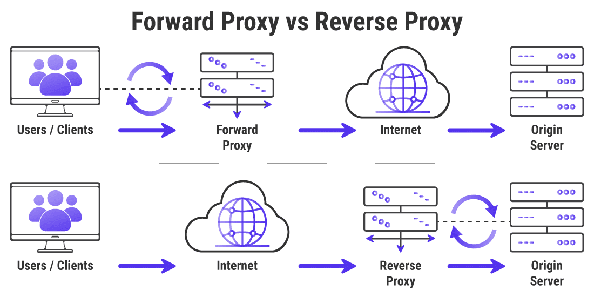

---

### **2. Cara Kerja & Alur Request**

Proses komunikasi pada Reverse Proxy berlangsung dalam tahapan berikut:

1. **Client Request**: Klien mengirimkan HTTP Request ke nama domain public (misal: `http://jarkom.it/app/`). Request ini diterima oleh Reverse Proxy pada IP Publik / Gateway (`VPC1`).
2. **Request Inspection & Routing**: Reverse Proxy memeriksa Header HTTP, URI path (`/app/` atau `/static/`), atau Host Name, lalu menentukan server *backend* mana yang berhak menangani *request* tersebut.
3. **Backend Forwarding**: Reverse Proxy meneruskan *request* ke server *backend* internal (`VPC3`, `VPC4`, atau `VPC5`) melalui IP lokal.
4. **Backend Response**: Server *backend* memproses permintaan (menjalankan PHP atau membaca file HTML) dan mengembalikan hasilnya ke Reverse Proxy.
5. **Client Response**: Reverse Proxy meneruskan respons balik ke klien. Dari sudut pandang klien, seluruh respons diproses langsung oleh satu server tunggal.

---

### **3. Manfaat Utama Reverse Proxy**

Mengimplementasikan Reverse Proxy memberikan keuntungan teknis dalam skala produksi:

* **Security & Anonymity**: Alamat IP server *backend* internal terlindungi dari akses publik langsung.
* **Load Balancing**: Mendistribusikan trafik HTTP secara merata ke beberapa server *backend* agar tidak terjadi kelebihan beban (*overload*).
* **SSL/TLS Termination**: Enkripsi HTTPS cukup ditangani di Reverse Proxy, sehingga server *backend* hanya perlu mengolah HTTP biasa.
* **Centralized Authentication**: Fitur otentikasi (seperti Basic Auth atau OAuth) dapat dipusatkan di pintu utama (Reverse Proxy) sebelum *request* diizinkan masuk ke *backend*.
* **Caching & Compression**: Menyimpan *cache* konten statis dan melakukan kompresi data (gzip) untuk mempercepat waktu respons klien.

---

## **B. Arsitektur & Topologi Praktikum**

### **1. Topologi Jaringan**

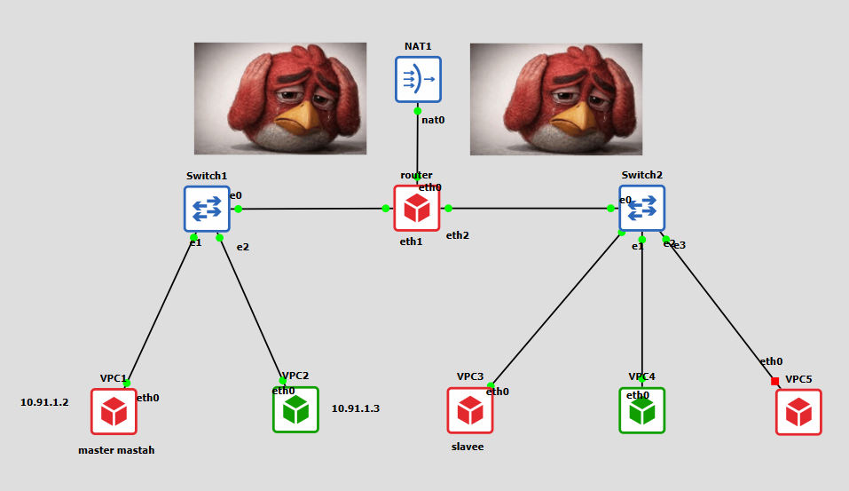

---

### **2. Pembagian IP Address, OS, & Peran Node**

Berikut adalah tabel alokasi IP Address, jenis Operating System Image, peran, dan modul aplikasi pada setiap node:

| Node | Interface | Jenis OS Image | IP Address | Netmask | Gateway | Peran & Fungsi |
| :--- | :--- | :--- | :--- | :--- | :--- | :--- |
| **Router** | `eth0`<br>`eth1`<br>`eth2` | Debinet / Router | DHCP (NAT)<br>`10.91.1.1`<br>`10.91.2.1` | Sesuai NAT<br>`255.255.255.0`<br>`255.255.255.0` | Otomatis<br>None<br>None | Router / Gateway Utama LAN 1 & LAN 2 |
| **VPC1** | `eth0` | **Debinet (Debian)** | `10.91.1.2` | `255.255.255.0` | `10.91.1.1` | **DNS Master (BIND9) & Reverse Proxy (Nginx)** |
| **VPC2** | `eth0` | **Alpinet (Alpine)** | `10.91.1.3` | `255.255.255.0` | `10.91.1.1` | **Client Tester** (`lynx`, `curl`, `ab`) |
| **VPC3** | `eth0` | **Debinet (Debian)** | `10.91.2.2` | `255.255.255.0` | `10.91.2.1` | **Backend Statis (Nginx)** & DNS Slave |
| **VPC4** | `eth0` | **Alpinet (Alpine)** | `10.91.2.3` | `255.255.255.0` | `10.91.2.1` | **Backend Dinamis Utama (Nginx + PHP-FPM)** |
| **VPC5** | `eth0` | **Debinet (Debian)** | `10.91.2.4` | `255.255.255.0` | `10.91.2.1` | **Backend Dinamis Replika (Nginx + PHP-FPM)** |

---

## **C. Implementasi Backend Web Server**

Sebelum mengonfigurasi Reverse Proxy, kita harus memastikan bahwa server *backend* (`VPC3`, `VPC4`, dan `VPC5`) telah berjalan dengan baik dan dapat menyajikan layanan masing-masing secara independen.

---

### **1. Setup Backend Server Statis - VPC3 (Debinet)**

Server `VPC3` menggunakan **Debinet (Debian)** dan dioptimalkan khusus untuk menyajikan file-file statis (HTML, CSS, gambar) serta fitur *directory listing* (*autoindex*).

1. **Buka terminal node `VPC3`**, lalu update package list dan install Nginx:
   ```bash
   apt-get update -y
   apt-get install -y nginx
   ```

2. **Buat direktori web root** `/var/www/static/annals` dan isi file HTML sampel:
   ```bash
   mkdir -p /var/www/static/annals

   cat > /var/www/static/index.html <<'HTML'
   <!doctype html>
   <html>
   <head><title>Static Backend - VPC3</title></head>
   <body>
       <h1>Selamat Datang di Backend Statis (VPC3 - Debian)</h1>
       <p>Server ini menangani aset statis.</p>
   </body>
   </html>
   HTML

   cat > /var/www/static/annals/readme.txt <<'TXT'
   Folder annals dengan fitur Autoindex (Directory Listing) aktif.
   TXT
   ```

3. **Buat file konfigurasi virtual host** di lokasi `/etc/nginx/sites-available/static.conf`:
   ```bash
   cat > /etc/nginx/sites-available/static.conf <<'NGINX'
   server {
       listen 80;
       server_name static.jarkom.it;

       root /var/www/static;
       index index.html;

       location /annals/ {
           autoindex on;
       }
   }
   NGINX
   ```

4. **Aktifkan konfigurasi virtual host dan restart service Nginx**:
   ```bash
   ln -sf /etc/nginx/sites-available/static.conf /etc/nginx/sites-enabled/
   rm -f /etc/nginx/sites-enabled/default
   nginx -t
   service nginx restart
   ```

Cek Hasil Akses Web Statis:

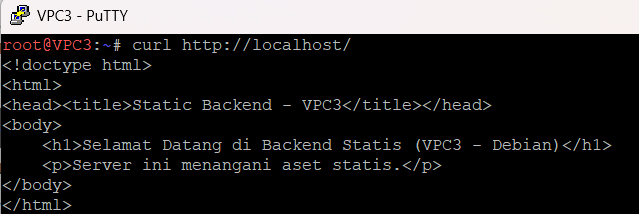


---

### **2. Setup Backend Server Dinamis PHP - VPC4 (Alpinet)**

Server `VPC4` menggunakan **Alpinet (Alpine Linux)** yang bertugas memproses logika aplikasi dinamis menggunakan Nginx dan **PHP-FPM**.

1. **Buka terminal node `VPC4`**, lalu pastikan repository Alpine aktif, update repository, dan install Nginx, PHP, serta modul PHP-FPM di Alpine:
   ```bash
   cat > /etc/apk/repositories <<'REPOS'
   http://dl-cdn.alpinelinux.org/alpine/v3.18/main
   http://dl-cdn.alpinelinux.org/alpine/v3.18/community
   REPOS

   apk update
   apk add nginx php-fpm php-mysqli php-json
   ```

2. **Buat direktori web root** `/var/www/app` dan script PHP:
   ```bash
   mkdir -p /var/www/app

   cat > /var/www/app/index.php <<'PHP'
   <?php
   echo "<h1>Backend Dinamis - VPC4 (Alpine)</h1>";
   echo "<p>Host IP: " . $_SERVER['SERVER_ADDR'] . "</p>";
   echo "<p>Waktu Server: " . date('Y-m-d H:i:s') . "</p>";
   ?>
   PHP

   cat > /var/www/app/about.php <<'PHP'
   <?php
   echo "<h2>Halaman About - App Dinamis VPC4 (Alpine)</h2>";
   ?>
   PHP
   ```

3. **Buat file konfigurasi Nginx** di `/etc/nginx/http.d/app.conf`:
   *(Pada Alpinet / Alpine Linux, konfigurasi diletakkan di dalam folder `/etc/nginx/http.d/` dengan ekstensi `.conf`)*
   ```bash
   cat > /etc/nginx/http.d/app.conf <<'NGINX'
   server {
       listen 80;
       server_name app.jarkom.it;

       root /var/www/app;
       index index.php;

       location / {
           try_files $uri $uri/ /index.php?$args;
       }

       location ~ \.php$ {
           fastcgi_pass 127.0.0.1:9000;
           fastcgi_index index.php;
           include fastcgi_params;
           fastcgi_param SCRIPT_FILENAME $document_root$fastcgi_script_name;
       }
   }
   NGINX
   ```

4. **Hapus file konfigurasi default dan jalankan service di Alpinet**:
   ```bash
   rm -f /etc/nginx/http.d/default.conf
   nginx -t
   php-fpm82
   nginx
   ```
   *(Catatan untuk Alpinet: Jalankan daemon `php-fpm82` dan `nginx` secara langsung atau gunakan `rc-service` jika OpenRC aktif).*

Cek Hasil Akses Web Dinamis:
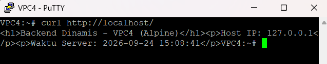

---

## **D. Konfigurasi Reverse Proxy - VPC1 (Debinet)**

Setelah server *backend* aktif, kita mengonfigurasi node **VPC1** (**Debinet / Debian**) agar bertindak sebagai Reverse Proxy utama.

---

### **1. Instalasi Nginx pada Reverse Proxy (VPC1)**

1. **Buka terminal node `VPC1`**, lalu install Nginx dan utilitas pembuatan password Basic Auth (`apache2-utils`):
   ```bash
   apt-get update -y
   apt-get install -y nginx apache2-utils
   ```

---

### **2. Konfigurasi Path-Based Routing (/static/ dan /app/)**

Reverse Proxy akan memetakan URL dari klien ke server *backend*:
* `http://jarkom.it/static/` $\rightarrow$ Diteruskan ke Backend Statis (`VPC3` / `10.91.2.2`)
* `http://jarkom.it/app/` $\rightarrow$ Diteruskan ke Backend Dinamis (`VPC4` / `10.91.2.3`)

1. **Di node `VPC1`**, buat file konfigurasi di lokasi `/etc/nginx/sites-available/reverse-proxy.conf`:
   ```bash
   cat > /etc/nginx/sites-available/reverse-proxy.conf <<'NGINX'
   # Format log khusus untuk mencatat Real IP dari Klien
   log_format custom_proxy '$remote_addr - $remote_user [$time_local] '
                           '"$request" $status $body_bytes_sent '
                           '"$http_referer" "$http_user_agent" '
                           'realip=$http_x_real_ip fwd=$http_x_forwarded_for';

   server {
       listen 80;
       server_name jarkom.it www.jarkom.it;

       access_log /var/log/nginx/reverse_access.log custom_proxy;

       # Normalisasi URI admin
       location = /admin { return 301 /admin/; }

       # 1. Protection Auth /admin/
       location ^~ /admin/ {
           auth_basic "Halaman Terproteksi Admin";
           auth_basic_user_file /etc/nginx/.htpasswd;
           alias /var/www/admin/;
           index index.html;
       }

       # 2. Path /static/ -> Forward ke VPC3 (10.91.2.2)
       location /static/ {
           proxy_pass http://10.91.2.2/;
           proxy_set_header Host $host;
           proxy_set_header X-Real-IP $remote_addr;
           proxy_set_header X-Forwarded-For $proxy_add_x_forwarded_for;
           proxy_set_header X-Forwarded-Proto $scheme;
       }

       # 3. Path /app/ -> Forward ke VPC4 (10.91.2.3)
       location /app/ {
           proxy_pass http://10.91.2.3/;
           proxy_set_header Host $host;
           proxy_set_header X-Real-IP $remote_addr;
           proxy_set_header X-Forwarded-For $proxy_add_x_forwarded_for;
           proxy_set_header X-Forwarded-Proto $scheme;
       }
   }
   NGINX
   ```

---

### **3. Konfigurasi Basic Authentication (/admin/)**

1. **Di node `VPC1`**, buat direktori lokal `/var/www/admin` dan file `index.html`:
   ```bash
   mkdir -p /var/www/admin
   cat > /var/www/admin/index.html <<'HTML'
   <!doctype html>
   <html>
   <head><title>Admin Dashboard</title></head>
   <body>
       <h1>Area Terproteksi Admin (VPC1)</h1>
       <p>Login Basic Auth Berhasil!</p>
   </body>
   </html>
   HTML
   ```

2. **Buat file kredensial password** `/etc/nginx/.htpasswd` (Username: `admin`, Password: `admin123`):
   ```bash
   htpasswd -bc /etc/nginx/.htpasswd admin admin123
   ```

3. **Aktifkan konfigurasi virtual host dan restart Nginx di `VPC1`**:
   ```bash
   ln -sf /etc/nginx/sites-available/reverse-proxy.conf /etc/nginx/sites-enabled/
   rm -f /etc/nginx/sites-enabled/default
   nginx -t
   service nginx restart
   ```

Cek Hasil Basic Authentication:

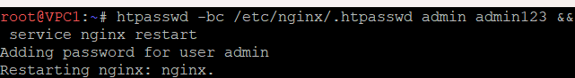

---

### **4. Integrasi dengan DNS Server BIND9**

Agar domain `jarkom.it` dan `www.jarkom.it` mengarah ke IP Reverse Proxy (`VPC1`), sesuaikan file zone BIND9 di **`VPC1`** pada file `/etc/bind/jarkom/jarkom.it`:

1. **Edit file zone `/etc/bind/jarkom/jarkom.it`**:
   ```bind
   $TTL    604800
   @       IN      SOA     jarkom.it. root.jarkom.it. (
                           2025100401 ; Serial
                           604800     ; Refresh
                           86400      ; Retry
                           2419200    ; Expire
                           604800 )   ; Negative Cache TTL
   ;
   @       IN      NS      jarkom.it.
   @       IN      A       10.91.1.2     ; IP VPC1 (Reverse Proxy)
   www     IN      CNAME   jarkom.it.
   ```

2. **Restart service DNS BIND9 di `VPC1`**:
   ```bash
   service bind9 restart
   ```

---

## **E. Skalabilitas & Load Balancing**

---

### **1. Konsep Load Balancing pada Nginx**

Ketika trafik ke server dinamis meningkat, satu server *backend* tidak akan sanggup melayani seluruh *request*. Nginx menyediakan fitur **Load Balancing** menggunakan modul `upstream` untuk membagi beban ke beberapa server *backend* replika.

Beberapa algoritma Load Balancing di Nginx:
* **Round Robin** *(Default)*: Request didistribusikan secara bergantian berurutan ke setiap server.
* **Least Connections (`least_conn`)**: Request dikirim ke server yang memiliki koneksi aktif paling sedikit.
* **IP Hash (`ip_hash`)**: Klien dengan IP sama akan selalu diarahkan ke server *backend* yang sama (persistensi sesi).

---

### **2. Setup Backend Replika - VPC5 (Debinet)**

Kita menggunakan node **VPC5** (`10.91.2.4`) yang berjenis **Debinet (Debian)** di Subnet 2 sebagai server backend replika dari **VPC4**.

1. **Buka terminal node `VPC5`**, lalu install Nginx dan PHP-FPM Debian:
   ```bash
   apt-get update -y
   apt-get install -y nginx php-fpm
   ```

2. **Buat direktori web root** `/var/www/app` dan script PHP penanda replika:
   ```bash
   mkdir -p /var/www/app

   cat > /var/www/app/index.php <<'PHP'
   <?php
   echo "<h1>Backend Dinamis Replika - VPC5 (Debian)</h1>";
   echo "<p>Host IP: " . $_SERVER['SERVER_ADDR'] . "</p>";
   echo "<p>Waktu Server: " . date('Y-m-d H:i:s') . "</p>";
   ?>
   PHP
   ```

3. **Buat file konfigurasi virtual host** di lokasi `/etc/nginx/sites-available/app.conf`:
   ```bash
   cat > /etc/nginx/sites-available/app.conf <<'NGINX'
   server {
       listen 80;
       server_name app.jarkom.it;

       root /var/www/app;
       index index.php;

       location / {
           try_files $uri $uri/ /index.php?$args;
       }

       location ~ \.php$ {
           include snippets/fastcgi-php.conf;
           fastcgi_pass unix:/run/php/php-fpm.sock;
       }
   }
   NGINX
   ```

4. **Aktifkan konfigurasi dan restart service Nginx & PHP-FPM**:
   ```bash
   ln -sf /etc/nginx/sites-available/app.conf /etc/nginx/sites-enabled/
   rm -f /etc/nginx/sites-enabled/default
   nginx -t
   service php-fpm start || service php8.2-fpm start
   service nginx restart
   ```

Cek Hasil Akses Web Dinamis:
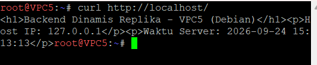

---

### **3. Konfigurasi Upstream & Algoritma Load Balancing**

1. **Buka terminal node `VPC1`**, lalu edit file `/etc/nginx/sites-available/reverse-proxy.conf` dan tambahkan blok `upstream`:

```nginx
# Deklarasi grup server backend dinamis (VPC4 & VPC5)
upstream dynamic_backend {
    # Pilihan Algoritma (default: Round Robin)
    # least_conn; 
    # ip_hash;

    server 10.91.2.3:80 weight=1; # VPC4 (Backend Utama - Alpine)
    server 10.91.2.4:80 weight=1; # VPC5 (Backend Replika - Debian)
}

server {
    listen 80;
    server_name jarkom.it www.jarkom.it;

    access_log /var/log/nginx/reverse_access.log custom_proxy;

    location = /admin { return 301 /admin/; }

    location ^~ /admin/ {
        auth_basic "Halaman Terproteksi Admin";
        auth_basic_user_file /etc/nginx/.htpasswd;
        alias /var/www/admin/;
        index index.html;
    }

    location /static/ {
        proxy_pass http://10.91.2.2/;
        proxy_set_header Host $host;
        proxy_set_header X-Real-IP $remote_addr;
        proxy_set_header X-Forwarded-For $proxy_add_x_forwarded_for;
        proxy_set_header X-Forwarded-Proto $scheme;
    }

    # Rute /app/ diarahkan ke grup upstream dynamic_backend
    location /app/ {
        proxy_pass http://dynamic_backend/;
        proxy_set_header Host $host;
        proxy_set_header X-Real-IP $remote_addr;
        proxy_set_header X-Forwarded-For $proxy_add_x_forwarded_for;
        proxy_set_header X-Forwarded-Proto $scheme;
    }
}
```

2. **Reload Nginx di node `VPC1`**:
   ```bash
   nginx -t && service nginx reload
   ```

---

## **F. Pengujian & Verifikasi System**

Pengujian dilakukan dari node Client **`VPC2` (Alpinet / Alpine)**. Pastikan file `/etc/resolv.conf` di **`VPC2`** telah diarahkan ke IP DNS Master (`10.91.1.2`).

---

### **1. Pengujian HTTP dengan Lynx & Curl - VPC2 (Alpinet)**

1. **Buka terminal node `VPC2`**, lalu install utilitas pengujian di Alpinet:
   ```bash
   apk update
   apk add curl lynx apache2-utils
   ```

2. **Pengujian akses rute statis `/static/`**:
   ```bash
   curl -i http://jarkom.it/static/
   ```
   *Hasil Ekspektasi*: Menampilkan konten HTML dari `VPC3` (Debian).

3. **Pengujian akses rute dinamis `/app/` (Load Balancing)**:
   Jalankan perintah `curl` berulang kali di **`VPC2`**:
   ```bash
   curl http://jarkom.it/app/
   curl http://jarkom.it/app/
   ```
   *Hasil Ekspektasi*: Output akan berganti secara selang-seling antara `Backend Dinamis - VPC4 (Alpine)` dan `Backend Dinamis Replika - VPC5 (Debian)`.

Hasil Pengujian Rute Statis dan Dinamis
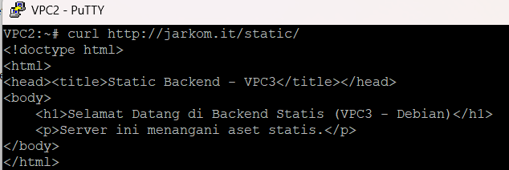
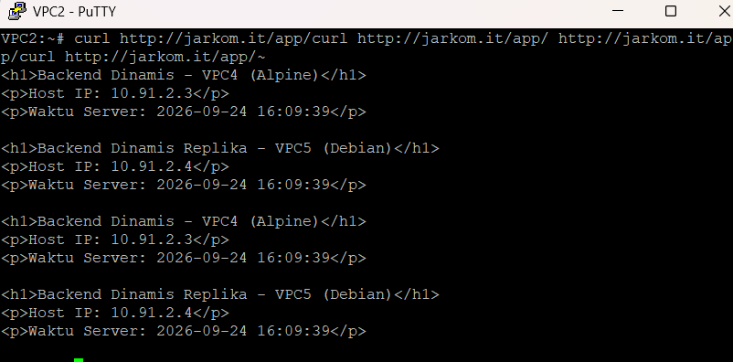

---

### **2. Pengujian Basic Auth (Success & Failure)**

1. **Di node `VPC2`**, uji akses rute `/admin/` **tanpa autentikasi**:
   ```bash
   curl -i http://jarkom.it/admin/
   ```
   *Hasil Ekspektasi*: Respons **HTTP 401 Unauthorized**.

2. **Di node `VPC2`**, uji akses rute `/admin/` **dengan kredensial benar**:
   ```bash
   curl -i -u admin:admin123 http://jarkom.it/admin/
   ```
   *Hasil Ekspektasi*: Respons **HTTP 200 OK** dan pesan "Area Terproteksi Admin (VPC1)".

Hasil Pengujian Basic Auth
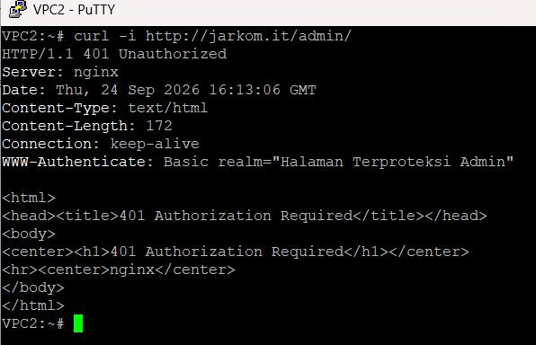
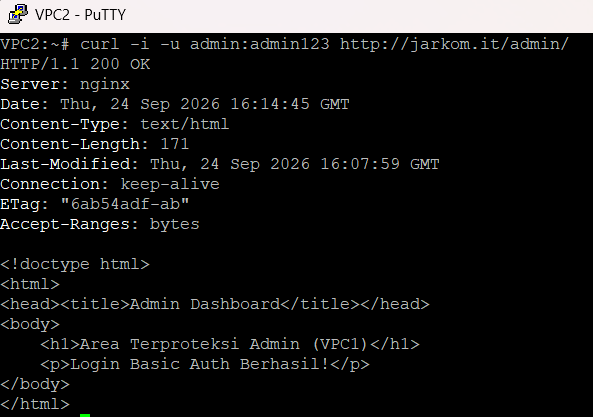
---

### **3. Load Testing Menggunakan Apache Benchmark (ab)**

Jalankan pengujian beban dari terminal **`VPC2`**:

1. **Uji beban pada Rute Dinamis (`/app/`)**:
   ```bash
   ab -n 500 -c 20 http://jarkom.it/app/
   ```

2. **Uji beban pada Rute Statis (`/static/`)**:
   ```bash
   ab -n 500 -c 20 http://jarkom.it/static/
   ```

**Metrik Kunci yang Dianalisis**:
* **Requests per second (RPS)**: Jumlah request yang mampu diproses per detik.
* **Time per request**: Waktu latensi rata-rata per request.


Hasil Pengujian ab pada Rute Dinamis dan Statis
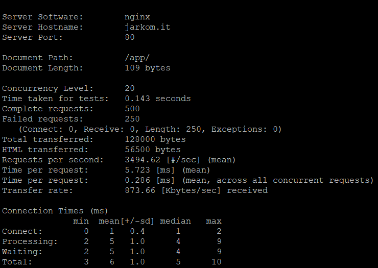

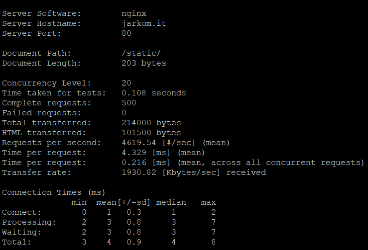

---

### **4. Verifikasi Real IP Header di Backend Log**

1. **Buka terminal server backend `VPC4` (Alpinet)**, lalu pantau log akses Nginx:
   ```bash
   tail -f /var/log/nginx/access.log
   ```

2. **Kirim request dari client `VPC2` (`10.91.1.3`)**:
   ```bash
   curl http://jarkom.it/app/
   ```

3. **Verifikasi Log**: Log akses di **`VPC4`** maupun **`VPC5`** harus mencatat IP asal Klien (`10.91.1.3`) melalui header `X-Forwarded-For` / `X-Real-IP`, bukannya mencatat IP Reverse Proxy (`10.91.1.2`).