# **Reverse Proxy & Load Balancing**


Materi ini merupakan kelanjutan dari materi Reverse Proxy pada Modul 2. Pada modul ini, fokus pembelajaran diarahkan pada implementasi **Load Balancing tingkat lanjut**, **manajemen cluster multi-worker**, **integrasi database terpusat (MariaDB)**, **tuning performa PHP-FPM**, serta **analisis keandalan sistem dan uji beban (load testing)**.

---

## **Daftar Isi**

- [0. Konsep Dasar: Forward Proxy vs. Reverse Proxy](#konsep-dasar-forward-proxy-vs-reverse-proxy)
- [1. Topologi dan Arsitektur Jaringan](#1-topologi-dan-arsitektur-jaringan)
  - [1.1 Skema Topologi](#11-skema-topologi)
  - [1.2 Tabel Alokasi IP Address dan Peran Node](#12-tabel-alokasi-ip-address-dan-peran-node)
  - [1.3 Manajemen Layanan pada Container GNS3](#13-manajemen-layanan-pada-container-gns3)
- [2. Implementasi Database Terpusat (MariaDB Server)](#2-implementasi-database-terpusat-mariadb-server)
  - [2.1 Setup MariaDB di DB-Server (Debinet)](#21-setup-mariadb-di-db-server-debinet)
  - [2.2 Konfigurasi Akses Jaringan dan Hak Akses Remote](#22-konfigurasi-akses-jaringan-dan-hak-akses-remote)
  - [2.3 Inisialisasi Database dan Skema Tabel](#23-inisialisasi-database-dan-skema-tabel)
  - [2.4 Catatan Konfigurasi pada Alpinet](#24-catatan-konfigurasi-pada-alpinet)
  - [2.5 Verifikasi Koneksi Database](#25-verifikasi-koneksi-database)
- [3. Implementasi Backend Worker Dinamis](#3-implementasi-backend-worker-dinamis)
  - [3.1 Instalasi Nginx, PHP, dan Driver Database](#31-instalasi-nginx-php-dan-driver-database)
  - [3.2 Mengenal PHP-FPM dan Protokol FastCGI](#32-mengenal-php-fpm-dan-protokol-fastcgi)
  - [3.3 Tuning Pool PHP-FPM](#33-tuning-pool-php-fpm)
  - [3.4 Konfigurasi Virtual Host Nginx Worker](#34-konfigurasi-virtual-host-nginx-worker)
  - [3.5 Pembuatan Script Aplikasi Multi-Worker](#35-pembuatan-script-aplikasi-multi-worker)
  - [3.6 Catatan Konfigurasi Worker pada Alpinet](#36-catatan-konfigurasi-worker-pada-alpinet)
  - [3.7 Verifikasi Akses Lokal Worker](#37-verifikasi-akses-lokal-worker)
- [4. Konfigurasi Nginx Load Balancer (LB-Proxy)](#4-konfigurasi-nginx-load-balancer-lb-proxy)
  - [4.1 Instalasi Nginx dan Format Log Real IP](#41-instalasi-nginx-dan-format-log-real-ip)
  - [4.2 Pemetaan Header Klien (proxy_set_header)](#42-pemetaan-header-klien-proxy_set_header)
  - [4.3 Implementasi Algoritma Load Balancing](#43-implementasi-algoritma-load-balancing)
    - [A. Round Robin (Default)](#a-round-robin-default)
    - [B. Weighted Round Robin](#b-weighted-round-robin)
    - [C. Least Connections (least_conn)](#c-least-connections-least_conn)
    - [D. IP Hash (ip_hash)](#d-ip-hash-ip_hash)
    - [E. Generic Hash (hash)](#e-generic-hash-hash)
  - [4.4 Parameter Keandalan dan Failover (backup, down, max_fails)](#44-parameter-keandalan-dan-failover-backup-down-max_fails)
  - [4.5 Penggunaan Proxy Binding (proxy_bind)](#45-penggunaan-proxy-binding-proxy_bind)
  - [4.6 Catatan Konfigurasi LB-Proxy pada Alpinet](#46-catatan-konfigurasi-lb-proxy-pada-alpinet)
- [5. Pengujian Sistem, Failover, dan Analisis Beban](#5-pengujian-sistem-failover-dan-analisis-beban)
  - [5.1 Pengujian Distribusi Algoritma dari Client](#51-pengujian-distribusi-algoritma-dari-client)
  - [5.2 Pengujian Failover dan High Availability](#52-pengujian-failover-dan-high-availability)
  - [5.3 Verifikasi Pencatatan Real IP dan Data Database](#53-verifikasi-pencatatan-real-ip-dan-data-database)
  - [5.4 Uji Beban (Load Testing) Menggunakan Apache Benchmark](#54-uji-beban-load-testing-menggunakan-apache-benchmark)
---

## **0. Konsep Dasar: Forward Proxy vs. Reverse Proxy**

Sebelum masuk ke konfigurasi teknis, penting untuk memahami perbedaan fundamental antara *Forward Proxy* dan *Reverse Proxy*:

### **A. Forward Proxy**
Forward Proxy bertindak sebagai perantara bagi **klien** untuk mengakses server di internet. Server tujuan mengira koneksi berasal dari proxy, bukan dari klien asli. Biasa dimanfaatkan untuk caching lokal, kontrol akses (filtering), atau menyembunyikan identitas klien.

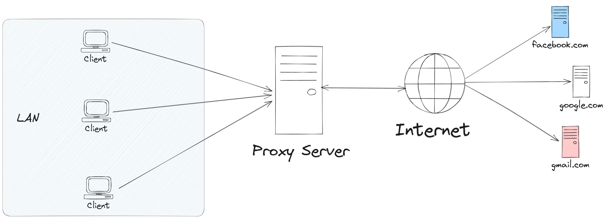

### **B. Reverse Proxy**
Reverse Proxy bertindak sebagai perantara di depan **server backend**. Klien luar mengira mereka sedang berkomunikasi langsung dengan server utama, padahal request diterima terlebih dahulu oleh reverse proxy untuk diteruskan ke backend worker. Reverse proxy digunakan untuk:
- **Keamanan**: Menyembunyikan topologi IP asli backend dari jaringan publik.
- **SSL Termination & Caching**: Mengurangi beban pemrosesan enkripsi dan file statis pada server backend.
- **Load Balancing**: Mendistribusikan request ke beberapa worker server secara bersamaan.

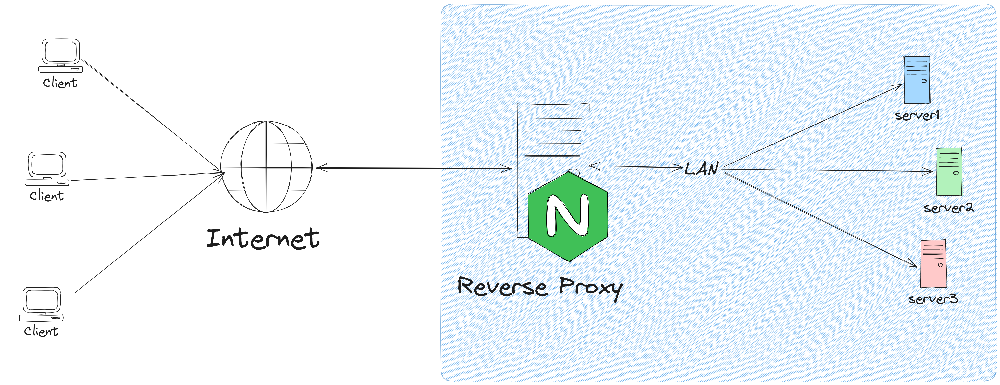

---

## **1. Contoh Implementasi Topologi dan Arsitektur Jaringan**

### **1.1 Skema Topologi**

Topologi praktikum ini memisahkan jaringan menjadi dua segmen:
1. **Subnet Publik / Client (`[PREFIX].1.0/24`)**: Berisi node Client dan antarmuka eksternal Load Balancer (`LB-Proxy`).
2. **Subnet Privat / Backend Farm (`[PREFIX].2.0/24`)**: Berisi antarmuka internal Load Balancer, tiga server backend dinamis (`Worker1`, `Worker2`, `Worker3`), serta server basis data terpusat (`DB-Server`).

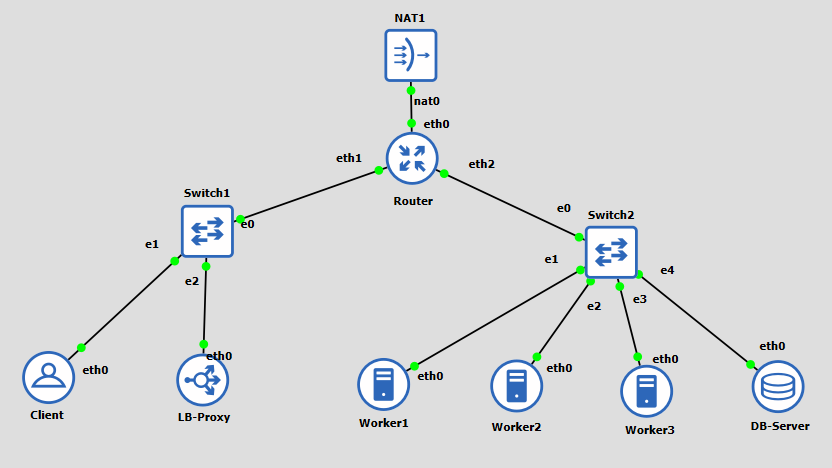


---

### **1.2 Tabel Alokasi IP Address dan Peran Node**

| Node | Interface | Image OS | IP Address | Netmask | Gateway | Peran / Fungsi |
| :--- | :--- | :--- | :--- | :--- | :--- | :--- |
| **Router** | `eth0`<br>`eth1`<br>`eth2` | Debinet / Router | DHCP (NAT)<br>`[PREFIX].1.1`<br>`[PREFIX].2.1` | Sesuai NAT<br>`255.255.255.0`<br>`255.255.255.0` | Otomatis<br>None<br>None | Router / Gateway antar-subnet |
| **Client** | `eth0` | Debinet | `[PREFIX].1.2` | `255.255.255.0` | `[PREFIX].1.1` | Klien penguji (`curl`, `lynx`, `ab`) |
| **LB-Proxy** | `eth0` | Debinet | `[PREFIX].1.3` | `255.255.255.0` | `[PREFIX].1.1` | Nginx Reverse Proxy & Load Balancer |
| **Worker1** | `eth0` | Debinet | `[PREFIX].2.2` | `255.255.255.0` | `[PREFIX].2.1` | Web Server Dinamis (Nginx + PHP-FPM) |
| **Worker2** | `eth0` | Debinet | `[PREFIX].2.3` | `255.255.255.0` | `[PREFIX].2.1` | Web Server Dinamis (Nginx + PHP-FPM) |
| **Worker3** | `eth0` | Debinet | `[PREFIX].2.4` | `255.255.255.0` | `[PREFIX].2.1` | Web Server Dinamis (Nginx + PHP-FPM) |
| **DB-Server**| `eth0` | Debinet | `[PREFIX].2.10` | `255.255.255.0` | `[PREFIX].2.1` | Database Server Terpusat (MariaDB) |


---

### **1.3 Manajemen Layanan pada Container GNS3**

Container berbasis Docker di GNS3 (seperti Debinet dan Alpinet) tidak menjalankan daemon systemd sebagai PID 1. Oleh karena itu, perintah `systemctl` tidak dapat digunakan.

Gunakan standar pengelolaan service berikut:
- **Debinet (Debian)**: Gunakan utilitas `service` atau script init langsung:
  ```bash
  service nginx start
  service nginx restart
  service nginx status
  # atau
  /etc/init.d/nginx restart
  ```
- **Alpinet (Alpine)**: Gunakan OpenRC atau jalankan executable secara langsung di background:
  ```bash
  rc-service nginx restart
  # atau jika OpenRC tidak aktif di container
  nginx -s reload
  ```

---

## **2. Implementasi Database Terpusat (MariaDB Server)**

Pada arsitektur klaster web server, data aplikasi dinamis tidak boleh disimpan secara lokal pada masing-masing worker karena akan menimbulkan inkonsistensi data. Server `DB-Server` berfungsi menyediakan basis data terpusat yang dapat diakses bersama oleh `Worker1`, `Worker2`, dan `Worker3`.

---

### **2.1 Setup MariaDB di DB-Server (Debinet)**

1. Masuk ke terminal node **`DB-Server`**, perbarui daftar paket, dan pasang paket MariaDB:
   ```bash
   apt-get update -y
   apt-get install -y mariadb-server mariadb-client
   ```

2. Jalankan layanan MariaDB:
   ```bash
   service mariadb start
   service mariadb status
   ```

Contoh output status:
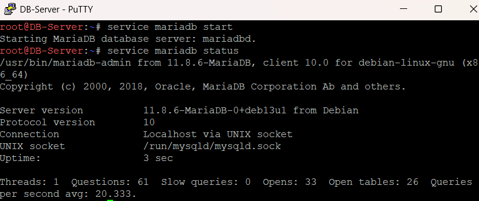

---

### **2.2 Konfigurasi Akses Jaringan dan Hak Akses Remote**

Secara default, MariaDB hanya mendengarkan koneksi lokal pada alamat loopback (`127.0.0.1`). Agar server worker di Subnet 2 dapat terhubung, MariaDB harus dikonfigurasi untuk menerima koneksi jaringan luar.

1. Buka file konfigurasi MariaDB di `/etc/mysql/mariadb.conf.d/50-server.cnf` (atau `/etc/mysql/my.cnf` tergantung versi Debian):
   ```bash
   nano /etc/mysql/mariadb.conf.d/50-server.cnf
   ```

2. Cari baris `bind-address` dan ubah nilainya menjadi `0.0.0.0`:
   ```cnf
   # Ubah dari 127.0.0.1 menjadi 0.0.0.0
   bind-address            = 0.0.0.0
   ```
   > **Kenapa `0.0.0.0`?**  
   > Secara default, nilai `127.0.0.1` (*localhost*) hanya mengizinkan koneksi dari dalam server itu sendiri. Alamat `0.0.0.0` (*inaddr_any*) menginstruksikan daemon MariaDB untuk mendengarkan (*listen*) permintaan koneksi masuk pada **seluruh interface jaringan**.

3. Simpan file konfigurasi, lalu muat ulang layanan:
   ```bash
   service mariadb restart
   ```

4. Verifikasi bahwa port 3306 mendengarkan pada seluruh antarmuka jaringan:
   ```bash
   netstat -tlpn | grep 3306
   # atau
   ss -tlpn | grep 3306
   ```

Verifikasi Port Binding:
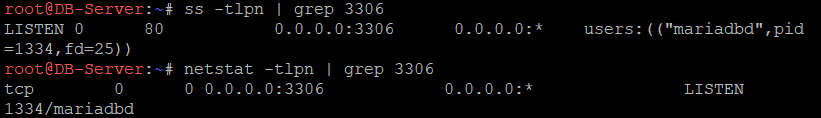

---

### **2.3 Inisialisasi Database dan Skema Tabel**

1. Masuk ke console MariaDB:
   ```bash
   mariadb -u root
   ```

2. Buat database `db_jarkom`, buat user untuk cluster worker, berikan izin akses dari subnet backend (`[PREFIX].2.%`), dan buat tabel pencatatan request:

   *(Contoh di bawah mengasumsikan prefix `10.91`, sesuaikan dengan prefix kelompok masing-masing)*:

   ```sql
   CREATE DATABASE db_jarkom;

   -- Buat user yang dapat diakses dari seluruh IP di subnet backend
   CREATE USER 'kelompok'@'%' IDENTIFIED BY 'password123';
   GRANT ALL PRIVILEGES ON db_jarkom.* TO 'kelompok'@'%';
   FLUSH PRIVILEGES;

   USE db_jarkom;

   -- Tabel untuk mencatat riwayat akses request dari load balancer
   CREATE TABLE request_logs (
       id INT AUTO_INCREMENT PRIMARY KEY,
       worker_name VARCHAR(50) NOT NULL,
       client_ip VARCHAR(50) NOT NULL,
       proxy_ip VARCHAR(50) NOT NULL,
       user_agent TEXT,
       created_at TIMESTAMP DEFAULT CURRENT_TIMESTAMP
   );
   ```

3. Keluar dari console MariaDB:
   ```sql
   EXIT;
   ```

---

### **2.4 Catatan Konfigurasi pada Alpinet**
Jika node **`DB-Server`** menggunakan image **Alpinet (Alpine Linux)**:

1. **Instalasi Paket**:
   ```bash
   apk update
   apk add mariadb mariadb-client
   ```
2. **Inisialisasi Data**:
   Alpine mewajibkan inisialisasi direktori data sebelum service dijalankan:
   ```bash
   mariadb-install-db --user=mysql --datadir=/var/lib/mysql
   ```
3. **Konfigurasi `bind-address`**:
   File konfigurasi terletak di `/etc/my.cnf` atau `/etc/my.cnf.d/mariadb-server.cnf`:
   ```cnf
   [mysqld]
   bind-address = 0.0.0.0
   skip-networking = 0
   ```
4. **Menjalankan Layanan**:
   ```bash
   /etc/init.d/mariadb setup
   /etc/init.d/mariadb start
   # atau jalankan daemon secara manual di background
   /usr/bin/mysqld_safe --datadir=/var/lib/mysql &
   ```

---

### **2.5 Verifikasi Koneksi Database**

Uji koneksi remote dari salah satu node worker (misalnya **`Worker1`**):

1. Di terminal **`Worker1`**, pasang client MariaDB:
   ```bash
   apt-get update -y && apt-get install -y mariadb-client
   ```

2. Lakukan koneksi ke `DB-Server` (`[PREFIX].2.10`):
   ```bash
   mariadb -h [PREFIX].2.10 -u kelompok -ppassword123 -e "SHOW DATABASES; USE db_jarkom; SHOW TABLES;"
   ```

Verifikasi Koneksi Remote:
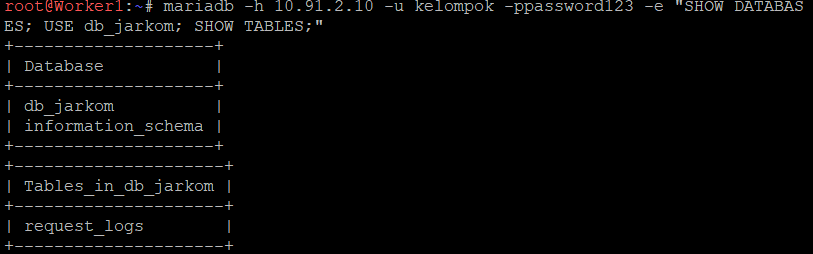

---

## **3. Implementasi Backend Worker Dinamis**

Ketiga worker (`Worker1`, `Worker2`, `Worker3`) berfungsi mengeksekusi script PHP dan berinteraksi dengan database terpusat.

Lakukan langkah-langkah di subbab 3.1 sampai 3.5 pada **ketiga node worker**.

---

### **3.1 Instalasi Nginx, PHP, dan Driver Database**

Jalankan perintah berikut pada terminal setiap worker:

```bash
apt-get update -y
apt-get install -y nginx php-fpm php-mysqli mariadb-client
```

Pastikan ekstensi `mysqli` terpasang agar PHP dapat berkomunikasi dengan MariaDB.

---

### **3.2 Mengenal PHP-FPM dan Protokol FastCGI**

Nginx dirancang dengan arsitektur *event-driven asynchronous* yang sangat efisien dan ringan dalam menyajikan file statis (HTML, CSS, gambar). Namun, **Nginx tidak memiliki modul penerjemah PHP internal** (berbeda dengan modul `mod_php` bawaan Apache).

Oleh karena itu, Nginx membutuhkan daemon terpisah yaitu **PHP-FPM** (*FastCGI Process Manager*):

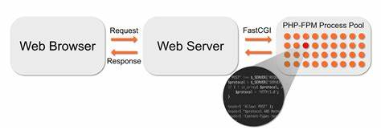

- **Alur Kerja Pemrosesan Request:**
  1. Klien mengirimkan request HTTP untuk file `.php` ke Nginx.
  2. Nginx bertindak sebagai FastCGI client, meneruskan request melalui Unix Socket (`/run/php/php8.4-fpm.sock`) ke master process PHP-FPM.
  3. Master process menugaskan salah satu *child worker process* yang sedang siaga untuk mengeksekusi script PHP dan berinteraksi dengan database (MariaDB).
  4. Hasil eksekusi script dikembalikan ke Nginx dalam bentuk format teks/HTML, lalu Nginx mengirimkan respons akhir ke klien.

---

### **3.3 Tuning Pool PHP-FPM**

Pada sistem dengan beban konkurensi tinggi, konfigurasi default PHP-FPM sering kali membatasi jumlah child process (`pm.max_children = 5`), sehingga request yang datang secara bersamaan dapat mengalami antrean panjang atau timeout.

1. Pastikan layanan PHP-FPM dinyalakan terlebih dahulu:
   ```bash
   service php8.4-fpm start
   ```

2. Buka file konfigurasi pool utama (pada Debinet menggunakan PHP 8.4):
   ```bash
   nano /etc/php/8.4/fpm/pool.d/www.conf
   ```

3. Cari dan sesuaikan parameter process manager berikut di dalam file `www.conf`:
   ```ini
   pm = dynamic
   pm.max_children = 30
   pm.start_servers = 6
   pm.min_spare_servers = 4
   pm.max_spare_servers = 10
   pm.max_requests = 500
   ```
   - `pm.max_children`: Jumlah maksimum proses PHP yang diizinkan berjalan sekaligus.
   - `pm.start_servers`: Jumlah proses yang dibuat saat service pertama kali dinyalakan.
   - `pm.min_spare_servers` & `pm.max_spare_servers`: Batas minimum dan maksimum proses cadangan yang siaga menunggu request.
   - `pm.max_requests`: Jumlah request yang diproses oleh satu worker sebelum proses di-recycle untuk mencegah kebocoran memori (memory leak).

   *(Catatan: Pastikan baris `listen = /run/php/php8.4-fpm.sock` di dalam file `www.conf` dibiarkan apa adanya karena Debian secara default sudah menggunakan Unix socket).*

4. Simpan konfigurasi, lalu muat ulang layanan PHP-FPM:
   ```bash
   service php8.4-fpm restart
   ```

5. Verifikasi bahwa file socket aktif sudah terbentuk:
   ```bash
   ls -la /run/php/
   ```
   *(Harus muncul file `php8.4-fpm.sock`)*

---

### **3.4 Konfigurasi Virtual Host Nginx Worker**

1. Tulis konfigurasi virtual host default di `/etc/nginx/sites-available/default`:
   ```bash
   cat > /etc/nginx/sites-available/default <<'NGINX'
   server {
       listen 80 default_server;
       listen [::]:80 default_server;

       root /var/www/html;
       index index.php index.html;

       server_name _;

       location / {
           try_files $uri $uri/ /index.php?$query_string;
       }

       location ~ \.php$ {
           include snippets/fastcgi-php.conf;
           fastcgi_pass unix:/run/php/php8.4-fpm.sock;
       }

       location ~ /\.ht {
           deny all;
       }
   }
   NGINX
   ```

2. Uji sintaks konfigurasi dan jalankan/restart layanan Nginx:
   ```bash
   nginx -t
   service nginx restart || service nginx start
   ```

---

### **3.5 Pembuatan Script Aplikasi Multi-Worker**

Buat file `/var/www/html/index.php` pada masing-masing worker. File ini berfungsi menangkap header dari Load Balancer, mencatat kunjungan ke `DB-Server`, dan mencetak status respons worker.

```bash
cat > /var/www/html/index.php <<'PHP'
<?php
header('Content-Type: text/html; charset=UTF-8');

// Konfigurasi Database Terpusat (Sesuaikan IP DB-Server dengan prefix kelompok)
$db_host = "10.91.2.10";
$db_user = "kelompok";
$db_pass = "password123";
$db_name = "db_jarkom";

$hostname    = gethostname();
$server_ip   = $_SERVER['SERVER_ADDR'] ?? 'Unknown';
$proxy_ip    = $_SERVER['REMOTE_ADDR'] ?? 'Unknown';
$client_ip   = $_SERVER['HTTP_X_REAL_IP'] ?? $_SERVER['HTTP_X_FORWARDED_FOR'] ?? $proxy_ip;
$user_agent  = $_SERVER['HTTP_USER_AGENT'] ?? 'Unknown';

$db_status   = "Terkoneksi";
$total_hits  = 0;

// Koneksi ke MariaDB Terpusat
$conn = @new mysqli($db_host, $db_user, $db_pass, $db_name);

if ($conn->connect_error) {
    $db_status = "Gagal: " . $conn->connect_error;
} else {
    // Insert log request
    $stmt = $conn->prepare("INSERT INTO request_logs (worker_name, client_ip, proxy_ip, user_agent) VALUES (?, ?, ?, ?)");
    if ($stmt) {
        $stmt->bind_param("ssss", $hostname, $client_ip, $proxy_ip, $user_agent);
        $stmt->execute();
        $stmt->close();
    }

    // Hitung total request yang tercatat di seluruh cluster
    $res = $conn->query("SELECT COUNT(*) AS total FROM request_logs");
    if ($res) {
        $row = $res->fetch_assoc();
        $total_hits = $row['total'];
    }
    $conn->close();
}
?>
<!DOCTYPE html>
<html>
<head>
    <title>Cluster Worker: <?php echo htmlspecialchars($hostname); ?></title>
    <style>
        body { font-family: monospace; background: #0f172a; color: #f8fafc; padding: 2rem; }
        .card { background: #1e293b; border: 1px solid #334155; padding: 1.5rem; border-radius: 8px; max-width: 650px; }
        h2 { margin-top: 0; color: #38bdf8; border-bottom: 1px solid #334155; padding-bottom: 8px; }
        pre { font-family: monospace; font-size: 14px; margin: 0; line-height: 1.8; color: #f8fafc; }
    </style>
</head>
<body>
    <div class="card">
        <h2>Backend Cluster Worker</h2>
<pre>
Worker Hostname: <?php echo htmlspecialchars($hostname); ?>

Worker Local IP: <?php echo htmlspecialchars($server_ip); ?>

Reverse Proxy IP: <?php echo htmlspecialchars($proxy_ip); ?>

Client Real IP: <?php echo htmlspecialchars($client_ip); ?>

Status Database: <?php echo htmlspecialchars($db_status); ?>

Total Cluster Requests: <?php echo htmlspecialchars($total_hits); ?>
</pre>
    </div>
</body>
</html>
PHP
```

---

### **3.6 Catatan Konfigurasi Worker pada Alpinet**

Jika salah satu worker menggunakan image **Alpinet (Alpine Linux)**:

1. **Instalasi Paket**:
   ```bash
   apk update
   apk add nginx php82-fpm php82-mysqli mariadb-client
   ```
2. **Lokasi Konfigurasi Nginx**:
   Alpine meletakkan konfigurasi di `/etc/nginx/http.d/default.conf`.
   Konfigurasi blok PHP FastCGI di Alpine mengarahkan ke TCP port `127.0.0.1:9000` atau soket `/run/php-fpm82.sock`:
   ```nginx
   location ~ \.php$ {
       fastcgi_pass 127.0.0.1:9000;
       fastcgi_index index.php;
       include fastcgi_params;
       fastcgi_param SCRIPT_FILENAME $document_root$fastcgi_script_name;
   }
   ```
3. **Lokasi Konfigurasi Pool PHP-FPM**:
   File pool di Alpine berada di `/etc/php82/php-fpm.d/www.conf`.
4. **Menjalankan Layanan**:
   ```bash
   php-fpm82
   nginx
   # atau jika ingin reload
   nginx -s reload
   ```

---

### **3.7 Verifikasi Akses Lokal Worker**

Uji akses halaman web langsung pada masing-masing worker:

```bash
curl -s http://127.0.0.1 | grep -E "Worker Hostname|Status Database"
```

Verifikasi Akses Lokal Worker:
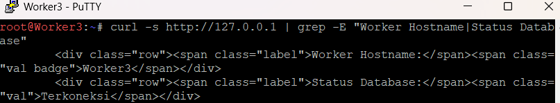

---

## **4. Konfigurasi Nginx Load Balancer (LB-Proxy)**

Node **`LB-Proxy`** bertindak sebagai perantara tunggal bagi klien luar untuk mengakses cluster backend.

---

### **4.1 Instalasi Nginx dan Format Log Real IP**

1. Di terminal **`LB-Proxy`**, instal Nginx:
   ```bash
   apt-get update -y
   apt-get install -y nginx
   ```

2. Buka file `/etc/nginx/nginx.conf` dan letakkan format log kustom berikut di dalam blok `http` (tepat di bagian `Logging Settings`):
   ```nginx
   http {
       ...
       ##
       # Logging Settings
       ##
       log_format lb_log '$remote_addr - $remote_user [$time_local] '
                         '"$request" $status $body_bytes_sent '
                         'rt=$request_time uct="$upstream_connect_time" '
                         'uht="$upstream_header_time" urt="$upstream_response_time" '
                         'upstream=$upstream_addr realip=$http_x_real_ip';

       access_log /var/log/nginx/access.log lb_log;
       ...
   }
   ```

   > **Fungsi format `lb_log`:**  
   > Format default Nginx tidak mencatat server tujuan. Format `lb_log` ditambahkan untuk memantau load balancing:
   > - `$upstream_addr`: IP dan port worker yang memproses request (misal `10.91.2.2:80`).
   > - `rt`: Total durasi pemrosesan request (detik).
   > - `urt`: Waktu respons dari worker backend (detik).
   > - `uct`: Waktu koneksi TCP ke worker (detik).
   > - `realip`: Alamat IP asli milik klien.

---

### **4.2 Pemetaan Header Klien (proxy_set_header)**

Ketika Nginx bertindak sebagai reverse proxy, secara default alamat IP asal request diubah menjadi IP milik proxy. Agar backend worker tetap mengetahui identitas asli klien (dan bisa mencatatnya ke database), kita menambahkan 4 baris header di dalam blok `location /`:

```nginx
location / {
    proxy_pass http://backend_cluster;

    # Meneruskan header asli klien ke backend worker:
    proxy_set_header Host $host;
    proxy_set_header X-Real-IP $remote_addr;
    proxy_set_header X-Forwarded-For $proxy_add_x_forwarded_for;
    proxy_set_header X-Forwarded-Proto $scheme;
}
```

**Fungsi masing-masing baris:**
- `Host $host`: Meneruskan nama host/domain yang dituju klien.
- `X-Real-IP $remote_addr`: Mengirimkan IP asli klien yang menghubungi Load Balancer.
- `X-Forwarded-For $proxy_add_x_forwarded_for`: Menyimpan daftar IP klien jika melewati proxy berantai.
- `X-Forwarded-Proto $scheme`: Menyatakan protokol yang digunakan (`http` atau `https`).
---

### **4.3 Implementasi Algoritma Load Balancing**

Konfigurasi load balancing ditempatkan pada file baru `/etc/nginx/sites-available/load-balancer.conf` di node **`LB-Proxy`**.

#### A. Round Robin (Default)

Round Robin mendistribusikan request secara berurutan dan bergantian ke setiap server backend.

1. **Buat file konfigurasi load balancer:**
   ```bash
   cat > /etc/nginx/sites-available/load-balancer.conf <<'NGINX'
   upstream backend_cluster {
       server 10.91.2.2:80; # Worker1
       server 10.91.2.3:80; # Worker2
       server 10.91.2.4:80; # Worker3
   }

   server {
       listen 80;
       server_name _;

       location / {
           proxy_pass http://backend_cluster;
           proxy_set_header Host $host;
           proxy_set_header X-Real-IP $remote_addr;
           proxy_set_header X-Forwarded-For $proxy_add_x_forwarded_for;
           proxy_set_header X-Forwarded-Proto $scheme;
       }
   }
   NGINX
   ```

   **Penjelasan singkat:**
   - `upstream backend_cluster`: Daftar server backend (Worker 1–3). Default algoritma: Round Robin (1:1:1).
   - `server`: Menerima request masuk dari klien pada port 80.
   - `location /`:
     - `proxy_pass`: Meneruskan request ke upstream `backend_cluster`.
     - `proxy_set_header`: Meneruskan informasi asli klien (Host, IP, protokol) ke backend worker.

2. **Aktifkan konfigurasi dan nonaktifkan default site:**
   ```bash
   ln -s /etc/nginx/sites-available/load-balancer.conf /etc/nginx/sites-enabled/
   rm -f /etc/nginx/sites-enabled/default
   ```

3. **Uji sintaks dan jalankan layanan Nginx:**
   ```bash
   nginx -t
   service nginx restart || service nginx start
   ```
---

#### *B. Weighted Round Robin*

Weighted Round Robin memberikan bobot prioritas (`weight`) ke masing-masing server backend. Server dengan bobot lebih tinggi akan menerima proporsi request yang lebih besar. Metode ini digunakan jika spesifikasi hardware server backend tidak seimbang.

```nginx
upstream backend_cluster {
    server 10.91.2.2:80 weight=3; # Worker1 menerima 3 dari setiap 6 request
    server 10.91.2.3:80 weight=2; # Worker2 menerima 2 dari setiap 6 request
    server 10.91.2.4:80 weight=1; # Worker3 menerima 1 dari setiap 6 request
}
```

Rasio distribusi di atas adalah 3 : 2 : 1 (Worker1 melayani 50% trafik, Worker2 melayani 33.3%, Worker3 melayani 16.7%).

---

#### C. Least Connections (least_conn)

Algoritma Least Connection mengalihkan request baru ke server backend yang saat itu sedang menangani jumlah koneksi aktif paling sedikit. Metode ini optimal jika pemrosesan request memiliki durasi yang bervariasi (misalnya ada request yang memakan waktu lama akibat query kompleks).

```nginx
upstream backend_cluster {
    least_conn;
    server 10.91.2.2:80; # Worker1
    server 10.91.2.3:80; # Worker2
    server 10.91.2.4:80; # Worker3
}
```

---

#### D. IP Hash (ip_hash)

Algoritma IP Hash menggunakan alamat IP klien (tiga oktet pertama IPv4) sebagai kunci hashing untuk menentukan server backend yang akan melayani request. Klien yang sama akan selalu diarahkan ke server backend yang sama, sehingga menjaga persistensi sesi (session stickiness).

```nginx
upstream backend_cluster {
    ip_hash;
    server 10.91.2.2:80; # Worker1
    server 10.91.2.3:80; # Worker2
    server 10.91.2.4:80; # Worker3
}
```

> **Catatan Penting IP Hash**: Jika salah satu server backend dinonaktifkan untuk maintenance pada konfigurasi `ip_hash`, tandai server tersebut dengan parameter `down` agar integritas hashing tidak berantakan.

---

#### E. Generic Hash (hash)

Algoritma Generic Hash memungkinkan penentuan kunci hash berdasarkan variabel khusus yang diinginkan oleh administrator, misalnya berdasarkan URL path (`$request_uri`). Metode ini cocok digunakan untuk skenario caching proxy.

```nginx
upstream backend_cluster {
    hash $request_uri consistent;
    server 10.91.2.2:80; # Worker1
    server 10.91.2.3:80; # Worker2
    server 10.91.2.4:80; # Worker3
}
```

Parameter `consistent` menerapkan algoritma ketamaian hash ketam (ketamaian hashing / consistent hashing) sehingga penambahan atau pengurangan server backend hanya memengaruhi sebagian kecil request.

---

### **4.4 Parameter Keandalan dan Failover (backup, down, max_fails)**

Nginx menyediakan parameter pendukung di dalam blok `upstream` untuk mengelola ketersediaan server:

```nginx
upstream backend_cluster {
    server 10.91.2.2:80 weight=3; # Worker1
    server 10.91.2.3:80 weight=2; # Worker2
    server 10.91.2.4:80 backup weight=1; # Worker3
}
```

Konfigurasi Failover di LB-Proxy:
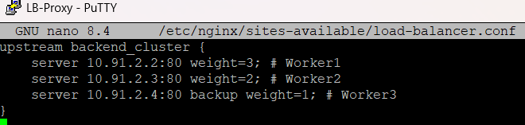

- `backup`: Menandai server cadangan yang hanya akan menerima request ketika seluruh server utama offline.
- `max_fails=3`: Jika komunikasi ke server gagal sebanyak 3 kali berturut-turut, Nginx menganggap server tersebut tidak aktif.
- `fail_timeout=10s`: Durasi waktu server dianggap tidak aktif sebelum Nginx mencoba mengirimkan request kembali untuk memeriksa status pemulihannya.
- `down`: Menandai server secara manual sebagai tidak aktif sementara waktu untuk pemeliharaan.

---

### **4.5 Penggunaan Proxy Binding (proxy_bind)**

Pada node Load Balancer yang memiliki beberapa antarmuka jaringan (multihomed) atau beberapa alamat IP sekunder pada interface internal, direktif `proxy_bind` digunakan untuk memaksa Nginx keluar menuju server backend menggunakan alamat IP tertentu.

Contoh konfigurasi:

```nginx
location / {
    proxy_bind 10.91.2.254; # Memaksa koneksi keluar menggunakan IP internal LB-Proxy
    proxy_pass http://backend_cluster;
    proxy_set_header Host $host;
    proxy_set_header X-Real-IP $remote_addr;
    proxy_set_header X-Forwarded-For $proxy_add_x_forwarded_for;
}
```

---

### **4.6 Catatan Konfigurasi LB-Proxy pada Alpinet**

Jika node **`LB-Proxy`** menggunakan **Alpinet**:

1. **Instalasi Paket**:
   ```bash
   apk update && apk add nginx
   ```
2. **Lokasi File**:
   Hapus konfigurasi default dan letakkan konfigurasi di `/etc/nginx/http.d/load-balancer.conf`:
   ```bash
   rm -f /etc/nginx/http.d/default.conf
   ```
3. **Aktivasi Layanan**:
   ```bash
   nginx -t
   nginx
   # atau reload setelah perubahan konfigurasi
   nginx -s reload
   ```

---

## *5. Pengujian Sistem, Failover, dan Analisis Beban*

Seluruh pengujian fungsional dan beban dijalankan dari terminal node **`Client`** (`[PREFIX].1.2`).

---

### **5.1 Pengujian Distribusi Algoritma dari Client**

1. Pasang utilitas pengujian pada node **`Client`**:
   ```bash
   apt-get update -y
   apt-get install -y curl apache2-utils lynx
   ```

2. **Pengujian Algoritma Round Robin**:
   Jalankan loop `curl` sebanyak 20 kali menuju IP eksternal `LB-Proxy` (`[PREFIX].1.3`):
   ```bash
   for i in {1..20}; do
       curl -s http://10.91.1.3 | grep "Worker Hostname:"
   done
   ```

Hasil Pengujian Round Robin:
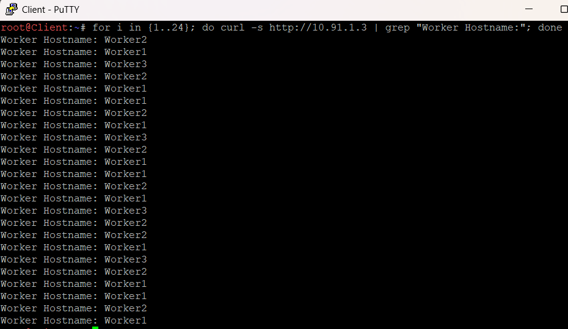

---


### **5.2 Pengujian Failover dan High Availability**

Pengujian ini membuktikan bahwa Nginx Load Balancer mampu mengisolasi node yang bermasalah tanpa menyebabkan request klien gagal.

1. Terapkan konfigurasi failover di file `/etc/nginx/sites-available/load-balancer.conf` pada node **`LB-Proxy`** (sesuai subbab 4.4), lalu reload Nginx (`nginx -t && nginx -s reload`).

2. **Pengujian Kondisi Normal (Worker1 dan Worker2 Aktif)**:  
   Jalankan loop `curl` sebanyak 10 kali dari node **`Client`**:
   ```bash
   for i in {1..10}; do curl -s http://10.91.1.3 | grep "Worker Hostname:"; done
   ```
   *Ekspektasi*: Hanya server utama (`Worker1` dan `Worker2`) yang melayani request secara bergantian sesuai bobot masing-masing. Server cadangan (`Worker3`) tidak menerima request sama sekali.

3. **Simulasi Downtime Server Utama**:  
   Matikan layanan Nginx pada kedua server utama:
   ```bash
   # Di terminal Worker1
   service nginx stop

   # Di terminal Worker2
   service nginx stop
   ```

4. **Pengujian Kondisi Failover (Pengalihan ke Server Backup)**:  
   Jalankan kembali loop `curl` sebanyak 10 kali dari terminal **`Client`**:
   ```bash
   for i in {1..10}; do curl -s http://10.91.1.3 | grep "Worker Hostname:"; done
   ```
   *Ekspektasi*: Karena seluruh server utama offline, Nginx Load Balancer secara otomatis mengalihkan seluruh trafik ke server `backup` yaitu **`Worker3`** tanpa memunculkan error 502 Bad Gateway.

Hasil Pengujian Failover: 
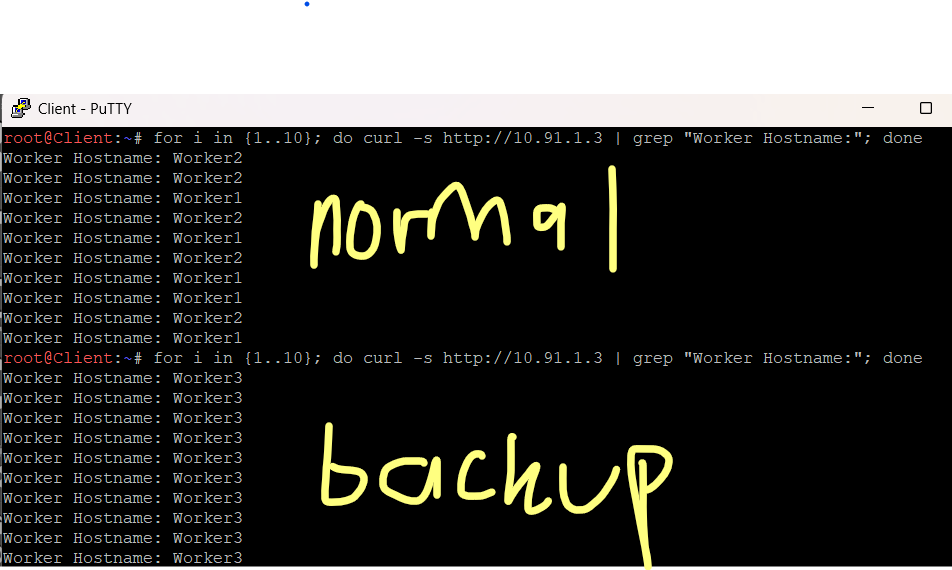

5. Hidupkan kembali layanan Nginx pada Worker1 dan Worker2 setelah pengujian selesai:
   ```bash
   service nginx start
   ```

---

### **5.3 Verifikasi Pencatatan Real IP dan Data Database**
1. Buka console MariaDB pada node **`DB-Server`**:
   ```bash
   mariadb -u kelompok -ppassword123 -e "USE db_jarkom; SELECT id, worker_name, client_ip, proxy_ip, created_at FROM request_logs ORDER BY id DESC LIMIT 15;"
   ```

Pemeriksaan Log Real IP di Database:
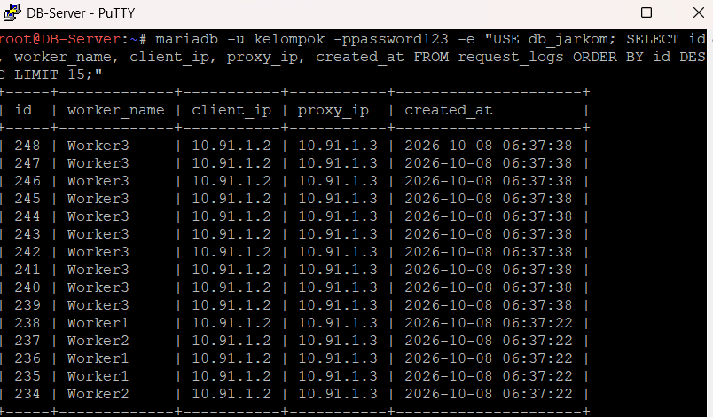

---

### **5.4 Uji Beban (Load Testing) Menggunakan Apache Benchmark**

Apache Benchmark (`ab`) digunakan untuk menguji ketahanan, kapasitas throughput (Requests Per Second / RPS), dan latensi response cluster di bawah beban konkuren.

1. **Uji Beban 1: Single Worker (Tanpa Load Balancer)**
   Jalankan benchmark langsung ke alamat IP salah satu worker (`Worker1`):
   ```bash
   ab -n 600 -c 30 -l http://10.91.2.2/
   ```

   Hasil Benchmark Single Worker (Worker1):
   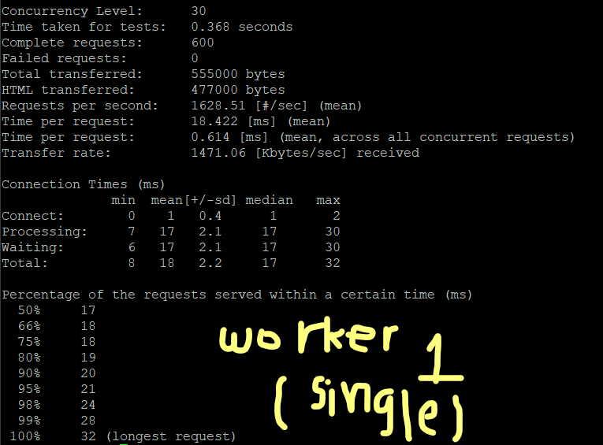

2. **Uji Beban 2: Cluster Multi-Worker (Melalui Load Balancer)**
   Jalankan benchmark dengan parameter beban yang sama ke alamat IP `LB-Proxy`:
   ```bash
   ab -n 600 -c 30 -l http://10.91.1.3/
   ```

   Hasil Benchmark Cluster Load Balancer:
   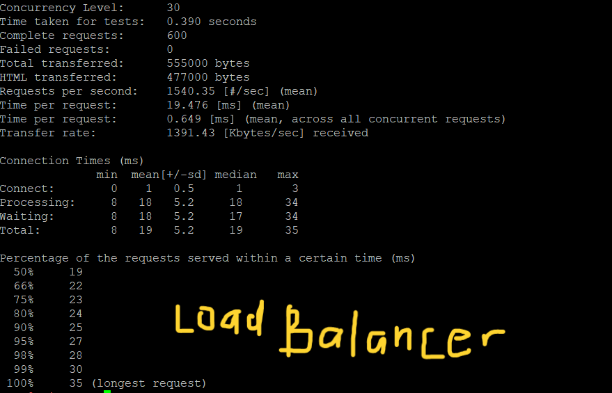
